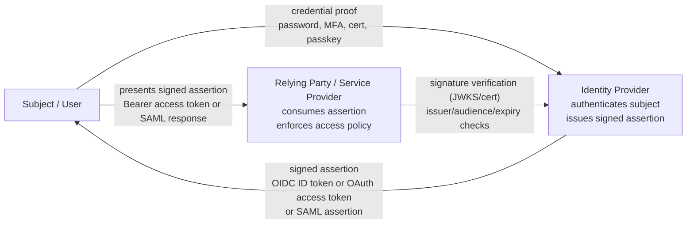
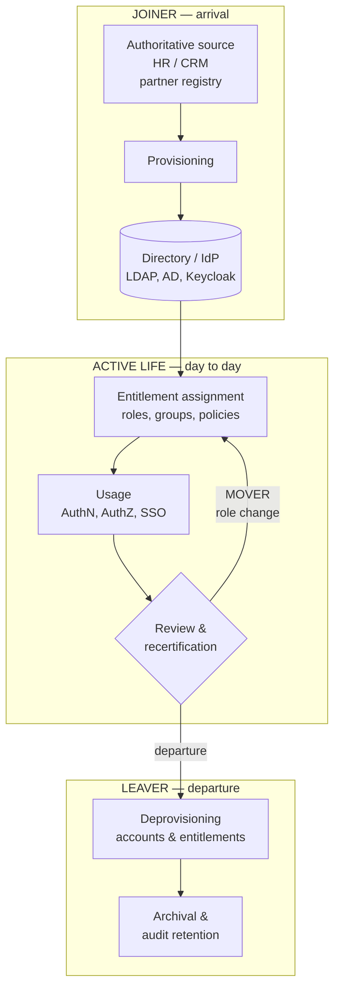
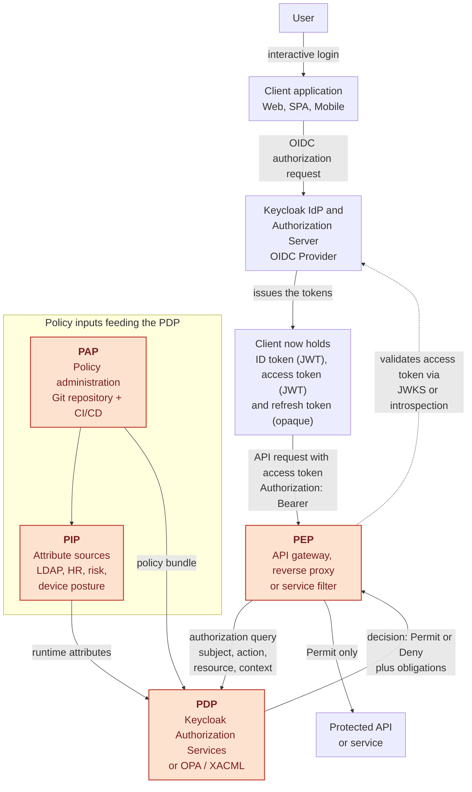
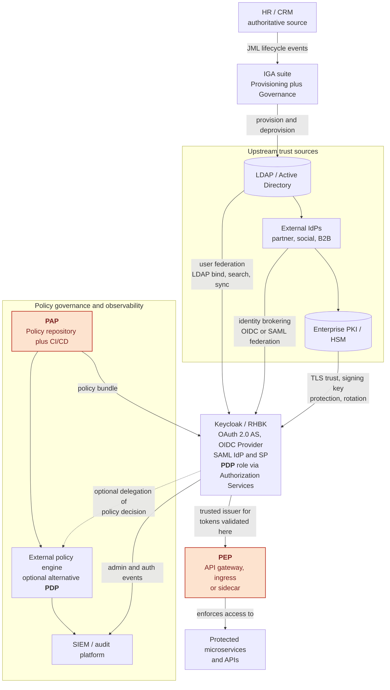
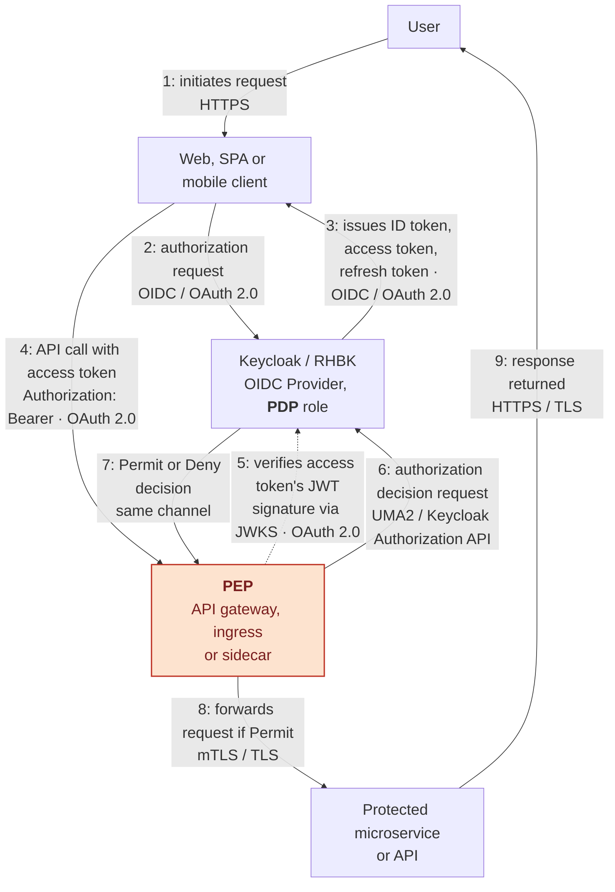
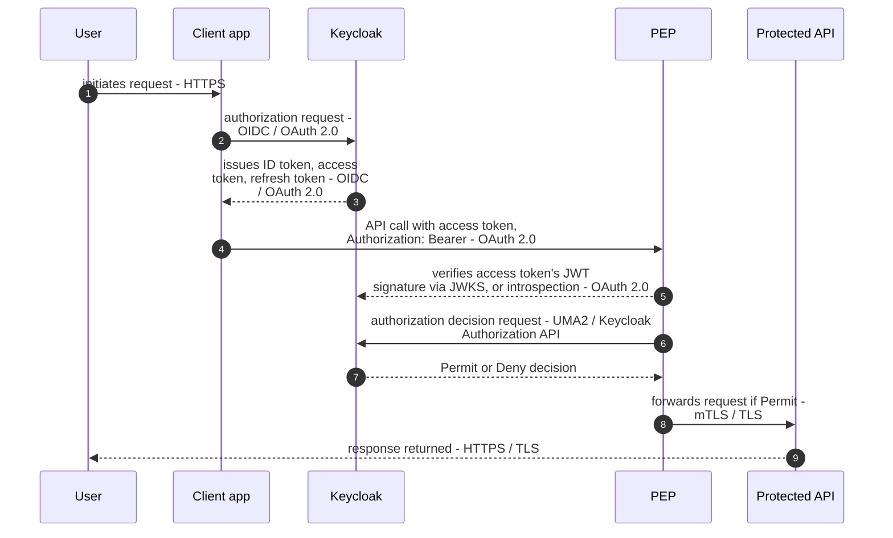

# Enterprise IAM with Keycloak

**Architecture • Security • OAuth 2.0 • OpenID Connect • LDAP • Kubernetes • High Availability • Interview Handbook**

*A practical reference for Senior IAM Engineers, Technical Leads and Security Architects.*

---

## Preface

Most Keycloak documentation follows the same path: install the server, create a realm, create a client, done. That path produces operators, not architects.

This handbook takes the opposite route. It starts from **identity** and **trust**, works its way up through authentication, authorisation, federation, OAuth 2.0, OIDC, JWT, LDAP and PKI, and only then arrives at Keycloak's architecture, production deployment, performance and troubleshooting. That is how senior architects reason, and it is how interviews at architecture level are actually conducted.

Every important concept is treated with the same anatomy:

* Definition
* History and the problem it solves
* Standards and RFCs
* Internal mechanism
* Diagram
* Production implementation
* Security implications
* Performance implications
* Troubleshooting
* Common misconceptions
* Interview questions (Beginner / Intermediate / Senior / Expert)

### Who this book is for

IAM Engineers, Senior IAM Engineers, Technical Leads and Security Architects. It assumes you already know Linux, networking, HTTP, JSON and enterprise IT. It is **not** a beginner's tutorial.

### How to read it

* Preparing for an interview → read the **Theory** sections and the end-of-chapter questions.
* Building a platform → read the **Production Notes** and the **Labs**.
* Designing a target architecture → read the **Architecture** sections and the case studies.

### Guiding principles

1. **Vendor-neutral first, Keycloak implementation second.** Understand *why* before *how*.
2. **RFC-driven, but practical.** Specifications are interpreted, not quoted.
3. **Interview perspective** in every chapter.
4. **Production perspective** — HA, monitoring, logging, security and scalability are woven into every topic, not isolated at the end.
5. **Architect mindset** — not only "how to configure" but "why this design" and "what are the trade-offs".
6. **IAM ↔ PKI bridge** — a link rarely covered in existing literature, and a differentiator in interviews.

### Three parallel tracks

| Track | Audience | Content |
| :--- | :--- | :--- |
| **Theory** | Interview preparation | Concepts, standards, diagrams, explanations |
| **Hands-on Labs** | Engineers | Docker Compose, Kubernetes, OpenShift, REST API, CLI |
| **Architecture** | Technical Leads | Design decisions, scalability, HA, migration strategies, security reviews |

After the OAuth 2.0 chapter, for instance, you should be able to explain OAuth 2.0 to an interviewer, implement it in Keycloak, troubleshoot it in production, and design an OAuth 2.0 architecture for a large enterprise.

### Final objective

By the end of this project, you'll have:

* A GitBook suitable for publication.
* A GitHub repository with labs and examples.
* A personal study guide for Senior IAM and Keycloak interviews.
* A technical reference you can consult during real-world projects.

---

## Summary (table of contents)

### Part I — Identity Foundations
* **Chapter 1 — IAM Fundamentals** ✅ *(written below)*
* Chapter 2 — Directories, LDAP and X.500
* Chapter 3 — Kerberos, NTLM and legacy enterprise SSO
* Chapter 4 — PKI, X.509 and cryptographic trust
* Chapter 5 — Sessions, cookies and the limits of HTTP authentication

### Part II — Modern Protocols
* Chapter 6 — OAuth 2.0: delegation, grants and threat model
* Chapter 7 — OpenID Connect: authentication on top of OAuth 2.0
* Chapter 8 — JWT: structure, signature, validation and pitfalls
* Chapter 9 — SAML 2.0 and interoperability with OIDC
* Chapter 10 — PKCE, DPoP, mTLS-bound tokens and FAPI

### Part III — Keycloak Architecture
* Chapter 11 — Internal architecture (Quarkus, Infinispan, JPA, providers)
* Chapter 12 — Realms, clients, roles, groups and client scopes
* Chapter 13 — Authentication flows, MFA, WebAuthn and step-up
* Chapter 14 — User federation: LDAP, Active Directory, custom stores
* Chapter 15 — Identity brokering and multi-tenancy
* Chapter 16 — Authorization Services (ABAC, UMA 2.0) and external policy engines

### Part IV — Production
* Chapter 17 — Deployment on RHEL, containers, Kubernetes and OpenShift
* Chapter 18 — High availability, clustering and multi-site
* Chapter 19 — Reverse proxies and API Gateways
* Chapter 20 — Performance, tuning and capacity planning
* Chapter 21 — Observability, auditing and SIEM integration
* Chapter 22 — Upgrades, backup and disaster recovery

### Part V — Advanced Topics
* Chapter 23 — Extending Keycloak: SPIs, custom providers, themes
* Chapter 24 — Configuration as code: Admin CLI, Terraform, Ansible, Operator
* Chapter 25 — Migrating from a legacy IdP
* Chapter 26 — IAM ↔ PKI convergence: mTLS, HSM, certificate lifecycle
* Chapter 27 — Comparison: Keycloak, RHBK, Okta, Entra ID, Ping Identity, ForgeRock, Auth0

### Part VI — Practice
* Chapter 28 — Labs (Docker Compose, Kubernetes, OpenShift)
* Chapter 29 — Production incident walkthroughs
* Chapter 30 — Architecture case studies
* Chapter 31 — 200+ interview questions with expected answers
* Appendices — Glossary, RFC index, `kcadm` cookbook, sample JWTs

---

## Repository layout (target)

```
keycloak-handbook/
├── README.md
├── SUMMARY.md
├── docs/
├── labs/
├── diagrams/
├── examples/
├── docker/
├── kubernetes/
├── openshift/
├── postman/
├── scripts/
├── glossary/
└── appendices/
```

The companion lab environment (planned) contains Keycloak, PostgreSQL, OpenLDAP, phpLDAPadmin, Prometheus, Grafana and NGINX in a single `docker-compose.yml`, together with sample realms, sample clients and Postman collections for the Admin REST API and the OAuth/OIDC flows.

---

## Roadmap

| Milestone | Content | Status |
| :--- | :--- | :--- |
| **M1** | Scaffolding: README, SUMMARY, structure | ✅ Done |
| **M2** | Core identity protocols (IAM, LDAP, Kerberos, OAuth 2.0, OIDC, SAML, JWT) | 🚧 Chapter 1 written |
| **M3** | Keycloak architecture and administration | ⏳ Planned |
| **M4** | Production deployments (HA, Kubernetes/OpenShift, proxies, gateways) | ⏳ Planned |
| **M5** | Advanced topics (SPIs, Authorization Services, performance, PKI) | ⏳ Planned |
| **M6** | Labs, case studies and 200+ interview questions | ⏳ Planned |

---

# Chapter 1 — IAM Fundamentals

> **Objectives of this chapter**
> By the end of it you will be able to: define identity, authentication, authorisation, federation and trust without ambiguity; explain why enterprise IAM exists as a discipline; describe the identity lifecycle; distinguish IAM, CIAM, IGA and PAM; position Keycloak inside that landscape; and answer interview questions on all of the above.

## 1.1 Why IAM exists

Every information system eventually faces the same three questions:

1. **Who is making this request?** — authentication
2. **Is this request allowed?** — authorisation
3. **Can we prove afterwards what happened?** — auditability

For a single application, the answers can be hard-coded: a user table, a password column, a role column. That approach fails as soon as the second application appears, and it collapses at enterprise scale for reasons that are organisational as much as technical:

* **Credential sprawl.** Each application storing its own passwords multiplies the attack surface and the number of breaches that can leak them.
* **Inconsistent policy.** Password rules, lockout thresholds and MFA differ per application; the weakest one defines the real security level.
* **Lifecycle drift.** When an employee leaves, someone must remember every application in which the account exists. Nobody does.
* **No traceability.** Auditors ask "who had access to this system in March?" and the answer is spread across twenty databases.
* **No user experience.** Twenty applications, twenty logins.

IAM exists to move these concerns out of applications and into a **shared, governed service**. The application stops asking "what is your password?" and starts asking "show me a token from a source I trust".

That shift — from *storing credentials* to *consuming trusted assertions* — is the single most important idea in this book.

## 1.2 The vocabulary, precisely

These terms are used loosely in everyday conversation and precisely in interviews. Get them right.

| Term | Definition | Typical question it answers |
| :--- | :--- | :--- |
| **Identity** | The digital representation of a subject (person, service, device) in a system | *Who exists?* |
| **Identifier** | A unique key referring to that identity (`uid`, `sub`, UUID, DN, email) | *How do we name it?* |
| **Attribute / Claim** | A statement about the identity (department, e-mail, assurance level) | *What do we know about it?* |
| **Credential** | Proof material the subject can present (password, certificate, passkey, OTP) | *What can it show?* |
| **Authentication (AuthN)** | The process of verifying a claimed identity | *Are you really you?* |
| **Authorisation (AuthZ)** | The decision to permit or deny an operation on a resource | *Are you allowed?* |
| **Session** | Stateful context retained after a successful authentication | *Are you still you?* |
| **Federation** | Trusting identities authenticated by another domain | *Do we trust their word?* |
| **Single Sign-On (SSO)** | One authentication reused across multiple applications | *Must you log in again?* |
| **Provisioning** | Creating/updating/removing accounts and entitlements in target systems | *Does the account exist there?* |
| **Governance (IGA)** | Certifying and reviewing who should have what | *Should you still have it?* |
| **Auditability** | The ability to reconstruct after the fact who did what, when | *Can we prove it?* |

Two distinctions cause most confusion in interviews:

**Authentication is not authorisation.** A valid token proves identity; it does not automatically confer rights. Keycloak issues assertions; the resource server (or gateway) makes the access decision. Conflating the two is how systems end up trusting any signed token, regardless of audience.

**Identification is not authentication.** Typing a username identifies you. Proving you control a credential authenticates you. An e-mail address in a claim is an identifier, not proof.

## 1.3 The trust triangle

Nearly every modern identity protocol — OAuth 2.0, OIDC, SAML, WS-Fed — is a variation on the same triangle.

**Schema 1.3 — Trust triangle: credential, assertion and validation flow**



The critical property is that **the Relying Party never sees the credential**. It only sees a signed statement it can verify cryptographically, usually offline, using the IdP's published public keys.

Three trust anchors make this work:

1. **Cryptographic trust** — the RP holds, or can fetch, the IdP's public key (JWKS endpoint in OIDC, metadata certificate in SAML). This is where IAM meets PKI.
2. **Metadata trust** — the RP knows the IdP's issuer identifier, endpoints and supported algorithms, and refuses anything else.
3. **Contractual trust** — an out-of-band agreement about assurance levels, attribute semantics and liability. Not technical, but it is what auditors read.

Break any one of these and the protocol is theatre. A signature you do not verify, an issuer you do not check, or an audience you ignore each turn a secure protocol into an open door.

## 1.4 Subjects are not only humans

A frequent gap in candidates' answers: IAM covers three populations, with different requirements.

* **Human identities.** Employees, contractors, customers. Interactive, browser-based, MFA-capable, subject to HR lifecycle events.
* **Workload / machine identities.** Services, batch jobs, microservices. Non-interactive, high volume, authenticated by client secrets, certificates (mTLS) or platform-attested identities (Kubernetes service accounts, SPIFFE). In Keycloak these are **service accounts** using the `client_credentials` grant.
* **Device identities.** Laptops, IoT devices, terminals. Usually certificate-based, tied to enrolment and attestation.

Machine identities now outnumber human ones by an order of magnitude in most estates, yet they are frequently secured with static secrets that never rotate. Raising that point in an interview signals real production experience.

## 1.5 The identity lifecycle

Governance rests on lifecycle events, traditionally summarised as **Joiner / Mover / Leaver (JML)**.

**Schema 1.5 — Identity lifecycle (JML): joiner, mover, leaver**



Design rules that survive contact with production:

* **One authoritative source per attribute.** If two systems can both change an e-mail address, they will disagree, and you will spend your career reconciling them.
* **Deprovisioning is a security control, not an administrative chore.** Orphaned accounts are the classic finding in every audit report.
* **Movers are harder than leavers.** People change roles and accumulate entitlements. Without revocation on change, permissions ratchet upward for a whole career — *privilege creep*.
* **Recertification must be actionable.** A review campaign where managers approve everything by default is worse than none: it produces documented negligence.

**Where Keycloak sits:** Keycloak is an *identity provider and access broker*, not a governance suite. It authenticates, federates and issues tokens. It does not natively run certification campaigns or complex approval workflows. In a mature estate you will find an IGA product (SailPoint, Saviynt, Omada, OpenIAM…) upstream, feeding directories and Keycloak. Saying this clearly in an interview shows you understand the boundaries of the tool.

## 1.6 The four neighbouring disciplines

| Discipline | Focus | Typical products |
| :--- | :--- | :--- |
| **IAM / Workforce** | Authentication, SSO, federation for employees and contractors | Keycloak, RHBK, PingAM, Entra ID, ADFS |
| **CIAM** | Same, for customers and partners, at consumer scale | Keycloak, Auth0, Okta CIC, Entra External ID |
| **IGA** | Governance: provisioning, entitlement catalogues, certification, SoD | SailPoint, Saviynt, Omada |
| **PAM** | Privileged access: vaulting, session recording, just-in-time elevation | CyberArk, Delinea, HashiCorp Boundary |

### IAM vs CIAM in practice

The protocols are identical; the constraints are not.

| Dimension | Workforce IAM | CIAM |
| :--- | :--- | :--- |
| Population size | Thousands to hundreds of thousands | Millions to tens of millions |
| Source of truth | HR system | The user themselves (self-registration) |
| Onboarding | Provisioned, controlled | Self-service, must be frictionless |
| Authentication | Corporate credentials, MFA mandated | Social login, e-mail/OTP, passkeys, progressive |
| Failure impact | Employees cannot work | Revenue stops immediately |
| Dominant concerns | Governance, compliance, SoD | UX, conversion rate, consent, GDPR, elasticity |
| Data protection | Employment contract | Consent, right to erasure, portability |

A single Keycloak deployment can serve both, but almost never in the same realm: token lifetimes, password policies, brute-force settings, themes and session limits diverge too much. **Separate realms — often separate clusters — is the defensible answer.**

## 1.7 Assurance levels

Not all authentications are equal, and mature architectures make that explicit rather than implicit.

* **eIDAS** (EU) defines *low*, *substantial* and *high* assurance levels for electronic identification.
* **NIST SP 800-63-3** separates **IAL** (identity proofing), **AAL** (authentication strength) and **FAL** (federation assertion strength) — a genuinely useful decomposition, because proofing quality and authenticator strength are independent problems.
* **OIDC** carries this at protocol level through `acr` (Authentication Context Class Reference) and `amr` (Authentication Methods References) claims, and lets a relying party *request* a level with `acr_values`.

This is the foundation of **step-up authentication**: a user browses a portal with a password-only session, then requests a sensitive operation; the application requests a higher `acr`, and the IdP challenges for a second factor before issuing a token that satisfies it. Keycloak implements this with conditional flows bound to authentication levels.

Interviewers like this topic because it separates people who have configured MFA from people who have designed an authentication policy.

## 1.8 Access control models

| Model | Decision based on | Strength | Weakness |
| :--- | :--- | :--- | :--- |
| **DAC** | Resource owner's discretion | Simple, flexible | Ungovernable at scale |
| **MAC** | System-enforced labels/clearances | Very strong, used in defence | Rigid, costly |
| **RBAC** | What the subject **is** (roles) | Auditable, understandable, mature | Role explosion, static |
| **ABAC** | **Attributes** and context | Fine-grained, dynamic | Hard to reason about and audit |
| **ReBAC** | Relationships (Google Zanzibar style) | Excellent for sharing graphs | New tooling, unfamiliar |
| **PBAC / policy-as-code** | Externalised written policies | Testable, versioned, portable | Requires engineering discipline |

The pragmatic enterprise answer is **RBAC as the backbone, ABAC for the exceptions**. Roles carry the coarse structure that auditors can read; attributes and context handle time, location, device posture, transaction amount and assurance level.

Keycloak natively implements RBAC (realm roles, client roles, composite roles, groups) and provides ABAC through **Authorization Services** (resources, scopes, policies, permissions, UMA 2.0). For large-scale or cross-product policy, externalising decisions to **OPA/Rego**, **Cedar** or an XACML engine is a legitimate design — Keycloak then authenticates and provides attributes, and the policy engine decides.

### PDP / PEP / PIP / PAP

Standard vocabulary worth using precisely:

* **PEP** (Policy Enforcement Point) — where the decision is applied: API gateway, service filter, reverse proxy.
* **PDP** (Policy Decision Point) — where the decision is computed: Keycloak Authorization Services, OPA, XACML engine.
* **PIP** (Policy Information Point) — where extra attributes come from: LDAP, HR system, risk engine.
* **PAP** (Policy Administration Point) — where policies are authored and versioned.

**Schema 1.8 — How PEP/PDP/PIP/PAP fits in IAM architecture, including token origin**



In this flow, the token seen by the PEP is the **access token** previously issued by Keycloak. The **ID token** is for the client application to represent the authenticated user context and is normally not used as an API bearer token.

Naming is deliberately precise throughout this book, because the three tokens are easy to confuse:

* **ID token** — always a signed JWT (mandated by the OIDC specification); read once by the client application to learn who logged in, then normally discarded; never sent to a resource server.
* **Access token** — a signed JWT by default when Keycloak issues it, though the OAuth 2.0 specification itself treats it as an opaque string from the client's point of view; this is the token sent to APIs.
* **Refresh token** — opaque by default in Keycloak (a reference the session can revoke), used only to obtain new tokens from Keycloak; never sent to any resource server.

**Bearer is not a token type.** It is the OAuth 2.0 *token type* and HTTP authentication scheme (RFC 6750), stating that whoever presents — "bears" — the token is granted access, with no extra proof of possession required. Saying "Bearer access token" is therefore a mild redundancy, kept in this book only inside the literal HTTP header (`Authorization: Bearer <access token>`); everywhere else the book simply says **access token**. The alternative to a bearer token is a *sender-constrained* token (DPoP or mTLS-bound tokens, covered in Chapter 10), which cannot be replayed by whoever steals it.

## 1.9 Where Keycloak fits

Placed on the map, Keycloak is:

* an **OAuth 2.0 Authorization Server**,
* an **OpenID Connect Provider**,
* a **SAML 2.0 Identity Provider *and* Service Provider**,
* an **identity broker** in front of external IdPs,
* a **user federation layer** over LDAP/AD and custom stores,
* and, optionally, a **policy decision point** through Authorization Services.

It is **not**: an IGA suite, a PAM solution, a full-featured SCIM provisioning engine, or an LDAP server (it consumes directories, it does not replace them).

<div style="page-break-before: always;"></div>

**Schema 1.9a — Global IAM/CIAM infrastructure as deployed**

This first view is purely static: it shows what exists once the platform is built, before any particular user request happens.



Upstream sources are stacked vertically purely for print readability; in practice they act in parallel, each independently trusted by Keycloak. Keycloak itself plays the PDP role directly through Authorization Services; the external policy engine is an alternative, optional architecture, not a mandatory hop.

<div style="page-break-before: always;"></div>

**Schema 1.9b — Runtime: what happens the moment the user issues a request**

This second view is dynamic: it follows one concrete user request through the infrastructure shown above.



The arrows are numbered 1 to 9 and follow a single request end to end, top to bottom: the same Keycloak instance issues the tokens in step 3 and later plays the PDP role in steps 5-7 when the gateway asks for a decision; the same gateway plays the PEP role throughout. Each arrow also names the protocol actually on the wire, not just the functional intent.

Step 5 is a real signature check, not a lookup: Keycloak issues the access token and ID token as a signed JWT, typically RS256 or ES256. The PEP does not trust the token just because it arrived on the wire; it fetches Keycloak's public signing keys from the JWKS endpoint (`/realms/{realm}/protocol/openid-connect/certs`), matches the token's `kid` header to the right key, verifies the JWT signature against that public key, and checks the `iss`, `aud`, `exp` and `nbf` claims. For opaque, non-JWT reference tokens, the PEP instead calls Keycloak's introspection endpoint online on every request, trading a network round trip for the same guarantee; JWKS-based local verification is the more common choice because the public keys can be cached and reused across many requests.

In full: `kid` names which published key to use; `iss` is the issuer — the realm URL the token claims to come from; `aud` is the audience — the client or API the token is meant for; `exp` is the expiry timestamp, after which the token must be rejected; `nbf` is the not-before timestamp, before which the token must equally be rejected even though it is otherwise valid. This section only needs the principle — verify signature, issuer and audience before trusting anything else in the token; Chapter 8 (*JWT: structure, signature, validation and pitfalls*), not yet written, will work through a complete token byte-by-byte with every claim explained.

<div style="page-break-before: always;"></div>

**Schema 1.9c — Timeline: the same request, arrow by arrow**

This third view is the "cherry on the cake": a sequence diagram built on the exact same numbered steps as Schema 1.9b, giving the definitive, unambiguous ordering and protocol detail for one user request as it crosses every actor over time.



The `autonumber` directive reproduces the same 1-to-9 numbering used in Schema 1.9b, so both diagrams can be cross-referenced arrow by arrow: the flowchart shows where each actor sits in the infrastructure, the sequence diagram shows precisely when and in what order each protocol exchange happens. As in Schema 1.9b, step 5 is the signature check: the PEP verifies the access token's JWT signature against Keycloak's public keys published on the JWKS endpoint, matching the token's `kid` header, rather than trusting the token on sight; for opaque tokens it calls introspection online instead.

<div style="page-break-after: always;"></div>

## 1.10 Production notes

**Common mistakes**

* Using the `master` realm for business applications. It is the administrative realm; compromising it compromises everything.
* Treating Keycloak as the source of truth when an HR system or directory already is. You will build a second authoritative source by accident.
* Modelling every organisational nuance as a role. Role explosion makes access reviews impossible; use groups and attributes.
* Ignoring machine identities until an incident forces the question.
* Designing authentication without designing **deprovisioning**.

**Best practices**

* One realm per security domain and per population type; never mix workforce and customer populations.
* Define the authoritative source for each attribute in writing, before configuring anything.
* Make roles business-meaningful and few; push variability into attributes.
* Instrument authentication events from day one — they are both security telemetry and product analytics.
* Treat the IdP as tier-0 infrastructure: if it is down, nothing works. Design its availability accordingly.

**Security implications**

Centralising identity concentrates risk. The IdP becomes the highest-value target in the estate: whoever controls the signing keys can mint any identity. Realm private keys therefore deserve PKI-grade handling — restricted access, documented rotation, optional HSM protection, and monitored administrative events.

**Performance implications**

At this level the number to remember is that authentication is bursty and correlated: everyone logs in between 08:00 and 09:00. Capacity planning must target the peak login rate and the token refresh rate, not the average.

## 1.11 Interview questions

**Beginner**

1. Define authentication and authorisation, and give one example of each.
2. What is Single Sign-On, and what problem does it solve?
3. What is an identity provider?

**Intermediate**

4. Explain the difference between identification, authentication and authorisation.
5. What is the JML lifecycle, and why is the "mover" case the hardest?
6. Compare RBAC and ABAC, and say when you would combine them.
7. Why should the `master` realm never host business applications?

**Senior**

8. Where does Keycloak stop and where does an IGA product start? Draw the boundary.
9. How would you design IAM for both a workforce population and a customer population in the same company?
10. Explain the PEP/PDP/PIP/PAP model and place Keycloak inside it.
11. How do you handle machine identities at scale, and what would you replace static client secrets with?
12. What are `acr` and `amr`, and how do they enable step-up authentication?

**Expert**

13. Your IdP is now tier-0 infrastructure. Describe the failure modes and the mitigations for each.
14. An auditor asks who had administrative access to a critical application six months ago. What must have been designed in advance for you to answer?
15. Argue for and against externalising authorisation decisions to a policy engine instead of using Keycloak Authorization Services.
16. How does the compromise of a realm signing key differ, in blast radius and remediation, from the compromise of a CA private key?

## 1.12 Summary

* IAM exists to remove credential handling and access decisions from individual applications and to make them a governed, auditable, shared service.
* The trust triangle — subject, identity provider, relying party — underlies OAuth 2.0, OIDC and SAML alike; its safety depends on verifying signature, issuer and audience.
* Identity covers humans, workloads and devices; workload identity is the most neglected and the fastest growing.
* Lifecycle (JML) and governance determine whether an IAM platform is genuinely secure or merely convenient.
* Keycloak is an authentication, federation and token-issuing platform — powerful and extensible, but not a governance or privileged-access product.

## 1.13 References

* NIST SP 800-63-3 — *Digital Identity Guidelines* (IAL / AAL / FAL)
* eIDAS Regulation (EU) 910/2014 and its assurance levels
* RFC 6749 — *The OAuth 2.0 Authorization Framework*
* RFC 7519 — *JSON Web Token (JWT)*
* RFC 6750 — *The OAuth 2.0 Authorization Framework: Bearer Token Usage*
* RFC 9449 — *OAuth 2.0 Demonstrating Proof of Possession (DPoP)*
* OpenID Connect Core 1.0
* Keycloak documentation — Server Administration Guide

## 1.14 Glossary of acronyms

Every acronym used in this chapter, defined in place so the chapter can be read standalone. Some are explained in more depth earlier in the running text (§1.2, §1.7, §1.8, §1.9); they are repeated here briefly for quick lookup. This glossary will grow as later chapters introduce new acronyms.

**Access control models**

* **DAC** — Discretionary Access Control. The resource owner decides who gets access; simple but ungovernable at scale.
* **MAC** — Mandatory Access Control. A central authority enforces fixed labels/clearances; rigid, used in defence-grade systems.
* **RBAC** — Role-Based Access Control. Access follows the roles assigned to a subject; auditable but prone to role explosion.
* **ABAC** — Attribute-Based Access Control. Access follows attributes and context (time, device, risk); fine-grained but harder to audit.
* **ReBAC** — Relationship-Based Access Control. Access follows relationships in a graph (Google Zanzibar style); good for sharing/collaboration models.
* **PBAC** — Policy-Based Access Control, also called policy-as-code. Access follows externalised, versioned, testable policy rules.
* **XACML** — eXtensible Access Control Markup Language. A standard, XML-based language and architecture (PEP/PDP/PIP/PAP) for expressing and evaluating authorisation policies.
* **OPA** — Open Policy Agent. A popular general-purpose external policy engine, usually written in its Rego language, often used as an alternative PDP to Keycloak Authorization Services.

**PEP / PDP / PIP / PAP model**

* **PEP** — Policy Enforcement Point. Where an access decision is applied: API gateway, reverse proxy, service filter.
* **PDP** — Policy Decision Point. Where an access decision is computed: Keycloak Authorization Services, OPA, an XACML engine.
* **PIP** — Policy Information Point. Where extra attributes used in a decision come from: LDAP, HR system, risk engine.
* **PAP** — Policy Administration Point. Where policies are authored, reviewed and versioned, typically a Git repository plus CI/CD.

**Identity disciplines**

* **IAM** — Identity and Access Management. The overall discipline covered by this book: authenticating subjects and deciding what they may do.
* **CIAM** — Customer IAM. IAM for customers and partners, at consumer scale, with different constraints (UX, conversion, consent) from workforce IAM.
* **IGA** — Identity Governance and Administration. Provisioning, entitlement catalogues, certification campaigns and segregation of duties; governs IAM rather than replacing it.
* **PAM** — Privileged Access Management. Vaulting, session recording and just-in-time elevation for highly privileged accounts; a neighbouring discipline to IAM.
* **JML** — Joiner / Mover / Leaver. The standard three-phase model of the identity lifecycle used for governance.
* **SoD** — Segregation of Duties (also Separation of Duties). The governance control ensuring no single identity can both request and approve the same sensitive action.

**Authentication and session concepts**

* **AuthN** — Shorthand for Authentication: verifying a claimed identity.
* **AuthZ** — Shorthand for Authorisation: deciding whether an action on a resource is permitted.
* **SSO** — Single Sign-On. One authentication event reused across multiple applications without re-prompting the user.
* **MFA** — Multi-Factor Authentication. Requiring two or more independent proofs of identity (password, OTP, certificate, biometric).
* **OTP** — One-Time Password. A short-lived, single-use credential, typically delivered by an authenticator app or SMS.
* **IAL / AAL / FAL** — Identity Assurance Level, Authenticator Assurance Level, Federation Assurance Level (NIST SP 800-63-3); independent measures of proofing quality, authenticator strength and federation assertion strength.
* **acr** — Authentication Context Class Reference. An OIDC claim naming the authentication level actually satisfied for a login.
* **amr** — Authentication Methods References. An OIDC claim listing which methods (password, OTP, WebAuthn…) were actually used.

**Protocols and standards**

* **OAuth 2.0** — Delegated-authorisation framework (RFC 6749): lets an application obtain a limited-scope access token to call an API on a user's behalf, without ever seeing the user's password.
* **OIDC** — OpenID Connect. An authentication layer built on top of OAuth 2.0, adding the ID token and a standard way to learn who the user is.
* **SAML** — Security Assertion Markup Language. An older, XML-based federation protocol, still common in enterprise SSO, functionally overlapping with OIDC.
* **UMA 2.0** — User-Managed Access. An OAuth 2.0 extension used by Keycloak Authorization Services to let a resource owner define fine-grained, shareable access policies.
* **DPoP** — Demonstrating Proof of Possession (RFC 9449). A mechanism that binds a token to a client-held key so it cannot be replayed if stolen; an alternative to plain Bearer tokens.
* **FAPI** — Financial-grade API. A profile of OAuth 2.0/OIDC with stricter security requirements, originally for banking APIs.
* **PKCE** — Proof Key for Code Exchange. An OAuth 2.0 extension that protects the authorization code flow for public clients (SPAs, mobile apps) that cannot hold a secret.

**Tokens and cryptography**

* **JWT** — JSON Web Token (RFC 7519). A compact, signed (and optionally encrypted) token format; the concrete format normally used for ID tokens and, by default, Keycloak access tokens.
* **JWKS** — JSON Web Key Set. A JSON document, published at a well-known endpoint, listing the public keys a verifier needs to check a JWT's signature.
* **kid** — Key ID. A JWT header field naming which key in the JWKS was used to sign it.
* **iss** — Issuer. A JWT claim identifying which realm/authority issued the token.
* **aud** — Audience. A JWT claim identifying which client or API the token is meant for; a PEP must reject a token whose audience is not itself.
* **exp** — Expiration time. A JWT claim after which the token must be rejected.
* **nbf** — Not before. A JWT claim before which the token must be rejected even though it is otherwise valid.
* **sub** — Subject. A JWT/OIDC claim carrying the stable, unique identifier of the authenticated subject.
* **RS256** — RSA signature with SHA-256. A common asymmetric JWT signing algorithm: Keycloak signs with a private key, verifiers check with the matching public key from JWKS.
* **ES256** — ECDSA signature with SHA-256 (elliptic curve). A faster, smaller alternative to RS256 with equivalent security, increasingly preferred for new deployments.
* **mTLS** — Mutual TLS. Both sides of a TLS connection present certificates; used for workload identity and for binding tokens to a client certificate.
* **TLS** — Transport Layer Security. The standard protocol securing HTTP traffic in transit (`https://`); the baseline every arrow in this chapter's diagrams assumes.
* **HSM** — Hardware Security Module. A dedicated hardware device that stores and uses private keys (e.g. a realm's signing key) without ever exposing them in software.
* **PKI** — Public Key Infrastructure. The certificates, keys and processes that establish and manage cryptographic trust; the discipline OIDC/SAML signature verification quietly depends on.

**Directories and infrastructure**

* **LDAP** — Lightweight Directory Access Protocol. The standard protocol for querying and updating directory services; Keycloak federates against it for user lookup and bind authentication.
* **AD** — Active Directory. Microsoft's directory service, commonly the authoritative LDAP-compatible store Keycloak federates against in enterprises.
* **DN** — Distinguished Name. The unique path identifying an entry in an LDAP directory (e.g. `cn=jdoe,ou=users,dc=example,dc=com`).
* **IdP** — Identity Provider. The party that authenticates the subject and issues signed assertions or tokens (Keycloak, in this book).
* **RP / SP** — Relying Party (OIDC vocabulary) / Service Provider (SAML vocabulary). The application that consumes the IdP's assertion and enforces access; the two terms name the same role in the trust triangle.
* **SIEM** — Security Information and Event Management. The platform aggregating and analysing security events, including the admin and authentication events Keycloak emits.
* **HR / CRM** — Human Resources / Customer Relationship Management systems. Typical authoritative sources feeding identity lifecycle events into IAM.
* **SPA** — Single Page Application. A browser-based client application (React, Angular, Vue…) that runs entirely client-side and therefore cannot safely hold a client secret, hence its reliance on PKCE.
* **RHBK** — Red Hat Build of Keycloak. Red Hat's supported, productised distribution of the open-source Keycloak project, referenced throughout this book alongside upstream Keycloak.
* **API** — Application Programming Interface. The protected resource ultimately being accessed in every schema in this chapter.
* **CI/CD** — Continuous Integration / Continuous Delivery. The automated pipeline recommended for reviewing and deploying policy changes authored at the PAP.
* **B2B** — Business-to-Business. Used here to describe external partner identities federated into Keycloak as an upstream trust source.
* **GDPR** — General Data Protection Regulation (EU). The data-protection law shaping CIAM consent, right-to-erasure and data-portability requirements.
* **UUID** — Universally Unique Identifier. A common format for the `sub`/identifier claim naming a subject uniquely and without reuse.

---

# Next chapters

Chapter 2 (*Directories, LDAP and X.500*) continues from section 1.9: why directories were designed the way they were, how the LDAP data model and search filters actually work, how replication behaves, and how Keycloak federates against LDAP and Active Directory in production — with the latency, pagination and synchronisation pitfalls that follow.

---

## Annexe: agent self-reference

* **Purpose:** in-depth technical reference manual on IAM and Keycloak, written in **English only**, following the six-milestone roadmap above.
* **Status:** Milestone 1 complete (preface, summary, structure, roadmap). Milestone 2 in progress — Chapter 1 written in full.
* **Writing contract:** each chapter must contain objectives, deep explanation of *why* before *how*, at least one Mermaid diagram, production notes (mistakes, best practices, security, performance), interview questions graded Beginner/Intermediate/Senior/Expert, a summary and references. Content is never compressed to save space.
* **Related documents:** `IAM_Entretien_Prepa_FR.md` (French interview preparation), `IAM_Interview_Prep_EN.md` (English translation), `Senior_IAM_Keycloak_Interview_QA.md` (source Q&A), `KeyCloack Reference Book.docx` (original planning conversation).
* **Next action:** write Chapter 2 — *Directories, LDAP and X.500*.
* **Last updated:** 2026-07-30.
