# Enterprise IAM with Keycloak

**Architecture • Security • OAuth 2.0 • OpenID Connect • LDAP • Kubernetes • High Availability • Interview Handbook**

*A practical reference for Senior IAM Engineers, Technical Leads and Security Architects.*

---

## Preface

Most Keycloak documentation follows the same path: install the server, create a realm, create a client, done. That path produces operators, not architects.

This handbook takes the opposite route. It starts from **identity** and **trust**, works its way up through authentication, authorisation, federation, OAuth 2.0, OIDC, JWT, LDAP and PKI, and only then arrives at Keycloak's architecture, production deployment, performance and troubleshooting. That is how senior architects reason, and it is how interviews at architecture level are actually conducted.

Every important concept is treated with the same anatomy:

* Definition
* History and the problem it solves
* Standards and RFCs
* Internal mechanism
* Diagram
* Production implementation
* Security implications
* Performance implications
* Troubleshooting
* Common misconceptions
* Interview questions (Beginner / Intermediate / Senior / Expert)

### Who this book is for

IAM Engineers, Senior IAM Engineers, Technical Leads and Security Architects. It assumes you already know Linux, networking, HTTP, JSON and enterprise IT. It is **not** a beginner's tutorial.

### How to read it

* Preparing for an interview → read the **Theory** sections and the end-of-chapter questions.
* Building a platform → read the **Production Notes** and the **Labs**.
* Designing a target architecture → read the **Architecture** sections and the case studies.

### Guiding principles

1. **Vendor-neutral first, Keycloak implementation second.** Understand *why* before *how*.
2. **RFC-driven, but practical.** Specifications are interpreted, not quoted.
3. **Interview perspective** in every chapter.
4. **Production perspective** — HA, monitoring, logging, security and scalability are woven into every topic, not isolated at the end.
5. **Architect mindset** — not only "how to configure" but "why this design" and "what are the trade-offs".
6. **IAM ↔ PKI bridge** — a link rarely covered in existing literature, and a differentiator in interviews.

### Three parallel tracks

| Track | Audience | Content |
| :--- | :--- | :--- |
| **Theory** | Interview preparation | Concepts, standards, diagrams, explanations |
| **Hands-on Labs** | Engineers | Docker Compose, Kubernetes, OpenShift, REST API, CLI |
| **Architecture** | Technical Leads | Design decisions, scalability, HA, migration strategies, security reviews |

After the OAuth 2.0 chapter, for instance, you should be able to explain OAuth 2.0 to an interviewer, implement it in Keycloak, troubleshoot it in production, and design an OAuth 2.0 architecture for a large enterprise.

### Final objective

By the end of this project, you'll have:

* A GitBook suitable for publication.
* A GitHub repository with labs and examples.
* A personal study guide for Senior IAM and Keycloak interviews.
* A technical reference you can consult during real-world projects.

---

## Summary (table of contents)

### Part I — Identity Foundations
* **Chapter 1 — IAM Fundamentals** ✅ *(written below)*
* Chapter 2 — Directories, LDAP and X.500
* Chapter 3 — Kerberos, NTLM and legacy enterprise SSO
* Chapter 4 — PKI, X.509 and cryptographic trust
* Chapter 5 — Sessions, cookies and the limits of HTTP authentication

### Part II — Modern Protocols
* Chapter 6 — OAuth 2.0: delegation, grants and threat model
* Chapter 7 — OpenID Connect: authentication on top of OAuth 2.0
* Chapter 8 — JWT: structure, signature, validation and pitfalls
* Chapter 9 — SAML 2.0 and interoperability with OIDC
* Chapter 10 — PKCE, DPoP, mTLS-bound tokens and FAPI

### Part III — Keycloak Architecture
* Chapter 11 — Internal architecture (Quarkus, Infinispan, JPA, providers)
* Chapter 12 — Realms, clients, roles, groups and client scopes
* Chapter 13 — Authentication flows, MFA, WebAuthn and step-up
* Chapter 14 — User federation: LDAP, Active Directory, custom stores
* Chapter 15 — Identity brokering and multi-tenancy
* Chapter 16 — Authorization Services (ABAC, UMA 2.0) and external policy engines

### Part IV — Production
* Chapter 17 — Deployment on RHEL, containers, Kubernetes and OpenShift
* Chapter 18 — High availability, clustering and multi-site
* Chapter 19 — Reverse proxies and API Gateways
* Chapter 20 — Performance, tuning and capacity planning
* Chapter 21 — Observability, auditing and SIEM integration
* Chapter 22 — Upgrades, backup and disaster recovery

### Part V — Advanced Topics
* Chapter 23 — Extending Keycloak: SPIs, custom providers, themes
* Chapter 24 — Configuration as code: Admin CLI, Terraform, Ansible, Operator
* Chapter 25 — Migrating from a legacy IdP
* Chapter 26 — IAM ↔ PKI convergence: mTLS, HSM, certificate lifecycle
* Chapter 27 — Comparison: Keycloak, RHBK, Okta, Entra ID, Ping Identity, ForgeRock, Auth0

### Part VI — Practice
* Chapter 28 — Labs (Docker Compose, Kubernetes, OpenShift)
* Chapter 29 — Production incident walkthroughs
* Chapter 30 — Architecture case studies
* Chapter 31 — 200+ interview questions with expected answers
* Appendices — Glossary, RFC index, `kcadm` cookbook, sample JWTs

---

## Repository layout (target)

```
keycloak-handbook/
├── README.md
├── SUMMARY.md
├── docs/
├── labs/
├── diagrams/
├── examples/
├── docker/
├── kubernetes/
├── openshift/
├── postman/
├── scripts/
├── glossary/
└── appendices/
```

The companion lab environment (planned) contains Keycloak, PostgreSQL, OpenLDAP, phpLDAPadmin, Prometheus, Grafana and NGINX in a single `docker-compose.yml`, together with sample realms, sample clients and Postman collections for the Admin REST API and the OAuth/OIDC flows.

---

## Roadmap

| Milestone | Content | Status |
| :--- | :--- | :--- |
| **M1** | Scaffolding: README, SUMMARY, structure | ✅ Done |
| **M2** | Core identity protocols (IAM, LDAP, Kerberos, OAuth 2.0, OIDC, SAML, JWT) | ✅ Done (Chapters 1-10 drafted) |
| **M3** | Keycloak architecture and administration | ✅ Done (Chapters 11-16 drafted) |
| **M4** | Production deployments (HA, Kubernetes/OpenShift, proxies, gateways) | ✅ Done (Chapters 17-22 drafted) |
| **M5** | Advanced topics (SPIs, Authorization Services, performance, PKI) | ✅ Done (Chapters 23-27 drafted) |
| **M6** | Labs, case studies and 200+ interview questions | ✅ Done (Chapters 28-31 drafted) |

---

# Chapter 1 — IAM Fundamentals

> **Objectives of this chapter**
> By the end of it you will be able to: define identity, authentication, authorisation, federation and trust without ambiguity; explain why enterprise IAM exists as a discipline; describe the identity lifecycle; distinguish IAM, CIAM, IGA and PAM; position Keycloak inside that landscape; and answer interview questions on all of the above.

## 1.1 Why IAM exists

Every information system eventually faces the same three questions:

1. **Who is making this request?** — authentication
2. **Is this request allowed?** — authorisation
3. **Can we prove afterwards what happened?** — auditability

For a single application, the answers can be hard-coded: a user table, a password column, a role column. That approach fails as soon as the second application appears, and it collapses at enterprise scale for reasons that are organisational as much as technical:

* **Credential sprawl.** Each application storing its own passwords multiplies the attack surface and the number of breaches that can leak them.
* **Inconsistent policy.** Password rules, lockout thresholds and MFA differ per application; the weakest one defines the real security level.
* **Lifecycle drift.** When an employee leaves, someone must remember every application in which the account exists. Nobody does.
* **No traceability.** Auditors ask "who had access to this system in March?" and the answer is spread across twenty databases.
* **No user experience.** Twenty applications, twenty logins.

IAM exists to move these concerns out of applications and into a **shared, governed service**. The application stops asking "what is your password?" and starts asking "show me a token from a source I trust".

That shift — from *storing credentials* to *consuming trusted assertions* — is the single most important idea in this book.

## 1.2 The vocabulary, precisely

These terms are used loosely in everyday conversation and precisely in interviews. Get them right.

| Term | Definition | Typical question it answers |
| :--- | :--- | :--- |
| **Identity** | The digital representation of a subject (person, service, device) in a system | *Who exists?* |
| **Identifier** | A unique key referring to that identity (`uid`, `sub`, UUID, DN, email) | *How do we name it?* |
| **Attribute / Claim** | A statement about the identity (department, e-mail, assurance level) | *What do we know about it?* |
| **Credential** | Proof material the subject can present (password, certificate, passkey, OTP) | *What can it show?* |
| **Authentication (AuthN)** | The process of verifying a claimed identity | *Are you really you?* |
| **Authorisation (AuthZ)** | The decision to permit or deny an operation on a resource | *Are you allowed?* |
| **Session** | Stateful context retained after a successful authentication | *Are you still you?* |
| **Federation** | Trusting identities authenticated by another domain | *Do we trust their word?* |
| **Single Sign-On (SSO)** | One authentication reused across multiple applications | *Must you log in again?* |
| **Provisioning** | Creating/updating/removing accounts and entitlements in target systems | *Does the account exist there?* |
| **Governance (IGA)** | Certifying and reviewing who should have what | *Should you still have it?* |
| **Auditability** | The ability to reconstruct after the fact who did what, when | *Can we prove it?* |

Two distinctions cause most confusion in interviews:

**Authentication is not authorisation.** A valid token proves identity; it does not automatically confer rights. Keycloak issues assertions; the resource server (or gateway) makes the access decision. Conflating the two is how systems end up trusting any signed token, regardless of audience.

**Identification is not authentication.** Typing a username identifies you. Proving you control a credential authenticates you. An e-mail address in a claim is an identifier, not proof.

## 1.3 The trust triangle

Nearly every modern identity protocol — OAuth 2.0, OIDC, SAML, WS-Fed — is a variation on the same triangle.

**Schema 1.3 — Trust triangle: credential, assertion and validation flow**

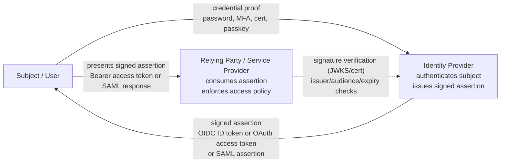

The critical property is that **the Relying Party never sees the credential**. It only sees a signed statement it can verify cryptographically, usually offline, using the IdP's published public keys.

Three trust anchors make this work:

1. **Cryptographic trust** — the RP holds, or can fetch, the IdP's public key (JWKS endpoint in OIDC, metadata certificate in SAML). This is where IAM meets PKI.
2. **Metadata trust** — the RP knows the IdP's issuer identifier, endpoints and supported algorithms, and refuses anything else.
3. **Contractual trust** — an out-of-band agreement about assurance levels, attribute semantics and liability. Not technical, but it is what auditors read.

Break any one of these and the protocol is theatre. A signature you do not verify, an issuer you do not check, or an audience you ignore each turn a secure protocol into an open door.

## 1.4 Subjects are not only humans

A frequent gap in candidates' answers: IAM covers three populations, with different requirements.

* **Human identities.** Employees, contractors, customers. Interactive, browser-based, MFA-capable, subject to HR lifecycle events.
* **Workload / machine identities.** Services, batch jobs, microservices. Non-interactive, high volume, authenticated by client secrets, certificates (mTLS) or platform-attested identities (Kubernetes service accounts, SPIFFE). In Keycloak these are **service accounts** using the `client_credentials` grant.
* **Device identities.** Laptops, IoT devices, terminals. Usually certificate-based, tied to enrolment and attestation.

Machine identities now outnumber human ones by an order of magnitude in most estates, yet they are frequently secured with static secrets that never rotate. Raising that point in an interview signals real production experience.

## 1.5 The identity lifecycle

Governance rests on lifecycle events, traditionally summarised as **Joiner / Mover / Leaver (JML)**.

**Schema 1.5 — Identity lifecycle (JML): joiner, mover, leaver**

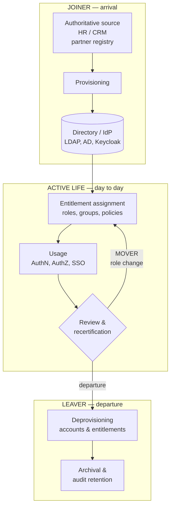

Design rules that survive contact with production:

* **One authoritative source per attribute.** If two systems can both change an e-mail address, they will disagree, and you will spend your career reconciling them.
* **Deprovisioning is a security control, not an administrative chore.** Orphaned accounts are the classic finding in every audit report.
* **Movers are harder than leavers.** People change roles and accumulate entitlements. Without revocation on change, permissions ratchet upward for a whole career — *privilege creep*.
* **Recertification must be actionable.** A review campaign where managers approve everything by default is worse than none: it produces documented negligence.

**Where Keycloak sits:** Keycloak is an *identity provider and access broker*, not a governance suite. It authenticates, federates and issues tokens. It does not natively run certification campaigns or complex approval workflows. In a mature estate you will find an IGA product (SailPoint, Saviynt, Omada, OpenIAM…) upstream, feeding directories and Keycloak. Saying this clearly in an interview shows you understand the boundaries of the tool.

## 1.6 The four neighbouring disciplines

| Discipline | Focus | Typical products |
| :--- | :--- | :--- |
| **IAM / Workforce** | Authentication, SSO, federation for employees and contractors | Keycloak, RHBK, PingAM, Entra ID, ADFS |
| **CIAM** | Same, for customers and partners, at consumer scale | Keycloak, Auth0, Okta CIC, Entra External ID |
| **IGA** | Governance: provisioning, entitlement catalogues, certification, SoD | SailPoint, Saviynt, Omada |
| **PAM** | Privileged access: vaulting, session recording, just-in-time elevation | CyberArk, Delinea, HashiCorp Boundary |

### IAM vs CIAM in practice

The protocols are identical; the constraints are not.

| Dimension | Workforce IAM | CIAM |
| :--- | :--- | :--- |
| Population size | Thousands to hundreds of thousands | Millions to tens of millions |
| Source of truth | HR system | The user themselves (self-registration) |
| Onboarding | Provisioned, controlled | Self-service, must be frictionless |
| Authentication | Corporate credentials, MFA mandated | Social login, e-mail/OTP, passkeys, progressive |
| Failure impact | Employees cannot work | Revenue stops immediately |
| Dominant concerns | Governance, compliance, SoD | UX, conversion rate, consent, GDPR, elasticity |
| Data protection | Employment contract | Consent, right to erasure, portability |

A single Keycloak deployment can serve both, but almost never in the same realm: token lifetimes, password policies, brute-force settings, themes and session limits diverge too much. **Separate realms — often separate clusters — is the defensible answer.**

## 1.7 Assurance levels

Not all authentications are equal, and mature architectures make that explicit rather than implicit.

* **eIDAS** (EU) defines *low*, *substantial* and *high* assurance levels for electronic identification.
* **NIST SP 800-63-3** separates **IAL** (identity proofing), **AAL** (authentication strength) and **FAL** (federation assertion strength) — a genuinely useful decomposition, because proofing quality and authenticator strength are independent problems.
* **OIDC** carries this at protocol level through `acr` (Authentication Context Class Reference) and `amr` (Authentication Methods References) claims, and lets a relying party *request* a level with `acr_values`.

This is the foundation of **step-up authentication**: a user browses a portal with a password-only session, then requests a sensitive operation; the application requests a higher `acr`, and the IdP challenges for a second factor before issuing a token that satisfies it. Keycloak implements this with conditional flows bound to authentication levels.

Interviewers like this topic because it separates people who have configured MFA from people who have designed an authentication policy.

## 1.8 Access control models

| Model | Decision based on | Strength | Weakness |
| :--- | :--- | :--- | :--- |
| **DAC** | Resource owner's discretion | Simple, flexible | Ungovernable at scale |
| **MAC** | System-enforced labels/clearances | Very strong, used in defence | Rigid, costly |
| **RBAC** | What the subject **is** (roles) | Auditable, understandable, mature | Role explosion, static |
| **ABAC** | **Attributes** and context | Fine-grained, dynamic | Hard to reason about and audit |
| **ReBAC** | Relationships (Google Zanzibar style) | Excellent for sharing graphs | New tooling, unfamiliar |
| **PBAC / policy-as-code** | Externalised written policies | Testable, versioned, portable | Requires engineering discipline |

The pragmatic enterprise answer is **RBAC as the backbone, ABAC for the exceptions**. Roles carry the coarse structure that auditors can read; attributes and context handle time, location, device posture, transaction amount and assurance level.

Keycloak natively implements RBAC (realm roles, client roles, composite roles, groups) and provides ABAC through **Authorization Services** (resources, scopes, policies, permissions, UMA 2.0). For large-scale or cross-product policy, externalising decisions to **OPA/Rego**, **Cedar** or an XACML engine is a legitimate design — Keycloak then authenticates and provides attributes, and the policy engine decides.

### PDP / PEP / PIP / PAP

Standard vocabulary worth using precisely:

* **PEP** (Policy Enforcement Point) — where the decision is applied: API gateway, service filter, reverse proxy.
* **PDP** (Policy Decision Point) — where the decision is computed: Keycloak Authorization Services, OPA, XACML engine.
* **PIP** (Policy Information Point) — where extra attributes come from: LDAP, HR system, risk engine.
* **PAP** (Policy Administration Point) — where policies are authored and versioned.

**Schema 1.8 — How PEP/PDP/PIP/PAP fits in IAM architecture, including token origin**

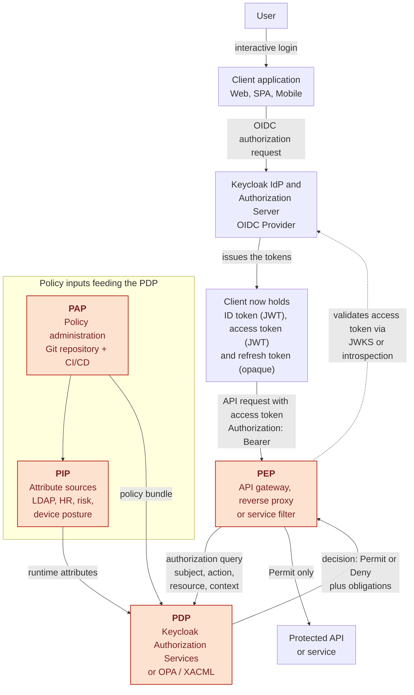

In this flow, the token seen by the PEP is the **access token** previously issued by Keycloak. The **ID token** is for the client application to represent the authenticated user context and is normally not used as an API bearer token.

Naming is deliberately precise throughout this book, because the three tokens are easy to confuse:

* **ID token** — always a signed JWT (mandated by the OIDC specification); read once by the client application to learn who logged in, then normally discarded; never sent to a resource server.
* **Access token** — a signed JWT by default when Keycloak issues it, though the OAuth 2.0 specification itself treats it as an opaque string from the client's point of view; this is the token sent to APIs.
* **Refresh token** — opaque by default in Keycloak (a reference the session can revoke), used only to obtain new tokens from Keycloak; never sent to any resource server.

**Bearer is not a token type.** It is the OAuth 2.0 *token type* and HTTP authentication scheme (RFC 6750), stating that whoever presents — "bears" — the token is granted access, with no extra proof of possession required. Saying "Bearer access token" is therefore a mild redundancy, kept in this book only inside the literal HTTP header (`Authorization: Bearer <access token>`); everywhere else the book simply says **access token**. The alternative to a bearer token is a *sender-constrained* token (DPoP or mTLS-bound tokens, covered in Chapter 10), which cannot be replayed by whoever steals it.

## 1.9 Where Keycloak fits

Placed on the map, Keycloak is:

* an **OAuth 2.0 Authorization Server**,
* an **OpenID Connect Provider**,
* a **SAML 2.0 Identity Provider *and* Service Provider**,
* an **identity broker** in front of external IdPs,
* a **user federation layer** over LDAP/AD and custom stores,
* and, optionally, a **policy decision point** through Authorization Services.

It is **not**: an IGA suite, a PAM solution, a full-featured SCIM provisioning engine, or an LDAP server (it consumes directories, it does not replace them).

<div style="page-break-before: always;"></div>

**Schema 1.9a — Global IAM/CIAM infrastructure as deployed**

This first view is purely static: it shows what exists once the platform is built, before any particular user request happens.

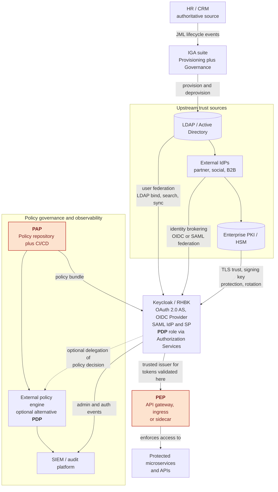

Upstream sources are stacked vertically purely for print readability; in practice they act in parallel, each independently trusted by Keycloak. Keycloak itself plays the PDP role directly through Authorization Services; the external policy engine is an alternative, optional architecture, not a mandatory hop.

<div style="page-break-before: always;"></div>

**Schema 1.9b — Runtime: what happens the moment the user issues a request**

This second view is dynamic: it follows one concrete user request through the infrastructure shown above.

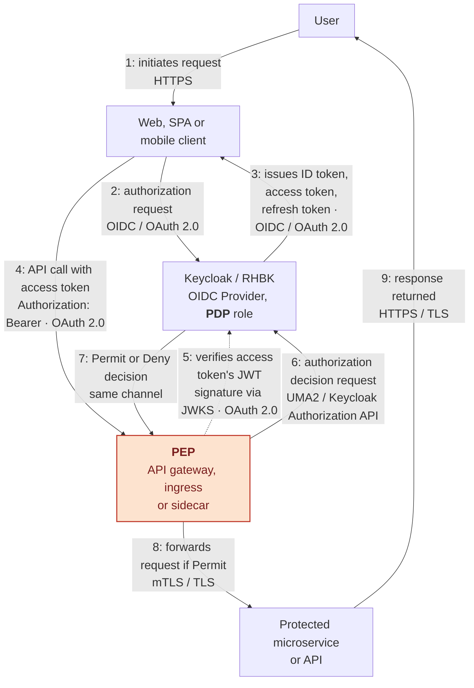

The arrows are numbered 1 to 9 and follow a single request end to end, top to bottom: the same Keycloak instance issues the tokens in step 3 and later plays the PDP role in steps 5-7 when the gateway asks for a decision; the same gateway plays the PEP role throughout. Each arrow also names the protocol actually on the wire, not just the functional intent.

Step 5 is a real signature check, not a lookup: Keycloak issues the access token and ID token as a signed JWT, typically RS256 or ES256. The PEP does not trust the token just because it arrived on the wire; it fetches Keycloak's public signing keys from the JWKS endpoint (`/realms/{realm}/protocol/openid-connect/certs`), matches the token's `kid` header to the right key, verifies the JWT signature against that public key, and checks the `iss`, `aud`, `exp` and `nbf` claims. For opaque, non-JWT reference tokens, the PEP instead calls Keycloak's introspection endpoint online on every request, trading a network round trip for the same guarantee; JWKS-based local verification is the more common choice because the public keys can be cached and reused across many requests.

In full: `kid` names which published key to use; `iss` is the issuer — the realm URL the token claims to come from; `aud` is the audience — the client or API the token is meant for; `exp` is the expiry timestamp, after which the token must be rejected; `nbf` is the not-before timestamp, before which the token must equally be rejected even though it is otherwise valid. This section only needs the principle — verify signature, issuer and audience before trusting anything else in the token; Chapter 8 (*JWT: structure, signature, validation and pitfalls*), not yet written, will work through a complete token byte-by-byte with every claim explained.

<div style="page-break-before: always;"></div>

**Schema 1.9c — Timeline: the same request, arrow by arrow**

This third view is the "cherry on the cake": a sequence diagram built on the exact same numbered steps as Schema 1.9b, giving the definitive, unambiguous ordering and protocol detail for one user request as it crosses every actor over time.

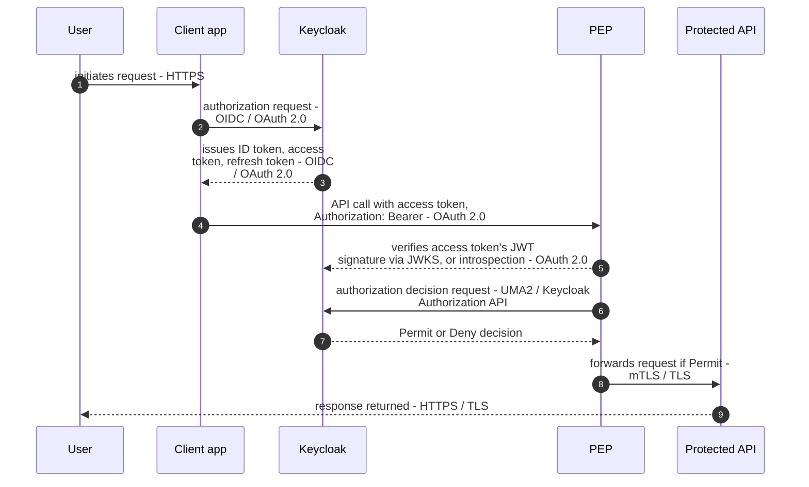

The `autonumber` directive reproduces the same 1-to-9 numbering used in Schema 1.9b, so both diagrams can be cross-referenced arrow by arrow: the flowchart shows where each actor sits in the infrastructure, the sequence diagram shows precisely when and in what order each protocol exchange happens. As in Schema 1.9b, step 5 is the signature check: the PEP verifies the access token's JWT signature against Keycloak's public keys published on the JWKS endpoint, matching the token's `kid` header, rather than trusting the token on sight; for opaque tokens it calls introspection online instead.

<div style="page-break-after: always;"></div>

## 1.10 Production notes

**Common mistakes**

* Using the `master` realm for business applications. It is the administrative realm; compromising it compromises everything.
* Treating Keycloak as the source of truth when an HR system or directory already is. You will build a second authoritative source by accident.
* Modelling every organisational nuance as a role. Role explosion makes access reviews impossible; use groups and attributes.
* Ignoring machine identities until an incident forces the question.
* Designing authentication without designing **deprovisioning**.

**Best practices**

* One realm per security domain and per population type; never mix workforce and customer populations.
* Define the authoritative source for each attribute in writing, before configuring anything.
* Make roles business-meaningful and few; push variability into attributes.
* Instrument authentication events from day one — they are both security telemetry and product analytics.
* Treat the IdP as tier-0 infrastructure: if it is down, nothing works. Design its availability accordingly.

**Security implications**

Centralising identity concentrates risk. The IdP becomes the highest-value target in the estate: whoever controls the signing keys can mint any identity. Realm private keys therefore deserve PKI-grade handling — restricted access, documented rotation, optional HSM protection, and monitored administrative events.

**Performance implications**

At this level the number to remember is that authentication is bursty and correlated: everyone logs in between 08:00 and 09:00. Capacity planning must target the peak login rate and the token refresh rate, not the average.

## 1.11 Interview questions

**Beginner**

1. Define authentication and authorisation, and give one example of each.
2. What is Single Sign-On, and what problem does it solve?
3. What is an identity provider?

**Intermediate**

4. Explain the difference between identification, authentication and authorisation.
5. What is the JML lifecycle, and why is the "mover" case the hardest?
6. Compare RBAC and ABAC, and say when you would combine them.
7. Why should the `master` realm never host business applications?

**Senior**

8. Where does Keycloak stop and where does an IGA product start? Draw the boundary.
9. How would you design IAM for both a workforce population and a customer population in the same company?
10. Explain the PEP/PDP/PIP/PAP model and place Keycloak inside it.
11. How do you handle machine identities at scale, and what would you replace static client secrets with?
12. What are `acr` and `amr`, and how do they enable step-up authentication?

**Expert**

13. Your IdP is now tier-0 infrastructure. Describe the failure modes and the mitigations for each.
14. An auditor asks who had administrative access to a critical application six months ago. What must have been designed in advance for you to answer?
15. Argue for and against externalising authorisation decisions to a policy engine instead of using Keycloak Authorization Services.
16. How does the compromise of a realm signing key differ, in blast radius and remediation, from the compromise of a CA private key?

## 1.12 Summary

* IAM exists to remove credential handling and access decisions from individual applications and to make them a governed, auditable, shared service.
* The trust triangle — subject, identity provider, relying party — underlies OAuth 2.0, OIDC and SAML alike; its safety depends on verifying signature, issuer and audience.
* Identity covers humans, workloads and devices; workload identity is the most neglected and the fastest growing.
* Lifecycle (JML) and governance determine whether an IAM platform is genuinely secure or merely convenient.
* Keycloak is an authentication, federation and token-issuing platform — powerful and extensible, but not a governance or privileged-access product.

## 1.13 References

* NIST SP 800-63-3 — *Digital Identity Guidelines* (IAL / AAL / FAL)
* eIDAS Regulation (EU) 910/2014 and its assurance levels
* RFC 6749 — *The OAuth 2.0 Authorization Framework*
* RFC 7519 — *JSON Web Token (JWT)*
* RFC 6750 — *The OAuth 2.0 Authorization Framework: Bearer Token Usage*
* RFC 9449 — *OAuth 2.0 Demonstrating Proof of Possession (DPoP)*
* OpenID Connect Core 1.0
* Keycloak documentation — Server Administration Guide

## 1.14 Glossary of acronyms

Every acronym used in this chapter, defined in place so the chapter can be read standalone. Some are explained in more depth earlier in the running text (§1.2, §1.7, §1.8, §1.9); they are repeated here briefly for quick lookup. This glossary will grow as later chapters introduce new acronyms.

**Access control models**

* **DAC** — Discretionary Access Control. The resource owner decides who gets access; simple but ungovernable at scale.
* **MAC** — Mandatory Access Control. A central authority enforces fixed labels/clearances; rigid, used in defence-grade systems.
* **RBAC** — Role-Based Access Control. Access follows the roles assigned to a subject; auditable but prone to role explosion.
* **ABAC** — Attribute-Based Access Control. Access follows attributes and context (time, device, risk); fine-grained but harder to audit.
* **ReBAC** — Relationship-Based Access Control. Access follows relationships in a graph (Google Zanzibar style); good for sharing/collaboration models.
* **PBAC** — Policy-Based Access Control, also called policy-as-code. Access follows externalised, versioned, testable policy rules.
* **XACML** — eXtensible Access Control Markup Language. A standard, XML-based language and architecture (PEP/PDP/PIP/PAP) for expressing and evaluating authorisation policies.
* **OPA** — Open Policy Agent. A popular general-purpose external policy engine, usually written in its Rego language, often used as an alternative PDP to Keycloak Authorization Services.

**PEP / PDP / PIP / PAP model**

* **PEP** — Policy Enforcement Point. Where an access decision is applied: API gateway, reverse proxy, service filter.
* **PDP** — Policy Decision Point. Where an access decision is computed: Keycloak Authorization Services, OPA, an XACML engine.
* **PIP** — Policy Information Point. Where extra attributes used in a decision come from: LDAP, HR system, risk engine.
* **PAP** — Policy Administration Point. Where policies are authored, reviewed and versioned, typically a Git repository plus CI/CD.

**Identity disciplines**

* **IAM** — Identity and Access Management. The overall discipline covered by this book: authenticating subjects and deciding what they may do.
* **CIAM** — Customer IAM. IAM for customers and partners, at consumer scale, with different constraints (UX, conversion, consent) from workforce IAM.
* **IGA** — Identity Governance and Administration. Provisioning, entitlement catalogues, certification campaigns and segregation of duties; governs IAM rather than replacing it.
* **PAM** — Privileged Access Management. Vaulting, session recording and just-in-time elevation for highly privileged accounts; a neighbouring discipline to IAM.
* **JML** — Joiner / Mover / Leaver. The standard three-phase model of the identity lifecycle used for governance.
* **SoD** — Segregation of Duties (also Separation of Duties). The governance control ensuring no single identity can both request and approve the same sensitive action.

**Authentication and session concepts**

* **AuthN** — Shorthand for Authentication: verifying a claimed identity.
* **AuthZ** — Shorthand for Authorisation: deciding whether an action on a resource is permitted.
* **SSO** — Single Sign-On. One authentication event reused across multiple applications without re-prompting the user.
* **MFA** — Multi-Factor Authentication. Requiring two or more independent proofs of identity (password, OTP, certificate, biometric).
* **OTP** — One-Time Password. A short-lived, single-use credential, typically delivered by an authenticator app or SMS.
* **IAL / AAL / FAL** — Identity Assurance Level, Authenticator Assurance Level, Federation Assurance Level (NIST SP 800-63-3); independent measures of proofing quality, authenticator strength and federation assertion strength.
* **acr** — Authentication Context Class Reference. An OIDC claim naming the authentication level actually satisfied for a login.
* **amr** — Authentication Methods References. An OIDC claim listing which methods (password, OTP, WebAuthn…) were actually used.

**Protocols and standards**

* **OAuth 2.0** — Delegated-authorisation framework (RFC 6749): lets an application obtain a limited-scope access token to call an API on a user's behalf, without ever seeing the user's password.
* **OIDC** — OpenID Connect. An authentication layer built on top of OAuth 2.0, adding the ID token and a standard way to learn who the user is.
* **SAML** — Security Assertion Markup Language. An older, XML-based federation protocol, still common in enterprise SSO, functionally overlapping with OIDC.
* **UMA 2.0** — User-Managed Access. An OAuth 2.0 extension used by Keycloak Authorization Services to let a resource owner define fine-grained, shareable access policies.
* **DPoP** — Demonstrating Proof of Possession (RFC 9449). A mechanism that binds a token to a client-held key so it cannot be replayed if stolen; an alternative to plain Bearer tokens.
* **FAPI** — Financial-grade API. A profile of OAuth 2.0/OIDC with stricter security requirements, originally for banking APIs.
* **PKCE** — Proof Key for Code Exchange. An OAuth 2.0 extension that protects the authorization code flow for public clients (SPAs, mobile apps) that cannot hold a secret.

**Tokens and cryptography**

* **JWT** — JSON Web Token (RFC 7519). A compact, signed (and optionally encrypted) token format; the concrete format normally used for ID tokens and, by default, Keycloak access tokens.
* **JWKS** — JSON Web Key Set. A JSON document, published at a well-known endpoint, listing the public keys a verifier needs to check a JWT's signature.
* **kid** — Key ID. A JWT header field naming which key in the JWKS was used to sign it.
* **iss** — Issuer. A JWT claim identifying which realm/authority issued the token.
* **aud** — Audience. A JWT claim identifying which client or API the token is meant for; a PEP must reject a token whose audience is not itself.
* **exp** — Expiration time. A JWT claim after which the token must be rejected.
* **nbf** — Not before. A JWT claim before which the token must be rejected even though it is otherwise valid.
* **sub** — Subject. A JWT/OIDC claim carrying the stable, unique identifier of the authenticated subject.
* **RS256** — RSA signature with SHA-256. A common asymmetric JWT signing algorithm: Keycloak signs with a private key, verifiers check with the matching public key from JWKS.
* **ES256** — ECDSA signature with SHA-256 (elliptic curve). A faster, smaller alternative to RS256 with equivalent security, increasingly preferred for new deployments.
* **mTLS** — Mutual TLS. Both sides of a TLS connection present certificates; used for workload identity and for binding tokens to a client certificate.
* **TLS** — Transport Layer Security. The standard protocol securing HTTP traffic in transit (`https://`); the baseline every arrow in this chapter's diagrams assumes.
* **HSM** — Hardware Security Module. A dedicated hardware device that stores and uses private keys (e.g. a realm's signing key) without ever exposing them in software.
* **PKI** — Public Key Infrastructure. The certificates, keys and processes that establish and manage cryptographic trust; the discipline OIDC/SAML signature verification quietly depends on.

**Directories and infrastructure**

* **LDAP** — Lightweight Directory Access Protocol. The standard protocol for querying and updating directory services; Keycloak federates against it for user lookup and bind authentication.
* **AD** — Active Directory. Microsoft's directory service, commonly the authoritative LDAP-compatible store Keycloak federates against in enterprises.
* **DN** — Distinguished Name. The unique path identifying an entry in an LDAP directory (e.g. `cn=jdoe,ou=users,dc=example,dc=com`).
* **IdP** — Identity Provider. The party that authenticates the subject and issues signed assertions or tokens (Keycloak, in this book).
* **RP / SP** — Relying Party (OIDC vocabulary) / Service Provider (SAML vocabulary). The application that consumes the IdP's assertion and enforces access; the two terms name the same role in the trust triangle.
* **SIEM** — Security Information and Event Management. The platform aggregating and analysing security events, including the admin and authentication events Keycloak emits.
* **HR / CRM** — Human Resources / Customer Relationship Management systems. Typical authoritative sources feeding identity lifecycle events into IAM.
* **SPA** — Single Page Application. A browser-based client application (React, Angular, Vue…) that runs entirely client-side and therefore cannot safely hold a client secret, hence its reliance on PKCE.
* **RHBK** — Red Hat Build of Keycloak. Red Hat's supported, productised distribution of the open-source Keycloak project, referenced throughout this book alongside upstream Keycloak.
* **API** — Application Programming Interface. The protected resource ultimately being accessed in every schema in this chapter.
* **CI/CD** — Continuous Integration / Continuous Delivery. The automated pipeline recommended for reviewing and deploying policy changes authored at the PAP.
* **B2B** — Business-to-Business. Used here to describe external partner identities federated into Keycloak as an upstream trust source.
* **GDPR** — General Data Protection Regulation (EU). The data-protection law shaping CIAM consent, right-to-erasure and data-portability requirements.
* **UUID** — Universally Unique Identifier. A common format for the `sub`/identifier claim naming a subject uniquely and without reuse.

---


# Chapter 2 — Directories, LDAP and X.500

> **Objectives of this chapter**
> Explain directory data modeling, LDAP protocol operations, schema design, replication semantics, and safe Keycloak federation with LDAP/AD.

## 2.1 Why this topic exists (before how)

LDAP survived because IAM directories optimize for very high read volume, hierarchical delegation, and predictable lookup semantics rather than relational joins. X.500 introduced the naming and schema model; LDAP made it operationally lighter for TCP/IP networks.

## 2.2 Core mechanisms and architecture decisions

* DIT structure: root, domains, OUs, leaf entries; DN is identity path, not business key.
* Protocol primitives: Bind, Search, Compare, Modify, Add, Delete, ModifyDN with server-side controls (paging, sorting).
* Schema governance: objectClass defines allowed/required attributes; extending schema without lifecycle ownership creates drift.
* Keycloak federation: LDAP is often source of credentials and groups; mapper precedence decides claim truth.

## 2.3 Chapter schema

Schema 2.1 — Directories, LDAP and X.500: control and runtime path

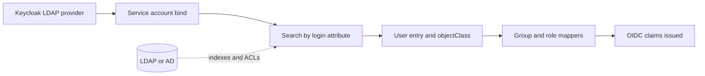

## 2.4 Production notes

**Common mistakes**

* Using broad subtree searches without indexed attributes, causing authentication spikes.
* Bi-directional writes for attributes already mastered in HR/AD, creating race conditions.
* Recursive group resolution without limits, causing huge token group claims.

**Best practices**

* Index login-critical attributes (`uid`, `mail`, `memberOf`) and validate query plans.
* Document attribute ownership (HR, AD, Keycloak mapper) before enabling import or write-back.
* Use paged searches and delta sync windows sized to directory capacity.

**Security implications**

A compromised LDAP bind account exposes identity metadata at scale. Use least-privilege bind DN, TLS with certificate validation, and distinct accounts for read vs write operations.

**Performance implications**

Latency is usually directory-bound, not Keycloak-bound. Deep group trees and unindexed filters inflate search time and token issuance latency.

## 2.5 Troubleshooting

* Check bind success and TLS trust first (`ldapsearch -ZZ` equivalent connectivity tests).
* Capture real search filters from Keycloak logs and validate against directory indexes.
* If sync stalls, inspect pagination control support and server size/time limits.

## 2.6 Common misconceptions

* LDAP is a database replacement for everything.
* DN is immutable forever; in reality rename/move operations happen during org changes.
* Import users once means federation complexity is solved.

## 2.7 Interview questions (graded)

**Beginner**

- **Q:** Why do enterprises still run LDAP/AD for IAM?
- **Expected answer:** Because directory data model and read patterns fit identity workloads better than transactional schemas.

**Intermediate**

- **Q:** How do subtree search scope and filter indexing affect login latency?
- **Expected answer:** Unindexed subtree filters force scans; indexed filters keep authentication predictable under load.

**Senior**

- **Q:** When would you use import mode vs live federation in Keycloak?
- **Expected answer:** Import for resilience/offline reads; live federation for freshest attributes, with explicit cache and outage strategy.

**Expert**

- **Q:** Design a safe group-to-role mapping strategy for 100k users.
- **Expected answer:** Constrain recursion, normalize group semantics, and map only authorization-relevant groups to avoid token bloat.

## 2.8 Summary

* LDAP/X.500 decisions are data-governance decisions before being connector settings.
* Search/index design directly impacts auth latency.
* Federation requires explicit ownership of attributes and groups.
* Directory security posture is tier-0 for IAM.

## 2.9 References

* RFC 4511
* RFC 4512
* RFC 4515
* ITU-T X.500


# Chapter 3 — Kerberos, NTLM and legacy enterprise SSO

> **Objectives of this chapter**
> Explain Kerberos ticket flow, NTLM limitations, and coexistence patterns while modernizing to OIDC with Keycloak.

## 3.1 Why this topic exists (before how)

Enterprises keep Kerberos because integrated Windows authentication gives seamless SSO for domain-joined devices. NTLM persists in legacy paths, but its relay resistance and cryptographic posture are weaker than Kerberos.

## 3.2 Core mechanisms and architecture decisions

* Kerberos flow: AS-REQ/AS-REP for TGT, TGS-REQ/TGS-REP for service ticket, AP exchange for service access.
* SPN correctness is mandatory; duplicates break service ticket resolution.
* Clock skew tolerance is strict; NTP drift creates intermittent auth failure.
* Modern pattern: keep Kerberos at workstation edge, use Keycloak broker/adapters for OIDC-facing apps.

## 3.3 Chapter schema

Schema 3.1 — Kerberos, NTLM and legacy enterprise SSO: control and runtime path

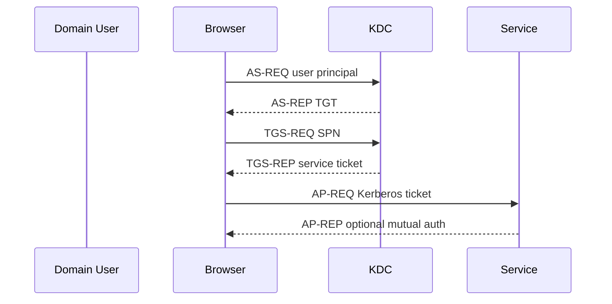

## 3.4 Production notes

**Common mistakes**

* Treating NTLM fallback as harmless; attackers exploit relay opportunities.
* Ignoring DNS canonicalization/SPN registration in multi-host services.
* Assuming browser SSO failures are app bugs instead of domain trust/policy issues.

**Best practices**

* Prefer Kerberos-only where possible; disable NTLM where business constraints allow.
* Track SPN inventory as configuration-as-code to prevent duplicates.
* Use constrained delegation intentionally; review delegation trust boundaries.

**Security implications**

Kerberos tickets are bearer-like within their trust context; ticket theft and unconstrained delegation can become lateral-movement accelerators.

**Performance implications**

KDC dependency creates sharp blast radius: KDC latency or packet loss appears as global login slowdown.

## 3.5 Troubleshooting

* If only some users fail, compare workstation time sync and domain trust path.
* Validate SPN uniqueness and service account key material after password rotation.
* Capture `WWW-Authenticate` negotiation headers to detect NTLM fallback unexpectedly.

## 3.6 Common misconceptions

* Kerberos is obsolete and can be removed quickly.
* NTLM and Kerberos are equivalent from a security standpoint.
* OIDC migration removes need to understand domain auth internals.

## 3.7 Interview questions (graded)

**Beginner**

- **Q:** What problem does Kerberos solve better than password re-entry?
- **Expected answer:** Mutual trust-based SSO without sending passwords to each service.

**Intermediate**

- **Q:** Why does clock skew break Kerberos more than many web protocols?
- **Expected answer:** Tickets contain strict validity windows and replay protections tied to time.

**Senior**

- **Q:** How do you modernize while preserving intranet SSO?
- **Expected answer:** Keep Kerberos at edge, federate/broker into OIDC, and migrate apps by trust boundary.

**Expert**

- **Q:** What is the risk profile of keeping NTLM enabled for fallback?
- **Expected answer:** Relay and downgrade paths increase; it should be explicitly constrained and monitored.

## 3.8 Summary

* Kerberos remains operationally critical in AD estates.
* SPN/time/DNS hygiene determines reliability.
* NTLM fallback must be treated as risk, not convenience.
* Migration strategy should separate user UX continuity from protocol backend evolution.

## 3.9 References

* RFC 4120
* RFC 4559
* RFC 4178
* MS-NLMP


# Chapter 4 — PKI, X.509 and cryptographic trust

> **Objectives of this chapter**
> Explain certificate chains, key lifecycle, revocation models, and how Keycloak trust anchors affect token and TLS security.

## 4.1 Why this topic exists (before how)

Identity protocols are only trustworthy if signature and TLS trust are trustworthy. PKI operational quality—not just math—decides whether issuers, endpoints, and keys are actually authentic.

## 4.2 Core mechanisms and architecture decisions

* X.509 chain building: leaf -> intermediate -> root; trust anchor is local trust store.
* Key usage and extended key usage constrain certificate purpose (server auth, client auth, signing).
* Revocation posture: OCSP/CRL soft-fail vs hard-fail has availability and security trade-offs.
* Keycloak uses PKI for HTTPS endpoints and for distributing token verification keys (JWKS trust bootstrap).

## 4.3 Chapter schema

Schema 4.1 — PKI, X.509 and cryptographic trust: control and runtime path

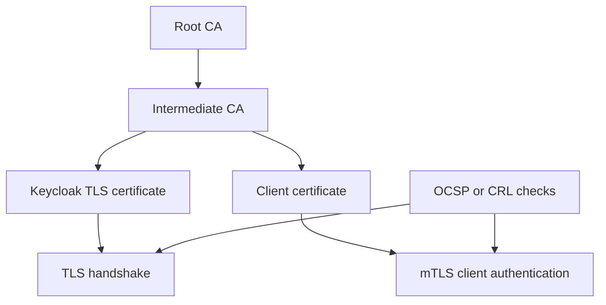

## 4.4 Production notes

**Common mistakes**

* Mixing internal test CAs and production trust stores.
* Rotating signing keys without overlap period, breaking token verification.
* Ignoring certificate SAN mismatches behind proxies.

**Best practices**

* Use staged key rotation with overlapping JWKS publication windows.
* Separate CA hierarchy for workload TLS vs human-facing public endpoints when needed.
* Audit trust store changes like privileged code changes.

**Security implications**

If CA private keys or realm signing keys are mishandled, attackers can mint trusted artifacts. HSM-backed custody and dual-control operations are justified for high-assurance realms.

**Performance implications**

Hard-fail revocation checks can increase latency or outages if OCSP path is unstable; design cache and responder resilience explicitly.

## 4.5 Troubleshooting

* When TLS fails unexpectedly, inspect chain order and SAN first, then cipher policy.
* For JWT verification failures after rotation, compare `kid` presence and JWKS cache TTL at gateways.
* Test OCSP/CRL reachability from runtime network segment, not only admin laptop.

## 4.6 Common misconceptions

* Having HTTPS enabled means PKI is solved.
* Self-signed certificates are fine if "internal".
* Revocation can be ignored because cert expiry exists.

## 4.7 Interview questions (graded)

**Beginner**

- **Q:** What is a trust anchor?
- **Expected answer:** A root CA certificate explicitly trusted by verifier systems.

**Intermediate**

- **Q:** Why are SAN fields critical now?
- **Expected answer:** Hostname validation relies on SAN; CN-only assumptions are obsolete.

**Senior**

- **Q:** How do you rotate Keycloak signing keys safely?
- **Expected answer:** Publish new key before use, overlap validity, monitor verifiers, then retire old key.

**Expert**

- **Q:** When do you hard-fail OCSP in IAM paths?
- **Expected answer:** Only where assurance demands it and responder availability is engineered accordingly.

## 4.8 Summary

* PKI hygiene is an IAM availability and security prerequisite.
* Key rotation must be designed as a lifecycle with overlap.
* Trust-store management is a privileged change process.
* Certificate validation failures are often operational misconfiguration, not cryptographic failure.

## 4.9 References

* RFC 5280
* RFC 6960
* RFC 7517
* NIST SP 800-57


# Chapter 5 — Sessions, cookies and the limits of HTTP authentication

> **Objectives of this chapter**
> Explain browser session mechanics, cookie security attributes, logout semantics, and Keycloak session/token coupling.

## 5.1 Why this topic exists (before how)

HTTP is stateless, but user journeys are stateful. Sessions are the continuity layer, and insecure cookie/session handling is a direct account-takeover path even when primary authentication is strong.

## 5.2 Core mechanisms and architecture decisions

* Cookie attributes: Secure, HttpOnly, SameSite, Path, Domain; each changes attack surface.
* Session fixation and replay are lifecycle bugs: session IDs must rotate after auth events.
* Front-channel vs back-channel logout have different consistency and latency properties.
* Keycloak session idle/max settings must align with access and refresh token lifetimes.

## 5.3 Chapter schema

Schema 5.1 — Sessions, cookies and the limits of HTTP authentication: control and runtime path

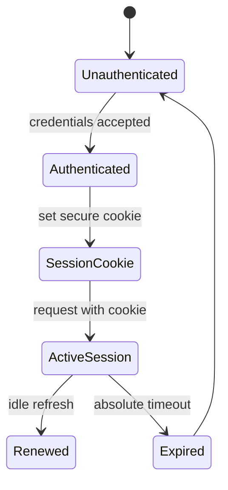

## 5.4 Production notes

**Common mistakes**

* Long-lived refresh/session defaults copied from dev to production.
* Broad cookie domain scope shared across unrelated apps.
* Assuming logout in one tab instantly revokes all downstream API access.

**Best practices**

* Use strict cookie scope and SameSite policy consistent with app topology.
* Rotate session identifiers after privilege or assurance elevation.
* Design token revocation expectations clearly: near-real-time vs eventual.

**Security implications**

Session theft often bypasses MFA entirely. Harden browser channel, set secure cookie policy, and monitor anomalous token refresh patterns.

**Performance implications**

Session stores and token introspection can become hot paths during morning bursts; tune caches and idle/max values together.

## 5.5 Troubleshooting

* If users log out but APIs still accept tokens, inspect token TTL and introspection/revocation strategy.
* If SSO loops occur, inspect SameSite and redirect URI/domain mismatch.
* Correlate proxy header rewriting with Keycloak cookie path/domain generation.

## 5.6 Common misconceptions

* JWTs eliminate need for session management.
* Short access tokens alone fully mitigate session risk.
* Single logout is instant and universal by default.

## 5.7 Interview questions (graded)

**Beginner**

- **Q:** Why do we need sessions after login?
- **Expected answer:** To avoid re-auth on every request while preserving continuity state.

**Intermediate**

- **Q:** What does SameSite protect against?
- **Expected answer:** Cross-site request contexts that can trigger CSRF-like cookie replay.

**Senior**

- **Q:** How do you align Keycloak session and token TTLs?
- **Expected answer:** Model user idle behavior, API trust window, and revocation latency together.

**Expert**

- **Q:** How would you design near-immediate logout across many APIs?
- **Expected answer:** Use short AT TTL, refresh revocation, back-channel logout, and gateway revalidation controls.

## 5.8 Summary

* Session design is security design.
* Cookie scope mistakes create cross-app exposure.
* Logout semantics must be explicit per channel.
* Token/session TTL coupling drives UX and risk.

## 5.9 References

* RFC 6265
* RFC 7009
* OpenID Back-Channel Logout
* OWASP Session Management Cheat Sheet


# Chapter 6 — OAuth 2.0: delegation, grants and threat model

> **Objectives of this chapter**
> Explain OAuth actors, grant selection, token security properties, and practical threat mitigations in Keycloak ecosystems.

## 6.1 Why this topic exists (before how)

OAuth 2.0 was created to avoid password sharing between users and third-party applications. Delegation gives bounded API rights without exposing primary credentials.

## 6.2 Core mechanisms and architecture decisions

* Actor model: resource owner, client, authorization server, resource server.
* Grant selection by client trust type: authorization code(+PKCE), client credentials, device code; avoid implicit/ROPC patterns.
* Scopes represent requested delegation, not entitlement truth by themselves.
* Threats: code interception, token replay, mix-up, redirect URI abuse, weak audience validation.

## 6.3 Chapter schema

Schema 6.1 — OAuth 2.0: delegation, grants and threat model: control and runtime path

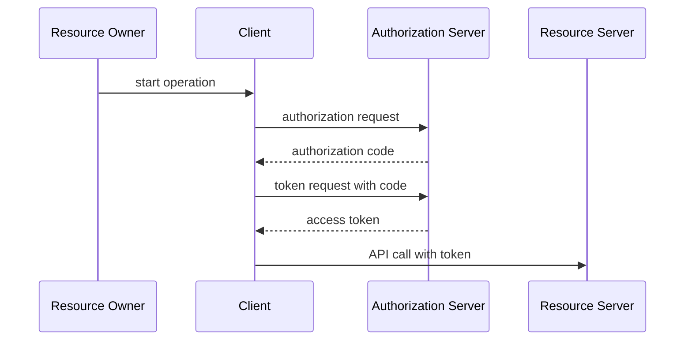

## 6.4 Production notes

**Common mistakes**

* Using one generic client for many apps and environments.
* Over-broad default scopes (`openid profile email roles everything`).
* Resource servers accepting any token signed by realm regardless of audience.

**Best practices**

* Register exact redirect URIs and strict client type metadata.
* Use confidential/public separation and rotate client credentials.
* Validate `iss`, `aud`, `exp`, and where needed `azp` at every API.

**Security implications**

****** theft equals delegated access theft. Sender-constraining and least-privilege scope policy reduce replay value and blast radius.

**Performance implications**

Token endpoint load rises with short TTL and high refresh churn; capacity planning must include grant mix and client retry behavior.

## 6.5 Troubleshooting

* If auth code exchange fails, inspect PKCE verifier/challenge mismatch and redirect URI exactness.
* If API accepts wrong-client tokens, inspect audience enforcement path in gateway/service.
* If refresh storms occur, inspect client retry backoff and session idle policy.

## 6.6 Common misconceptions

* OAuth is authentication by itself.
* Scopes are roles.
* Signing a token is enough without audience checks.

## 6.7 Interview questions (graded)

**Beginner**

- **Q:** What problem does OAuth solve?
- **Expected answer:** Delegated API access without sharing user passwords.

**Intermediate**

- **Q:** Why is authorization code + PKCE preferred?
- **Expected answer:** It protects code interception for public and browser/mobile clients.

**Senior**

- **Q:** How do you prevent token confusion across APIs?
- **Expected answer:** Per-resource audiences/scopes and strict API-side claim validation.

**Expert**

- **Q:** Which OAuth threats remain after PKCE and how do you mitigate?
- **Expected answer:** Replay/theft and issuer mix-up remain; enforce sender constraints and metadata pinning.

## 6.8 Summary

* OAuth is a delegation framework with strict actor boundaries.
* Grant choice is a security decision.
* Audience validation is mandatory.
* Threat modeling must include retry and outage behavior.

## 6.9 References

* RFC 6749
* RFC 6750
* RFC 7636
* RFC 6819


# Chapter 7 — OpenID Connect: authentication on top of OAuth 2.0

> **Objectives of this chapter**
> Explain OIDC identity assertions, discovery, session state, and safe client implementation patterns.

## 7.1 Why this topic exists (before how)

OIDC adds interoperable authentication semantics to OAuth 2.0: who authenticated, when, and with what assurance. Without OIDC, OAuth clients cannot reliably prove user identity.

## 7.2 Core mechanisms and architecture decisions

* ID token is for client authentication context; access token is for APIs.
* Discovery (`.well-known/openid-configuration`) binds endpoints and capabilities to issuer.
* Nonce/state protect replay and CSRF/mix-up in browser flows.
* Claims release via scopes and UserInfo requires data minimization discipline.

## 7.3 Chapter schema

Schema 7.1 — OpenID Connect: authentication on top of OAuth 2.0: control and runtime path

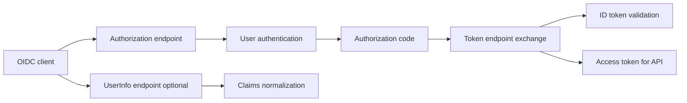

## 7.4 Production notes

**Common mistakes**

* Using ID token as bearer token to APIs.
* Skipping nonce validation in SPA/mobile clients.
* Treating UserInfo as always fresher than ID token without cache strategy.

**Best practices**

* Pin issuer/discovery metadata and enforce exact issuer match.
* Validate ID token signature, audience, nonce, and auth_time when required.
* Use pairwise subject identifiers when privacy boundaries require unlinkability.

**Security implications**

Identity claims often include personal data. Over-sharing claims across clients increases privacy and breach impact.

**Performance implications**

Heavy UserInfo calls can add latency; decide between richer ID tokens and runtime UserInfo based on freshness and scale needs.

## 7.5 Troubleshooting

* If login succeeds but user profile is empty, inspect scope-to-claim mappers.
* If nonce errors are intermittent, inspect multi-tab/session storage behavior in client.
* If RP-initiated logout fails, inspect post-logout redirect URI registration and session cookies.

## 7.6 Common misconceptions

* OIDC is just OAuth with one extra endpoint.
* ID token and access token are interchangeable.
* Discovery means no need to validate issuer.

## 7.7 Interview questions (graded)

**Beginner**

- **Q:** What does OIDC add to OAuth?
- **Expected answer:** Authentication and standardized identity claims.

**Intermediate**

- **Q:** Why do we need nonce?
- **Expected answer:** To prevent replay/token injection in browser-mediated flows.

**Senior**

- **Q:** When do you call UserInfo vs rely on ID token claims?
- **Expected answer:** UserInfo for fresher or dynamic claims; ID token for bounded login context.

**Expert**

- **Q:** How do you design privacy-preserving subject identifiers across clients?
- **Expected answer:** Use pairwise subjects and client-sector design to avoid cross-app correlation.

## 7.8 Summary

* OIDC formalizes authentication semantics on OAuth rails.
* Token purpose separation is non-negotiable.
* Discovery improves interoperability but not trust by itself.
* Claim minimization is both privacy and security control.

## 7.9 References

* OpenID Connect Core 1.0
* OpenID Discovery 1.0
* RFC 8414
* OpenID RP-Initiated Logout


# Chapter 8 — JWT: structure, signature, validation and pitfalls

> **Objectives of this chapter**
> Explain JOSE structure, algorithm policy, claim validation order, and common implementation vulnerabilities.

## 8.1 Why this topic exists (before how)

JWT scales because verification can be local and stateless. The same property makes validation bugs catastrophic: one parser mistake can accept forged tokens everywhere.

## 8.2 Core mechanisms and architecture decisions

* Structure: header, payload, signature; Base64URL encoding is transport, not secrecy.
* Algorithm policy must be explicit; never trust token-provided algorithm blindly.
* Claim checks: signature -> issuer -> audience -> time -> business constraints.
* JWKS cache and key rotation handling determine operational reliability.

## 8.3 Chapter schema

Schema 8.1 — JWT: structure, signature, validation and pitfalls: control and runtime path

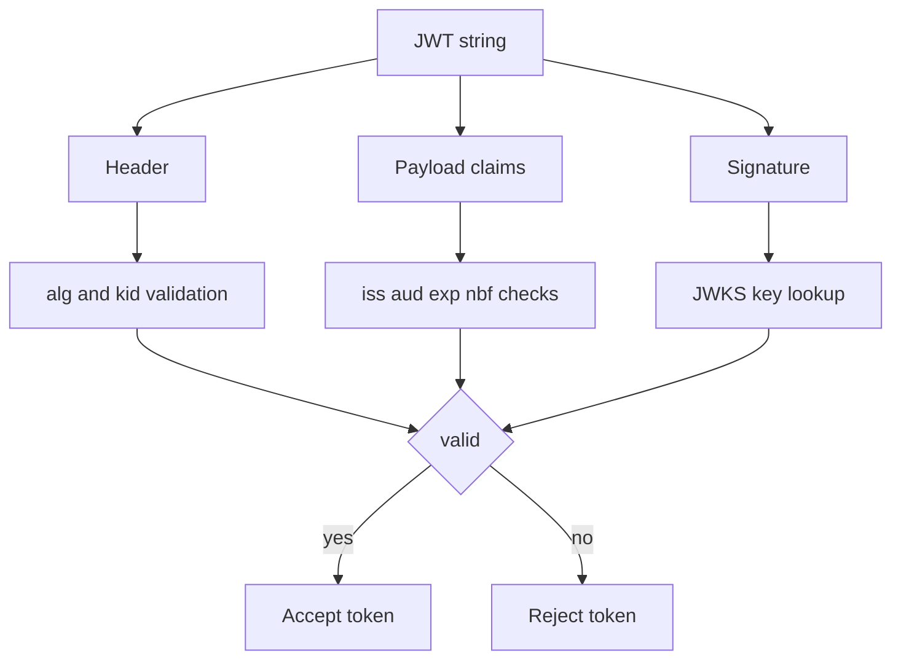

## 8.4 Production notes

**Common mistakes**

* Accepting `none` or unexpected algorithms due to permissive library defaults.
* Skipping audience checks for internal services.
* Ignoring clock skew/leeway coordination across distributed services.

**Best practices**

* Pin allowed algorithms per issuer.
* Centralize token validation middleware to avoid service-by-service drift.
* Define JWKS cache TTL and emergency key revoke playbook.

**Security implications**

JWT payload is readable; placing sensitive PII in tokens leaks data into logs and browser storage.

**Performance implications**

Large tokens increase header overhead and reverse-proxy limits; token bloat directly impacts latency and error rates.

## 8.5 Troubleshooting

* If one service rejects token but another accepts, diff library versions/defaults.
* If signature suddenly fails, inspect JWKS refresh behavior and stale cache.
* If `nbf/exp` failures spike, inspect NTP drift across nodes.

## 8.6 Common misconceptions

* JWTs are encrypted by default.
* Signed token means every claim is safe to trust without context.
* More claims is always better for downstream convenience.

## 8.7 Interview questions (graded)

**Beginner**

- **Q:** What does a JWT signature prove?
- **Expected answer:** Integrity and issuer possession of signing key.

**Intermediate**

- **Q:** Why check audience after signature?
- **Expected answer:** Because valid signatures can still target different recipients.

**Senior**

- **Q:** How do you handle emergency key compromise?
- **Expected answer:** Rotate keys, revoke sessions/tokens where possible, force cache refresh, and audit acceptance paths.

**Expert**

- **Q:** How would you constrain token size in microservice estates?
- **Expected answer:** Claim budgeting, per-API scopes, and token exchange/downscoping patterns.

## 8.8 Summary

* JWT validation order matters.
* Algorithm and audience policy must be strict.
* JWKS lifecycle is operationally critical.
* Token bloat is a real reliability issue.

## 8.9 References

* RFC 7515
* RFC 7517
* RFC 7518
* RFC 7519


# Chapter 9 — SAML 2.0 and interoperability with OIDC

> **Objectives of this chapter**
> Explain SAML assertion flow, XML signature realities, and bridge patterns between SAML and OIDC in Keycloak.

## 9.1 Why this topic exists (before how)

SAML remains dominant in enterprise SaaS and partner federation. Interoperability matters because migration is incremental: many organizations run SAML and OIDC simultaneously for years.

## 9.2 Core mechanisms and architecture decisions

* SAML assertions carry authentication statements, attributes, and conditions (audience, time, recipient).
* Bindings matter: Redirect, POST, Artifact each alter size, confidentiality, and operational behavior.
* Metadata lifecycle (entity IDs, certs, endpoints) is trust contract, not boilerplate.
* Keycloak can broker SAML upstream and issue OIDC downstream, or inverse depending integration needs.

## 9.3 Chapter schema

Schema 9.1 — SAML 2.0 and interoperability with OIDC: control and runtime path

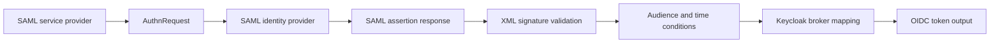

## 9.4 Production notes

**Common mistakes**

* Ignoring XML signature wrapping protections in legacy stacks.
* Manually editing metadata without version control.
* Mapping NameID/email incorrectly, causing account-link collisions.

**Best practices**

* Use signed metadata and automated rollover procedures.
* Normalize identity-linking rules (immutable subject preferred over email).
* Test clock skew and assertion lifetime with realistic latency.

**Security implications**

XML signature handling has historical parser pitfalls; hardened parser settings and library updates are mandatory.

**Performance implications**

Large SAML assertions can stress browser redirects and reverse proxies; attribute minimization and POST binding choices matter.

## 9.5 Troubleshooting

* If SAML login loops, inspect ACS URL and entityID exact match.
* If signature errors appear post-rotation, inspect partner metadata cache refresh.
* If users map to wrong accounts, inspect transient/persistent NameID strategy.

## 9.6 Common misconceptions

* SAML is insecure by design.
* OIDC migration means SAML can be ignored immediately.
* Any unique email is safe as long-term federation key.

## 9.7 Interview questions (graded)

**Beginner**

- **Q:** What does a SAML IdP assertion provide?
- **Expected answer:** Authenticated statement and attributes for SP consumption.

**Intermediate**

- **Q:** Why is metadata management critical?
- **Expected answer:** It defines endpoints and trust keys; stale metadata breaks or weakens trust.

**Senior**

- **Q:** How do you bridge SAML to OIDC safely?
- **Expected answer:** Preserve stable subject mapping, normalize assurance claims, and manage token/assertion TTL mismatches.

**Expert**

- **Q:** What are the highest-risk parser-level SAML issues?
- **Expected answer:** XML signature wrapping/XXE-like parser hardening gaps in outdated toolchains.

## 9.8 Summary

* SAML remains enterprise-critical.
* Interop success depends on identity mapping and metadata rigor.
* Bridge design must preserve assurance semantics.
* Operational rollover discipline prevents major outages.

## 9.9 References

* OASIS SAML Core 2.0
* SAML Bindings 2.0
* SAML Metadata 2.0
* RFC 7522


# Chapter 10 — PKCE, DPoP, mTLS-bound tokens and FAPI

> **Objectives of this chapter**
> Explain sender-constrained token patterns and financial-grade hardening profiles for high-risk OAuth/OIDC systems.

## 10.1 Why this topic exists (before how)

****** are easy to deploy but replayable. Modern extensions bind authorization artifacts to client-held key material, reducing theft replay value in mobile, SPA, and API ecosystems.

## 10.2 Core mechanisms and architecture decisions

* PKCE binds auth code redemption to original client entropy (`code_verifier`).
* DPoP binds token use to proof JWT signed by client key per request context.
* mTLS-bound tokens bind token to client certificate at TLS layer.
* FAPI profiles require stricter defaults (PAR/JAR, PKCE, stronger client auth, tighter redirect controls).

## 10.3 Chapter schema

Schema 10.1 — PKCE, DPoP, mTLS-bound tokens and FAPI: control and runtime path

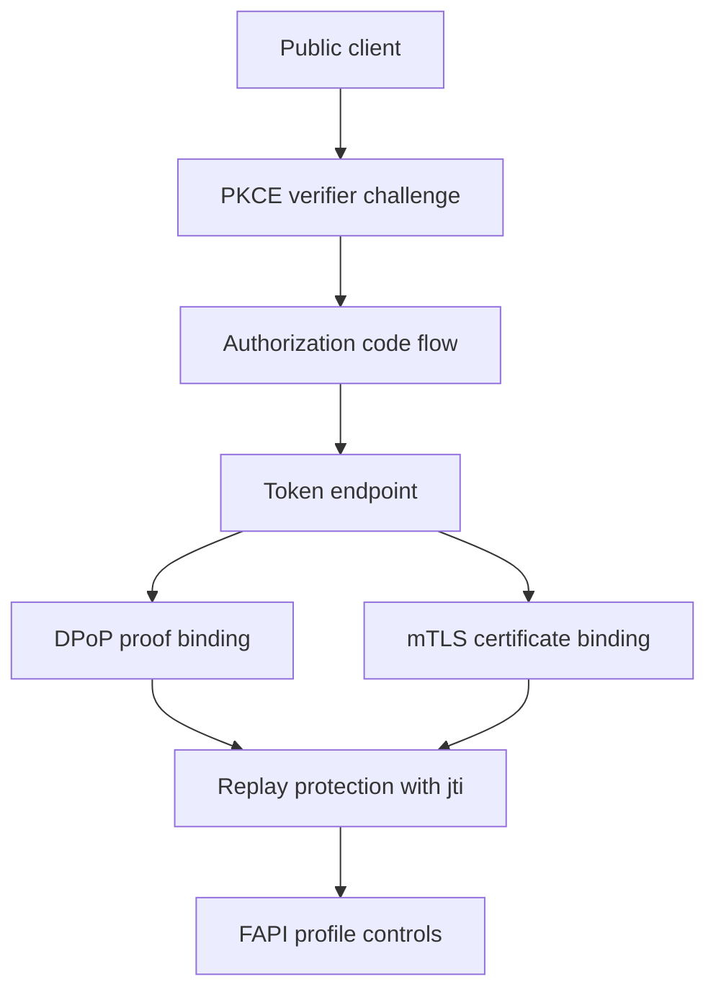

## 10.4 Production notes

**Common mistakes**

* Assuming PKCE alone protects access tokens after issuance.
* Terminating TLS where client cert identity is lost before enforcement.
* Implementing DPoP without nonce/replay storage strategy.

**Best practices**

* Use PKCE for every public client, no exceptions.
* Choose mTLS for server-to-server where certificate ops are mature; DPoP for app/mobile ergonomics.
* Adopt FAPI profile baselines for regulated/high-value APIs even outside banking when risk justifies.

**Security implications**

Sender-constrained tokens reduce replay impact but raise key-management obligations. Key custody and rotation quality become primary controls.

**Performance implications**

DPoP proof verification adds crypto per request; capacity models must include signature verification cost and nonce persistence.

## 10.5 Troubleshooting

* If DPoP failures spike, compare server clock skew and `htu/htm` normalization.
* If mTLS-bound token accepted without client cert, inspect proxy cert forwarding chain.
* If authorization code exchange fails, verify PKCE method and verifier encoding.

## 10.6 Common misconceptions

* PKCE is optional for modern apps.
* DPoP and mTLS are equivalent operationally.
* FAPI is only relevant to banks.

## 10.7 Interview questions (graded)

**Beginner**

- **Q:** What threat does PKCE primarily mitigate?
- **Expected answer:** Authorization code interception/replay by unauthorized client.

**Intermediate**

- **Q:** Why are sender-constrained tokens stronger than bearer tokens?
- **Expected answer:** Stolen token alone is insufficient without matching private key or certificate context.

**Senior**

- **Q:** How do you choose DPoP vs mTLS?
- **Expected answer:** By client type, cert lifecycle maturity, and gateway support constraints.

**Expert**

- **Q:** What additional telemetry is required for DPoP?
- **Expected answer:** Proof replay detection, key thumbprint drift, nonce issuance/validation metrics.

## 10.8 Summary

* Modern profiles address replay weaknesses in bearer-only designs.
* PKCE is baseline; sender constraints are defense-in-depth for high-value APIs.
* Operational key management is as important as protocol flags.
* FAPI controls improve both security and interoperability discipline.

## 10.9 References

* RFC 7636
* RFC 8705
* RFC 9449
* FAPI 1.0/2.0 profiles


# Chapter 11 — Internal architecture (Quarkus, Infinispan, JPA, providers)

> **Objectives of this chapter**
> Describe Keycloak runtime internals and subsystem interactions under load and failure.

## 11.1 Why this topic exists (before how)

Internal architecture (Quarkus, Infinispan, JPA, providers) is a recurring source of production risk because teams often optimize for initial setup speed and under-specify lifecycle controls. Senior-level design requires explicit boundaries, failure assumptions and ownership contracts before configuration work starts.

## 11.2 Core mechanisms and architecture decisions

* Quarkus runtime boot/profile behavior and impact on startup probes.
* Infinispan cache roles (sessions, login failures, keys) and invalidation semantics.
* JPA persistence hotspots: user queries, event tables, transaction boundaries.
* Provider SPI chain execution order during auth and token issuance.

## 11.3 Chapter schema

Schema 11.1 — Internal architecture (Quarkus, Infinispan, JPA, providers): control and runtime path

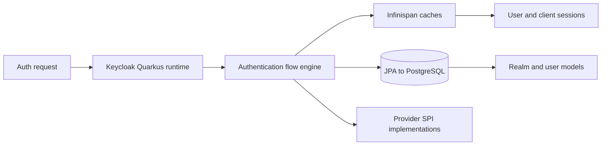

## 11.4 Production notes

**Common mistakes**

* Scaling pods without DB pool tuning.
* Ignoring cache mode when diagnosing cross-node session inconsistency.
* Custom provider code doing blocking remote calls on auth path.

**Best practices**

* Pin JVM/container limits with headroom validated by load tests.
* Separate DB indexes for event-heavy tables.
* Benchmark custom providers independently.

**Security implications**

Compromised provider code can bypass controls; sign and review custom jars like privileged code.

**Performance implications**

Hot caches can hide DB inefficiency until failover; monitor both cache hit rate and DB latency.

## 11.5 Troubleshooting

* If startup flaps, correlate readiness with DB migration/connectivity.
* If sessions disappear across nodes, inspect cache owners and sticky-session assumptions.
* If login is slow after customization, profile provider call graph.

## 11.6 Common misconceptions

* Keycloak internals do not matter if UI works.
* Infinispan is only a performance cache and not correctness-relevant.
* All SPIs are safe places for business logic.

## 11.7 Interview questions (graded)

**Beginner**

- **Q:** What is the primary goal of "Internal architecture (Quarkus, Infinispan, JPA, providers)" in a Keycloak platform?
- **Expected answer:** Focus on describe keycloak runtime internals and subsystem interactions under load and failure.

**Intermediate**

- **Q:** Which failure mode appears first when this area is misconfigured?
- **Expected answer:** Usually one of: Scaling pods without DB pool tuning.

**Senior**

- **Q:** What design trade-off do you document before rollout for Internal architecture (Quarkus, Infinispan, JPA, providers)?
- **Expected answer:** Document boundary ownership, rollback plan, and security vs latency trade-offs.

**Expert**

- **Q:** How do you prove this domain is production-ready under failure?
- **Expected answer:** By rehearsal with measurable SLO/security outcomes and audited control evidence.

## 11.8 Summary

* Internal architecture (Quarkus, Infinispan, JPA, providers) needs explicit control-plane decisions before runtime tuning.
* Failure modes are predictable and should be tested deliberately.
* Security and performance implications must be treated together.
* Interview-grade answers should combine mechanism detail and operational trade-offs.

## 11.9 References

* Keycloak Server Admin Guide
* Quarkus docs
* Infinispan docs
* Jakarta Persistence spec


# Chapter 12 — Realms, clients, roles, groups and client scopes

> **Objectives of this chapter**
> Model authorization structures that stay maintainable at enterprise scale.

## 12.1 Why this topic exists (before how)

Realms, clients, roles, groups and client scopes is a recurring source of production risk because teams often optimize for initial setup speed and under-specify lifecycle controls. Senior-level design requires explicit boundaries, failure assumptions and ownership contracts before configuration work starts.

## 12.2 Core mechanisms and architecture decisions

* Realm is security boundary; avoid mixing populations with different policy profiles.
* Client scopes govern claim release and token size discipline.
* Composite roles simplify admin UX but can hide privilege escalation paths.
* Groups should represent organization semantics; roles represent permissions.

## 12.3 Chapter schema

Schema 12.1 — Realms, clients, roles, groups and client scopes: control and runtime path

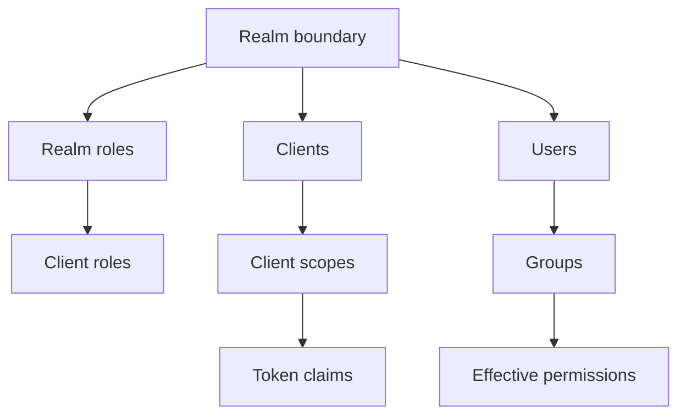

## 12.4 Production notes

**Common mistakes**

* Single mega-realm for workforce and CIAM.
* Granting realm-admin broadly for convenience.
* Pushing every attribute into access token.

**Best practices**

* Use per-domain realms with separate signing keys where needed.
* Define role taxonomy and naming convention early.
* Use default/optional scopes intentionally by client risk profile.

**Security implications**

Over-privileged composites create silent privilege creep; periodic entitlement review is required.

**Performance implications**

Token bloat from excessive roles/groups affects proxies and mobile clients.

## 12.5 Troubleshooting

* If permission seems inherited unexpectedly, inspect composite role graph.
* If token too large, trim default scopes and mapper output.
* If cross-app access leaks, verify client scope assignment boundaries.

## 12.6 Common misconceptions

* Groups and roles are interchangeable.
* Realm count should be minimized at all costs.
* More claims always improve downstream simplicity.

## 12.7 Interview questions (graded)

**Beginner**

- **Q:** What is the primary goal of "Realms, clients, roles, groups and client scopes" in a Keycloak platform?
- **Expected answer:** Focus on model authorization structures that stay maintainable at enterprise scale.

**Intermediate**

- **Q:** Which failure mode appears first when this area is misconfigured?
- **Expected answer:** Usually one of: Single mega-realm for workforce and CIAM.

**Senior**

- **Q:** What design trade-off do you document before rollout for Realms, clients, roles, groups and client scopes?
- **Expected answer:** Document boundary ownership, rollback plan, and security vs latency trade-offs.

**Expert**

- **Q:** How do you prove this domain is production-ready under failure?
- **Expected answer:** By rehearsal with measurable SLO/security outcomes and audited control evidence.

## 12.8 Summary

* Realms, clients, roles, groups and client scopes needs explicit control-plane decisions before runtime tuning.
* Failure modes are predictable and should be tested deliberately.
* Security and performance implications must be treated together.
* Interview-grade answers should combine mechanism detail and operational trade-offs.

## 12.9 References

* Keycloak docs on realms/clients
* OIDC Core 1.0
* RFC 8693
* SCIM RFC 7643


# Chapter 13 — Authentication flows, MFA, WebAuthn and step-up

> **Objectives of this chapter**
> Design adaptive authentication journeys with assurance-level controls.

## 13.1 Why this topic exists (before how)

Authentication flows, MFA, WebAuthn and step-up is a recurring source of production risk because teams often optimize for initial setup speed and under-specify lifecycle controls. Senior-level design requires explicit boundaries, failure assumptions and ownership contracts before configuration work starts.

## 13.2 Core mechanisms and architecture decisions

* Flow executions are ordered control gates; requirement level (REQUIRED/ALTERNATIVE/CONDITIONAL) changes semantics.
* WebAuthn offers phishing-resistant MFA with device-bound credentials.
* Step-up relies on requested context (`acr`) and flow branching.
* Recovery factors must be designed to avoid social-engineering bypass.

## 13.3 Chapter schema

Schema 13.1 — Authentication flows, MFA, WebAuthn and step-up: control and runtime path

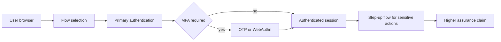

## 13.4 Production notes

**Common mistakes**

* MFA enrollment without recovery policy.
* Custom authenticators skipping brute-force protections.
* Using OTP as universal second factor without phishing risk consideration.

**Best practices**

* Use WebAuthn where supported, OTP fallback where necessary.
* Separate enrollment flow from login flow with explicit assurance transitions.
* Audit factor reset operations as high-risk admin events.

**Security implications**

Account recovery is often the weakest link; strict identity proofing for reset is mandatory.

**Performance implications**

Complex flows increase latency; keep remote dependencies outside critical authenticator steps.

## 13.5 Troubleshooting

* If step-up not triggered, inspect client `acr_values` and flow binding.
* If WebAuthn fails on specific browsers, inspect RP ID/origin configuration.
* If MFA prompts loop, inspect execution requirement and cookie/session continuity.

## 13.6 Common misconceptions

* Any MFA equals high assurance.
* WebAuthn removes need for fallback planning.
* Step-up can be done only in application code.

## 13.7 Interview questions (graded)

**Beginner**

- **Q:** What is the primary goal of "Authentication flows, MFA, WebAuthn and step-up" in a Keycloak platform?
- **Expected answer:** Focus on design adaptive authentication journeys with assurance-level controls.

**Intermediate**

- **Q:** Which failure mode appears first when this area is misconfigured?
- **Expected answer:** Usually one of: MFA enrollment without recovery policy.

**Senior**

- **Q:** What design trade-off do you document before rollout for Authentication flows, MFA, WebAuthn and step-up?
- **Expected answer:** Document boundary ownership, rollback plan, and security vs latency trade-offs.

**Expert**

- **Q:** How do you prove this domain is production-ready under failure?
- **Expected answer:** By rehearsal with measurable SLO/security outcomes and audited control evidence.

## 13.8 Summary

* Authentication flows, MFA, WebAuthn and step-up needs explicit control-plane decisions before runtime tuning.
* Failure modes are predictable and should be tested deliberately.
* Security and performance implications must be treated together.
* Interview-grade answers should combine mechanism detail and operational trade-offs.

## 13.9 References

* WebAuthn Level 2
* NIST SP 800-63B
* OIDC Core acr/amr
* FIDO2 CTAP


# Chapter 14 — User federation: LDAP, Active Directory, custom stores

> **Objectives of this chapter**
> Integrate external identity stores with clear ownership and sync semantics.

## 14.1 Why this topic exists (before how)

User federation: LDAP, Active Directory, custom stores is a recurring source of production risk because teams often optimize for initial setup speed and under-specify lifecycle controls. Senior-level design requires explicit boundaries, failure assumptions and ownership contracts before configuration work starts.

## 14.2 Core mechanisms and architecture decisions

* Federation modes: import, read-only, unsynced; each changes consistency and outage behavior.
* Mapper strategy controls canonical username/email/group projection.
* Custom user storage providers introduce bespoke latency and failure domains.
* Sync direction must respect authoritative source ownership.

## 14.3 Chapter schema

Schema 14.1 — User federation: LDAP, Active Directory, custom stores: control and runtime path

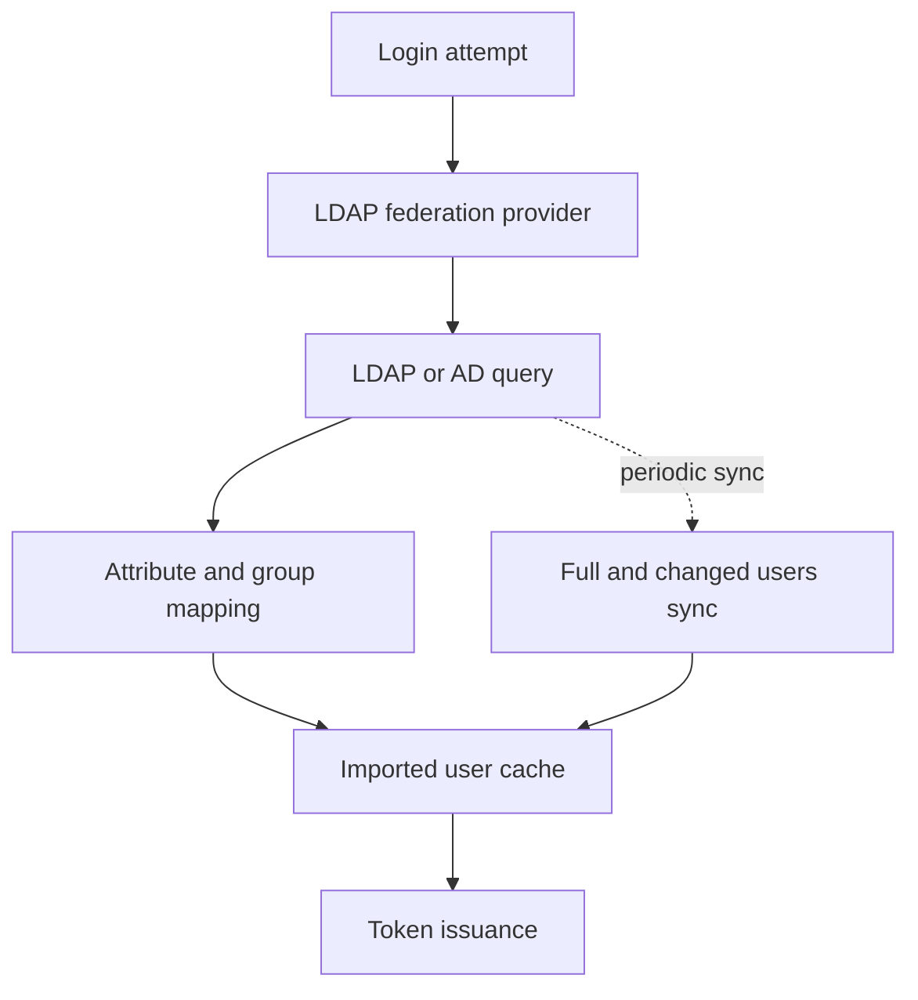

## 14.4 Production notes

**Common mistakes**

* Enabling write-back without data stewardship agreement.
* Assuming LDAP and Keycloak password policies are automatically aligned.
* Large full sync during business hours.

**Best practices**

* Run incremental sync windows and monitor drift metrics.
* Define conflict resolution for renamed users and duplicate identifiers.
* Load-test external store timeout behavior.

**Security implications**

Custom store connectors can become privileged backdoors; enforce secure coding and secret storage.

**Performance implications**

External directory latency propagates to login path unless cached thoughtfully.

## 14.5 Troubleshooting

* If users disappear, inspect filter/base DN changes.
* If updates are lost, inspect edit mode and mapper write flags.
* If login spikes timeout, inspect connection pool and directory limits.

## 14.6 Common misconceptions

* Federation means no lifecycle governance needed.
* Import mode and live mode have same risk profile.
* Custom store plugins are low-impact glue code.

## 14.7 Interview questions (graded)

**Beginner**

- **Q:** What is the primary goal of "User federation: LDAP, Active Directory, custom stores" in a Keycloak platform?
- **Expected answer:** Focus on integrate external identity stores with clear ownership and sync semantics.

**Intermediate**

- **Q:** Which failure mode appears first when this area is misconfigured?
- **Expected answer:** Usually one of: Enabling write-back without data stewardship agreement.

**Senior**

- **Q:** What design trade-off do you document before rollout for User federation: LDAP, Active Directory, custom stores?
- **Expected answer:** Document boundary ownership, rollback plan, and security vs latency trade-offs.

**Expert**

- **Q:** How do you prove this domain is production-ready under failure?
- **Expected answer:** By rehearsal with measurable SLO/security outcomes and audited control evidence.

## 14.8 Summary

* User federation: LDAP, Active Directory, custom stores needs explicit control-plane decisions before runtime tuning.
* Failure modes are predictable and should be tested deliberately.
* Security and performance implications must be treated together.
* Interview-grade answers should combine mechanism detail and operational trade-offs.

## 14.9 References

* RFC 4511
* RFC 4513
* MS-ADTS
* SCIM RFC 7644


# Chapter 15 — Identity brokering and multi-tenancy

> **Objectives of this chapter**
> Operate multiple trust domains and tenant boundaries safely.

## 15.1 Why this topic exists (before how)

Identity brokering and multi-tenancy is a recurring source of production risk because teams often optimize for initial setup speed and under-specify lifecycle controls. Senior-level design requires explicit boundaries, failure assumptions and ownership contracts before configuration work starts.

## 15.2 Core mechanisms and architecture decisions

* Identity brokering translates external IdP assertions to local identity model.
* Account linking policy (first-login flow) defines takeover risk.
* Tenant isolation can be realm-based, cluster-based, or hybrid depending risk.
* Per-tenant branding and policy must not weaken shared security baselines.

## 15.3 Chapter schema

Schema 15.1 — Identity brokering and multi-tenancy: control and runtime path

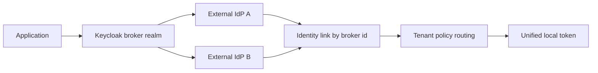

## 15.4 Production notes

**Common mistakes**

* Auto-linking accounts by email without verification.
* Shared admin roles across tenants.
* Single signing key for tenants with different compliance tiers.

**Best practices**

* Use immutable upstream subject for linking when available.
* Isolate high-risk tenants by realm and optionally infrastructure.
* Template broker configs via code to avoid manual drift.

**Security implications**

Broker trust misconfiguration can import fraudulent identities; strict issuer and signature checks are required.

**Performance implications**

Many upstream IdPs increase metadata and key-refresh overhead.

## 15.5 Troubleshooting

* If wrong account linked, inspect first-login flow and mapper precedence.
* If one tenant impacts another, inspect cache/key/admin boundary leakage.
* If broker login fails after upstream change, inspect metadata/issuer mismatch.

## 15.6 Common misconceptions

* Multi-tenancy is mostly UI theming.
* Brokered identity is equal assurance by default.
* Email is always a stable global key.

## 15.7 Interview questions (graded)

**Beginner**

- **Q:** What is the primary goal of "Identity brokering and multi-tenancy" in a Keycloak platform?
- **Expected answer:** Focus on operate multiple trust domains and tenant boundaries safely.

**Intermediate**

- **Q:** Which failure mode appears first when this area is misconfigured?
- **Expected answer:** Usually one of: Auto-linking accounts by email without verification.

**Senior**

- **Q:** What design trade-off do you document before rollout for Identity brokering and multi-tenancy?
- **Expected answer:** Document boundary ownership, rollback plan, and security vs latency trade-offs.

**Expert**

- **Q:** How do you prove this domain is production-ready under failure?
- **Expected answer:** By rehearsal with measurable SLO/security outcomes and audited control evidence.

## 15.8 Summary

* Identity brokering and multi-tenancy needs explicit control-plane decisions before runtime tuning.
* Failure modes are predictable and should be tested deliberately.
* Security and performance implications must be treated together.
* Interview-grade answers should combine mechanism detail and operational trade-offs.

## 15.9 References

* OIDC Federation draft
* SAML metadata profiles
* RFC 8707
* Keycloak broker docs


# Chapter 16 — Authorization Services (ABAC, UMA 2.0) and external policy engines

> **Objectives of this chapter**
> Implement fine-grained policy decisions and delegation patterns.

## 16.1 Why this topic exists (before how)

Authorization Services (ABAC, UMA 2.0) and external policy engines is a recurring source of production risk because teams often optimize for initial setup speed and under-specify lifecycle controls. Senior-level design requires explicit boundaries, failure assumptions and ownership contracts before configuration work starts.

## 16.2 Core mechanisms and architecture decisions

* Keycloak Authorization Services model resources, scopes, policies, permissions.
* UMA 2.0 enables resource-owner driven sharing and consent-like delegation.
* External PDP (OPA/XACML) helps unify policy across products.
* Decision input quality (subject/action/resource/context) determines policy quality.

## 16.3 Chapter schema

Schema 16.1 — Authorization Services (ABAC, UMA 2.0) and external policy engines: control and runtime path

```mermaid
flowchart TB
    User[Resource owner] --> PEP[Policy enforcement point]
    PEP --> KeycloakAuthz[Keycloak authorization services]
    KeycloakAuthz --> PDP[Policy decision point]
    PDP --> UMA[UMA permission ticket and RPT]
    PDP --> ExternalPDP[External PDP optional]
    ExternalPDP --> PDP
    UMA --> PEP
    PEP --> API[Protected API decision]
```

## 16.4 Production notes

**Common mistakes**

* Hard-coding resource IDs inside policies without lifecycle process.
* Combining role and attribute policies without test coverage.
* Returning permit on PDP errors for availability.

**Best practices**

* Version policies and test with scenario matrix.
* Default to deny on decision ambiguity.
* Log decision context for forensic replay.

**Security implications**

Policy engines can unintentionally leak sensitive attributes in decision logs; sanitize context payloads.

**Performance implications**

Fine-grained policy calls add latency; cache where correctness permits.

## 16.5 Troubleshooting

* If permit/deny seems random, replay exact input context against policy version.
* If UMA sharing fails, inspect permission ticket flow.
* If external PDP times out, inspect fallback mode and circuit breakers.

## 16.6 Common misconceptions

* ABAC replaces need for RBAC.
* Policy engine uptime is less critical than IdP uptime.
* Authorization logs are optional.

## 16.7 Interview questions (graded)

**Beginner**

- **Q:** What is the primary goal of "Authorization Services (ABAC, UMA 2.0) and external policy engines" in a Keycloak platform?
- **Expected answer:** Focus on implement fine-grained policy decisions and delegation patterns.

**Intermediate**

- **Q:** Which failure mode appears first when this area is misconfigured?
- **Expected answer:** Usually one of: Hard-coding resource IDs inside policies without lifecycle process.

**Senior**

- **Q:** What design trade-off do you document before rollout for Authorization Services (ABAC, UMA 2.0) and external policy engines?
- **Expected answer:** Document boundary ownership, rollback plan, and security vs latency trade-offs.

**Expert**

- **Q:** How do you prove this domain is production-ready under failure?
- **Expected answer:** By rehearsal with measurable SLO/security outcomes and audited control evidence.

## 16.8 Summary

* Authorization Services (ABAC, UMA 2.0) and external policy engines needs explicit control-plane decisions before runtime tuning.
* Failure modes are predictable and should be tested deliberately.
* Security and performance implications must be treated together.
* Interview-grade answers should combine mechanism detail and operational trade-offs.

## 16.9 References

* UMA 2.0
* RFC 7662
* XACML 3.0
* OPA docs


# Chapter 17 — Deployment on RHEL, containers, Kubernetes and OpenShift

> **Objectives of this chapter**
> Select deployment patterns aligned to reliability and security operations.

## 17.1 Why this topic exists (before how)

Deployment on RHEL, containers, Kubernetes and OpenShift is a recurring source of production risk because teams often optimize for initial setup speed and under-specify lifecycle controls. Senior-level design requires explicit boundaries, failure assumptions and ownership contracts before configuration work starts.

## 17.2 Core mechanisms and architecture decisions

* Runtime packaging affects patching velocity and operational consistency.
* Kubernetes/OpenShift deployment requires probes, resource limits, and secret integration.
* RHEL/bare-metal installs may fit strict environments with established ops controls.
* PostgreSQL placement and network topology directly impact auth latency.

## 17.3 Chapter schema

Schema 17.1 — Deployment on RHEL, containers, Kubernetes and OpenShift: control and runtime path

```mermaid
flowchart LR
    GitOps[Configuration repository] --> Image[Hardened Keycloak image]
    Image --> Cluster[Kubernetes or OpenShift]
    Cluster --> Pods[Keycloak pods]
    Pods --> Database[(External PostgreSQL)]
    Ingress[Ingress or Route TLS] --> Pods
    Secrets[Secret manager integration] --> Pods
```

## 17.4 Production notes

**Common mistakes**

* Running with ephemeral DB in production-like envs.
* No liveness/readiness distinction causing restart storms.
* Secrets mounted with excessive file permissions.

**Best practices**

* Use immutable images and signed supply chain.
* Separate startup, readiness and liveness probe thresholds.
* Externalize secrets to platform-native secure stores.

**Security implications**

Container image provenance and runtime privileges are major attack surfaces.

**Performance implications**

Cold starts and JVM warm-up can distort autoscaling decisions.

## 17.5 Troubleshooting

* If rollout stalls, inspect readiness deps (DB, cache, DNS).
* If pods OOM, inspect heap vs container limits.
* If TLS fails after ingress change, inspect trust/termination chain.

## 17.6 Common misconceptions

* Kubernetes deployment automatically equals HA.
* One Helm chart works unchanged for all environments.
* Container restarts are harmless noise.

## 17.7 Interview questions (graded)

**Beginner**

- **Q:** What is the primary goal of "Deployment on RHEL, containers, Kubernetes and OpenShift" in a Keycloak platform?
- **Expected answer:** Focus on select deployment patterns aligned to reliability and security operations.

**Intermediate**

- **Q:** Which failure mode appears first when this area is misconfigured?
- **Expected answer:** Usually one of: Running with ephemeral DB in production-like envs.

**Senior**

- **Q:** What design trade-off do you document before rollout for Deployment on RHEL, containers, Kubernetes and OpenShift?
- **Expected answer:** Document boundary ownership, rollback plan, and security vs latency trade-offs.

**Expert**

- **Q:** How do you prove this domain is production-ready under failure?
- **Expected answer:** By rehearsal with measurable SLO/security outcomes and audited control evidence.

## 17.8 Summary

* Deployment on RHEL, containers, Kubernetes and OpenShift needs explicit control-plane decisions before runtime tuning.
* Failure modes are predictable and should be tested deliberately.
* Security and performance implications must be treated together.
* Interview-grade answers should combine mechanism detail and operational trade-offs.

## 17.9 References

* Kubernetes docs
* OpenShift docs
* OCI image spec
* CIS benchmarks


# Chapter 18 — High availability, clustering and multi-site

> **Objectives of this chapter**
> Engineer resilience across node, zone and site failures.

## 18.1 Why this topic exists (before how)

High availability, clustering and multi-site is a recurring source of production risk because teams often optimize for initial setup speed and under-specify lifecycle controls. Senior-level design requires explicit boundaries, failure assumptions and ownership contracts before configuration work starts.

## 18.2 Core mechanisms and architecture decisions

* HA requires redundancy in app, cache, DB, and network planes.
* Session replication strategy and sticky sessions influence failover behavior.
* Multi-site adds consistency/latency trade-offs beyond single-cluster HA.
* RTO/RPO objectives must map to technical controls and tested runbooks.

## 18.3 Chapter schema

Schema 18.1 — High availability, clustering and multi-site: control and runtime path

```mermaid
flowchart TD
    SiteA[Site A] --> LBA[Local load balancer]
    SiteB[Site B] --> LBB[Local load balancer]
    LBA --> NodeA1[Node A1]
    LBA --> NodeA2[Node A2]
    LBB --> NodeB1[Node B1]
    LBB --> NodeB2[Node B2]
    NodeA1 <--> CacheA[(Infinispan site A)]
    NodeB1 <--> CacheB[(Infinispan site B)]
    CacheA <--> XSite[x-site replication]
    XSite <--> CacheB
```

## 18.4 Production notes

**Common mistakes**

* Active-active without data-conflict strategy.
* Assuming DB failover is instantaneous and transparent.
* Skipping regional disaster game-days.

**Best practices**

* Define failure domains and quorum assumptions explicitly.
* Test zone and site failovers with synthetic auth traffic.
* Keep key material replicated with secure controls.

**Security implications**

Failover paths can bypass hardened routes if not tested (e.g., emergency endpoints).

**Performance implications**

Cross-site replication can add write latency and stale-read windows.

## 18.5 Troubleshooting

* If failover works for app but not login, inspect cache/session persistence.
* If split-brain symptoms appear, inspect cluster membership/quorum events.
* If DR restore works but tokens fail, inspect signing key continuity.

## 18.6 Common misconceptions

* More nodes always mean more availability.
* HA is complete when pods run in two zones.
* DR backups alone prove resilience.

## 18.7 Interview questions (graded)

**Beginner**

- **Q:** What is the primary goal of "High availability, clustering and multi-site" in a Keycloak platform?
- **Expected answer:** Focus on engineer resilience across node, zone and site failures.

**Intermediate**

- **Q:** Which failure mode appears first when this area is misconfigured?
- **Expected answer:** Usually one of: Active-active without data-conflict strategy.

**Senior**

- **Q:** What design trade-off do you document before rollout for High availability, clustering and multi-site?
- **Expected answer:** Document boundary ownership, rollback plan, and security vs latency trade-offs.

**Expert**

- **Q:** How do you prove this domain is production-ready under failure?
- **Expected answer:** By rehearsal with measurable SLO/security outcomes and audited control evidence.

## 18.8 Summary

* High availability, clustering and multi-site needs explicit control-plane decisions before runtime tuning.
* Failure modes are predictable and should be tested deliberately.
* Security and performance implications must be treated together.
* Interview-grade answers should combine mechanism detail and operational trade-offs.

## 18.9 References

* Infinispan cross-site docs
* PostgreSQL HA docs
* NIST SP 800-34
* Keycloak HA guidance


# Chapter 19 — Reverse proxies and API Gateways

> **Objectives of this chapter**
> Enforce token, transport and routing policy at the edge.

## 19.1 Why this topic exists (before how)

Reverse proxies and API Gateways is a recurring source of production risk because teams often optimize for initial setup speed and under-specify lifecycle controls. Senior-level design requires explicit boundaries, failure assumptions and ownership contracts before configuration work starts.

## 19.2 Core mechanisms and architecture decisions

* Proxy is trust boundary: TLS termination, header normalization, path routing.
* Gateway often performs token validation and coarse authorization before service hop.
* Forwarded headers must be strictly controlled to prevent spoofing.
* mTLS between gateway and backend protects east-west identity context.

## 19.3 Chapter schema

Schema 19.1 — Reverse proxies and API Gateways: control and runtime path

```mermaid
flowchart LR
    Client[Browser or API client] --> Gateway[Reverse proxy or API gateway]
    Gateway --> TLS[TLS termination or passthrough]
    TLS --> HeaderPolicy[Forwarded header policy]
    HeaderPolicy --> Keycloak[Keycloak endpoints]
    Gateway --> WAF[WAF and rate limiting]
    WAF --> Keycloak
    Keycloak --> Tokens[Token operations]
```

## 19.4 Production notes

**Common mistakes**

* Trusting client-supplied forwarded headers.
* Permissive CORS exposing tokens to wrong origins.
* Proxy buffering config breaking large SAML/OIDC payloads.

**Best practices**

* Normalize and overwrite forwarded headers at edge.
* Enforce strict upstream TLS and cert validation.
* Implement explicit route-level auth policy.

**Security implications**

Header spoofing and misrouted auth bypass are common proxy-layer vulnerabilities.

**Performance implications**

JWT verification at gateway adds CPU cost but reduces backend duplication.

## 19.5 Troubleshooting

* If backend sees wrong user identity, inspect header transform rules.
* If intermittent 401 behind proxy, inspect clock drift and JWKS cache.
* If redirects break, inspect `X-Forwarded-Proto/Host` consistency.

## 19.6 Common misconceptions

* Gateway is only for routing.
* TLS termination at edge means backend channel can be plain HTTP safely.
* CORS is frontend-only concern.

## 19.7 Interview questions (graded)

**Beginner**

- **Q:** What is the primary goal of "Reverse proxies and API Gateways" in a Keycloak platform?
- **Expected answer:** Focus on enforce token, transport and routing policy at the edge.

**Intermediate**

- **Q:** Which failure mode appears first when this area is misconfigured?
- **Expected answer:** Usually one of: Trusting client-supplied forwarded headers.

**Senior**

- **Q:** What design trade-off do you document before rollout for Reverse proxies and API Gateways?
- **Expected answer:** Document boundary ownership, rollback plan, and security vs latency trade-offs.

**Expert**

- **Q:** How do you prove this domain is production-ready under failure?
- **Expected answer:** By rehearsal with measurable SLO/security outcomes and audited control evidence.

## 19.8 Summary

* Reverse proxies and API Gateways needs explicit control-plane decisions before runtime tuning.
* Failure modes are predictable and should be tested deliberately.
* Security and performance implications must be treated together.
* Interview-grade answers should combine mechanism detail and operational trade-offs.

## 19.9 References

* RFC 9110
* RFC 7239
* OWASP ASVS
* RFC 8705


# Chapter 20 — Performance, tuning and capacity planning

> **Objectives of this chapter**
> Predict and tune IAM throughput under burst and steady-state load.

## 20.1 Why this topic exists (before how)

Performance, tuning and capacity planning is a recurring source of production risk because teams often optimize for initial setup speed and under-specify lifecycle controls. Senior-level design requires explicit boundaries, failure assumptions and ownership contracts before configuration work starts.

## 20.2 Core mechanisms and architecture decisions

* Capacity starts from peak login and refresh rates, not daily average.
* Bottlenecks commonly lie in DB pool, cache misses, LDAP round-trips, and cryptographic operations.
* Token/session TTL choices alter endpoint mix and load profile.
* Performance engineering needs reproducible workload models.

## 20.3 Chapter schema

Schema 20.1 — Performance, tuning and capacity planning: control and runtime path

```mermaid
flowchart TD
    Load[Concurrent login load] --> Metrics[P95 latency and errors]
    Metrics --> Bottleneck{Primary bottleneck}
    Bottleneck -->|Database| DBTune[Index and pool tuning]
    Bottleneck -->|Cache| CacheTune[Topology and eviction tuning]
    Bottleneck -->|Compute| JVMTune[JVM and GC tuning]
    DBTune --> Capacity[Capacity model and headroom]
    CacheTune --> Capacity
    JVMTune --> Capacity
```

## 20.4 Production notes

**Common mistakes**

* Running load tests with unrealistic single-user loops.
* Tuning JVM without measuring DB contention.
* Ignoring client retry storms during partial outages.

**Best practices**

* Model multiple traffic classes: interactive login, refresh, token introspection, admin API.
* Set SLOs and alert on saturation leading indicators.
* Use backoff and rate-limits for abusive clients.

**Security implications**

Performance degradation can become security issue when teams disable validation checks under pressure—never trade core checks for throughput blindly.

**Performance implications**

CPU-heavy signature checks and DB I/O contention require different scaling levers.

## 20.5 Troubleshooting

* If p95 login spikes, split timings by external IdP/LDAP/DB.
* If token endpoint saturates, inspect refresh churn and client behavior.
* If throughput drops after scale-out, inspect cache affinity/network overhead.

## 20.6 Common misconceptions

* Autoscaling alone solves IAM performance.
* Shorter token TTL is always safer with no cost.
* Only Keycloak metrics matter for tuning.

## 20.7 Interview questions (graded)

**Beginner**

- **Q:** What is the primary goal of "Performance, tuning and capacity planning" in a Keycloak platform?
- **Expected answer:** Focus on predict and tune iam throughput under burst and steady-state load.

**Intermediate**

- **Q:** Which failure mode appears first when this area is misconfigured?
- **Expected answer:** Usually one of: Running load tests with unrealistic single-user loops.

**Senior**

- **Q:** What design trade-off do you document before rollout for Performance, tuning and capacity planning?
- **Expected answer:** Document boundary ownership, rollback plan, and security vs latency trade-offs.

**Expert**

- **Q:** How do you prove this domain is production-ready under failure?
- **Expected answer:** By rehearsal with measurable SLO/security outcomes and audited control evidence.

## 20.8 Summary

* Performance, tuning and capacity planning needs explicit control-plane decisions before runtime tuning.
* Failure modes are predictable and should be tested deliberately.
* Security and performance implications must be treated together.
* Interview-grade answers should combine mechanism detail and operational trade-offs.

## 20.9 References

* SRE Workbook
* PostgreSQL performance docs
* JVM tuning docs
* Little's Law


# Chapter 21 — Observability, auditing and SIEM integration

> **Objectives of this chapter**
> Build forensic-grade visibility across auth and admin events.

## 21.1 Why this topic exists (before how)

Observability, auditing and SIEM integration is a recurring source of production risk because teams often optimize for initial setup speed and under-specify lifecycle controls. Senior-level design requires explicit boundaries, failure assumptions and ownership contracts before configuration work starts.

## 21.2 Core mechanisms and architecture decisions

* Identity observability must connect user action to policy decision and backend result.
* Admin events and auth events need retention and tamper-evident transport.
* SIEM correlation rules should detect brute force, impossible travel, token abuse, and admin anomalies.
* Metrics, logs, and traces each serve different incident questions.

## 21.3 Chapter schema

Schema 21.1 — Observability, auditing and SIEM integration: control and runtime path

```mermaid
flowchart LR
    AuthEvents[Authentication events] --> Pipeline[Telemetry pipeline]
    AdminEvents[Admin events] --> Pipeline
    Logs[Runtime logs] --> Pipeline
    Metrics[Prometheus metrics] --> Dashboards[Grafana dashboards]
    Pipeline --> SIEM[SIEM correlation]
    SIEM --> Alerts[Security and ops alerts]
    Alerts --> Response[Incident response]
```

## 21.4 Production notes

**Common mistakes**

* Collecting logs without normalized fields.
* Dropping failed auth details due to volume.
* No separation between audit retention and debug retention.

**Best practices**

* Define canonical event schema and correlation IDs.
* Ship security-relevant events near real time.
* Test SIEM detection rules with attack simulations.

**Security implications**

Audit log integrity is compliance-critical; protect pipeline against truncation and unauthorized edits.

**Performance implications**

Overly verbose logging can hurt throughput and storage; sample non-critical debug paths.

## 21.5 Troubleshooting

* If SIEM misses brute-force event, inspect parser and field mapping.
* If event lag increases, inspect queue backpressure.
* If investigators cannot reconstruct timeline, enforce request ID propagation.

## 21.6 Common misconceptions

* Metrics can replace audit logs.
* If no alerts fired, no security issue happened.
* Retention policy is purely storage decision.

## 21.7 Interview questions (graded)

**Beginner**

- **Q:** What is the primary goal of "Observability, auditing and SIEM integration" in a Keycloak platform?
- **Expected answer:** Focus on build forensic-grade visibility across auth and admin events.

**Intermediate**

- **Q:** Which failure mode appears first when this area is misconfigured?
- **Expected answer:** Usually one of: Collecting logs without normalized fields.

**Senior**

- **Q:** What design trade-off do you document before rollout for Observability, auditing and SIEM integration?
- **Expected answer:** Document boundary ownership, rollback plan, and security vs latency trade-offs.

**Expert**

- **Q:** How do you prove this domain is production-ready under failure?
- **Expected answer:** By rehearsal with measurable SLO/security outcomes and audited control evidence.

## 21.8 Summary

* Observability, auditing and SIEM integration needs explicit control-plane decisions before runtime tuning.
* Failure modes are predictable and should be tested deliberately.
* Security and performance implications must be treated together.
* Interview-grade answers should combine mechanism detail and operational trade-offs.

## 21.9 References

* OpenTelemetry spec
* RFC 5424
* NIST 800-92
* MITRE ATT&CK


# Chapter 22 — Upgrades, backup and disaster recovery

> **Objectives of this chapter**
> Upgrade and recover without breaking trust continuity.

## 22.1 Why this topic exists (before how)

Upgrades, backup and disaster recovery is a recurring source of production risk because teams often optimize for initial setup speed and under-specify lifecycle controls. Senior-level design requires explicit boundaries, failure assumptions and ownership contracts before configuration work starts.

## 22.2 Core mechanisms and architecture decisions

* Upgrades change binaries, schema, configs, and trust artifacts simultaneously.
* Backup strategy must include DB, realm config, keys, and integration metadata.
* DR is proven only by restore and replay drills.
* Version compatibility windows influence rollback feasibility.

## 22.3 Chapter schema

Schema 22.1 — Upgrades, backup and disaster recovery: control and runtime path

```mermaid
flowchart TD
    Current[Current cluster] --> Backup[Backup and export]
    Backup --> Rehearsal[Restore rehearsal]
    Rehearsal --> Upgrade[Version upgrade]
    Upgrade --> Smoke[Protocol smoke tests]
    Smoke --> Cutover[Production cutover]
    Cutover --> Observe[Post-upgrade monitoring]
    Observe --> Decision{Rollback required}
    Decision -->|yes| Restore[Restore validated backup]
    Decision -->|no| Close[Close maintenance window]
```

## 22.4 Production notes

**Common mistakes**

* Upgrading directly across unsupported version jumps.
* Backing up DB but not externalized keys/certs.
* No rehearsal for rollback after schema migration.

**Best practices**

* Use staged upgrade environments with production-like traffic.
* Version-control realm exports and migration notes.
* Define DR runbooks with role assignments and timing targets.

**Security implications**

Backup archives may contain sensitive identity data and keys; encrypt and control access strictly.

**Performance implications**

Restore validation adds controlled overhead but prevents false confidence.

## 22.5 Troubleshooting

* If post-upgrade logins fail, inspect provider/API compatibility and schema migration logs.
* If restore succeeds but SSO breaks, inspect client secrets/redirect metadata drift.
* If rollback impossible, inspect irreversible migration steps done prematurely.

## 22.6 Common misconceptions

* A successful backup job equals recoverability.
* Minor version upgrades are risk-free for IAM.
* DR planning can wait until after go-live.

## 22.7 Interview questions (graded)

**Beginner**

- **Q:** What is the primary goal of "Upgrades, backup and disaster recovery" in a Keycloak platform?
- **Expected answer:** Focus on upgrade and recover without breaking trust continuity.

**Intermediate**

- **Q:** Which failure mode appears first when this area is misconfigured?
- **Expected answer:** Usually one of: Upgrading directly across unsupported version jumps.

**Senior**

- **Q:** What design trade-off do you document before rollout for Upgrades, backup and disaster recovery?
- **Expected answer:** Document boundary ownership, rollback plan, and security vs latency trade-offs.

**Expert**

- **Q:** How do you prove this domain is production-ready under failure?
- **Expected answer:** By rehearsal with measurable SLO/security outcomes and audited control evidence.

## 22.8 Summary

* Upgrades, backup and disaster recovery needs explicit control-plane decisions before runtime tuning.
* Failure modes are predictable and should be tested deliberately.
* Security and performance implications must be treated together.
* Interview-grade answers should combine mechanism detail and operational trade-offs.

## 22.9 References

* Keycloak upgrade guide
* NIST SP 800-34
* PostgreSQL backup docs
* Semantic Versioning


# Chapter 23 — Extending Keycloak: SPIs, custom providers, themes

> **Objectives of this chapter**
> Customize safely while preserving upgradeability.

## 23.1 Why this topic exists (before how)

Extending Keycloak: SPIs, custom providers, themes is a recurring source of production risk because teams often optimize for initial setup speed and under-specify lifecycle controls. Senior-level design requires explicit boundaries, failure assumptions and ownership contracts before configuration work starts.

## 23.2 Core mechanisms and architecture decisions

* SPIs allow extension at authentication, user storage, events, and protocol mappers.
* Theme customization impacts UX and security signaling (trusted origin cues).
* Custom providers must track Keycloak API evolution across upgrades.
* Extension boundaries should minimize coupling to internal classes.

## 23.3 Chapter schema

Schema 23.1 — Extending Keycloak: SPIs, custom providers, themes: control and runtime path

```mermaid
flowchart LR
    SPI[Provider SPI contract] --> CustomCode[Custom provider implementation]
    CustomCode --> Build[Build and package]
    Build --> Deploy[Deploy provider artifact]
    Deploy --> Register[Enable in realm config]
    Register --> Runtime[Flow execution]
    Runtime --> Monitoring[Metrics and logs]
```

## 23.4 Production notes

**Common mistakes**

* Embedding business-critical remote calls in authenticator without timeout control.
* Copy-pasting old SPI examples across major versions.
* Theme customizations that hide security warnings or consent context.

**Best practices**

* Keep custom provider surface minimal and well-tested.
* Use contract tests per Keycloak version upgrade.
* Treat themes as security-sensitive UI artifacts.

**Security implications**

Custom code runs in IdP trust boundary; supply-chain and code-review rigor must match core platform controls.

**Performance implications**

Poorly optimized providers can dominate auth latency more than base Keycloak.

## 23.5 Troubleshooting

* If provider not loaded, inspect module packaging and SPI registration files.
* If login errors after upgrade, inspect binary/API compatibility matrix.
* If UI regressions affect consent/login, compare theme templates against upstream changes.

## 23.6 Common misconceptions

* SPIs are plug-and-play with low maintenance cost.
* Themes are cosmetic only.
* Custom code can skip security review because it is internal.

## 23.7 Interview questions (graded)

**Beginner**

- **Q:** What is the primary goal of "Extending Keycloak: SPIs, custom providers, themes" in a Keycloak platform?
- **Expected answer:** Focus on customize safely while preserving upgradeability.

**Intermediate**

- **Q:** Which failure mode appears first when this area is misconfigured?
- **Expected answer:** Usually one of: Embedding business-critical remote calls in authenticator without timeout control.

**Senior**

- **Q:** What design trade-off do you document before rollout for Extending Keycloak: SPIs, custom providers, themes?
- **Expected answer:** Document boundary ownership, rollback plan, and security vs latency trade-offs.

**Expert**

- **Q:** How do you prove this domain is production-ready under failure?
- **Expected answer:** By rehearsal with measurable SLO/security outcomes and audited control evidence.

## 23.8 Summary

* Extending Keycloak: SPIs, custom providers, themes needs explicit control-plane decisions before runtime tuning.
* Failure modes are predictable and should be tested deliberately.
* Security and performance implications must be treated together.
* Interview-grade answers should combine mechanism detail and operational trade-offs.

## 23.9 References

* Keycloak SPI docs
* Quarkus extension model
* OWASP ASVS
* Jakarta EE patterns


# Chapter 24 — Configuration as code: Admin CLI, Terraform, Ansible, Operator

> **Objectives of this chapter**
> Manage Keycloak state declaratively with drift control.

## 24.1 Why this topic exists (before how)

Configuration as code: Admin CLI, Terraform, Ansible, Operator is a recurring source of production risk because teams often optimize for initial setup speed and under-specify lifecycle controls. Senior-level design requires explicit boundaries, failure assumptions and ownership contracts before configuration work starts.

## 24.2 Core mechanisms and architecture decisions

* Config-as-code enables repeatability, reviewability, and drift control.
* Different tools fit layers: `kcadm` for imperative tasks, Terraform for desired state, Operator for Kubernetes-native lifecycle.
* Idempotency and import-order rules decide reliability.
* State reconciliation must account for manual console edits.

## 24.3 Chapter schema

Schema 24.1 — Configuration as code: Admin CLI, Terraform, Ansible, Operator: control and runtime path

```mermaid
flowchart TD
    Git[Git source of truth] --> Terraform[Terraform resources]
    Git --> Ansible[Ansible tasks]
    Git --> KCADM[kcadm scripts]
    Terraform --> AdminAPI[Keycloak Admin API]
    Ansible --> AdminAPI
    KCADM --> AdminAPI
    AdminAPI --> Drift[Drift detection]
    Drift --> Git
```

## 24.4 Production notes

**Common mistakes**

* Applying Terraform against unmanaged hand-edited realms.
* Storing admin credentials in plaintext pipelines.
* No promotion pipeline between environments.

**Best practices**

* Use secrets manager for automation identities.
* Define environment overlays with explicit differences.
* Detect drift via periodic export/diff checks.

**Security implications**

Automation credentials are high-impact secrets; enforce short-lived tokens and least privilege.

**Performance implications**

Large declarative applies can stress admin API and DB; batch changes safely.

## 24.5 Troubleshooting

* If plan/apply oscillates, inspect provider computed fields and ignored attributes.
* If operator reconciles unexpectedly, inspect custom resource ownership boundaries.
* If pipeline fails intermittently, inspect API rate limits and retry policy.

## 24.6 Common misconceptions

* Automation removes need for governance.
* Any CLI script is config-as-code.
* Declarative tools guarantee safe changes automatically.

## 24.7 Interview questions (graded)

**Beginner**

- **Q:** What is the primary goal of "Configuration as code: Admin CLI, Terraform, Ansible, Operator" in a Keycloak platform?
- **Expected answer:** Focus on manage keycloak state declaratively with drift control.

**Intermediate**

- **Q:** Which failure mode appears first when this area is misconfigured?
- **Expected answer:** Usually one of: Applying Terraform against unmanaged hand-edited realms.

**Senior**

- **Q:** What design trade-off do you document before rollout for Configuration as code: Admin CLI, Terraform, Ansible, Operator?
- **Expected answer:** Document boundary ownership, rollback plan, and security vs latency trade-offs.

**Expert**

- **Q:** How do you prove this domain is production-ready under failure?
- **Expected answer:** By rehearsal with measurable SLO/security outcomes and audited control evidence.

## 24.8 Summary

* Configuration as code: Admin CLI, Terraform, Ansible, Operator needs explicit control-plane decisions before runtime tuning.
* Failure modes are predictable and should be tested deliberately.
* Security and performance implications must be treated together.
* Interview-grade answers should combine mechanism detail and operational trade-offs.

## 24.9 References

* Terraform docs
* Ansible idempotency docs
* Operator pattern
* GitOps principles


# Chapter 25 — Migrating from a legacy IdP

> **Objectives of this chapter**
> Plan phased migration with protocol and entitlement parity.

## 25.1 Why this topic exists (before how)

Migrating from a legacy IdP is a recurring source of production risk because teams often optimize for initial setup speed and under-specify lifecycle controls. Senior-level design requires explicit boundaries, failure assumptions and ownership contracts before configuration work starts.

## 25.2 Core mechanisms and architecture decisions

* Migration success depends on semantic parity: identifiers, assurance, claims, entitlement decisions.
* Coexistence period requires routing users/apps between old and new IdP safely.
* Cutover strategy should be reversible by cohort.
* Stakeholder alignment (security, app owners, compliance) is as critical as protocol mapping.

## 25.3 Chapter schema

Schema 25.1 — Migrating from a legacy IdP: control and runtime path

```mermaid
flowchart LR
    LegacyIdP[Legacy IdP] --> Export[Export identities and apps]
    Export --> Transform[Transform claims and entitlements]
    Transform --> Import[Import to Keycloak]
    Import --> ParallelRun[Parallel run period]
    ParallelRun --> Pilot[Wave pilot]
    Pilot --> Cutover[Progressive cutover]
    Cutover --> Decom[Legacy decommission]
```

## 25.4 Production notes

**Common mistakes**

* Migrating apps before identity-linking strategy is validated.
* Using email as sole stable identifier during account merge.
* Big-bang cutover without rollback cohorts.

**Best practices**

* Build compatibility matrix per app/protocol.
* Pilot with representative high-risk apps first.
* Define objective acceptance tests for auth, authz, audit.

**Security implications**

Migration windows are attractive attack periods; monitor anomalous linking and reset activity closely.

**Performance implications**

Parallel-run periods increase infra load and operational complexity.

## 25.5 Troubleshooting

* If migrated users loop at login, inspect subject mapping and session cookie domain clashes.
* If permissions differ post-cutover, inspect role/claim translation tables.
* If audit trails split, define cross-platform correlation strategy.

## 25.6 Common misconceptions

* Migration is mostly endpoint URL replacement.
* Legacy entitlements can be translated automatically.
* Rollback is easy after schema and subject changes.

## 25.7 Interview questions (graded)

**Beginner**

- **Q:** What is the primary goal of "Migrating from a legacy IdP" in a Keycloak platform?
- **Expected answer:** Focus on plan phased migration with protocol and entitlement parity.

**Intermediate**

- **Q:** Which failure mode appears first when this area is misconfigured?
- **Expected answer:** Usually one of: Migrating apps before identity-linking strategy is validated.

**Senior**

- **Q:** What design trade-off do you document before rollout for Migrating from a legacy IdP?
- **Expected answer:** Document boundary ownership, rollback plan, and security vs latency trade-offs.

**Expert**

- **Q:** How do you prove this domain is production-ready under failure?
- **Expected answer:** By rehearsal with measurable SLO/security outcomes and audited control evidence.

## 25.8 Summary

* Migrating from a legacy IdP needs explicit control-plane decisions before runtime tuning.
* Failure modes are predictable and should be tested deliberately.
* Security and performance implications must be treated together.
* Interview-grade answers should combine mechanism detail and operational trade-offs.

## 25.9 References

* OIDC Core 1.0
* SAML 2.0
* SCIM RFC 7644
* NIST SP 800-63


# Chapter 26 — IAM ↔ PKI convergence: mTLS, HSM, certificate lifecycle

> **Objectives of this chapter**
> Unify human and workload trust with shared key governance.

## 26.1 Why this topic exists (before how)

IAM ↔ PKI convergence: mTLS, HSM, certificate lifecycle is a recurring source of production risk because teams often optimize for initial setup speed and under-specify lifecycle controls. Senior-level design requires explicit boundaries, failure assumptions and ownership contracts before configuration work starts.

## 26.2 Core mechanisms and architecture decisions

* Convergence joins user and workload trust models under shared key governance.
* mTLS authenticates clients at transport layer while IAM handles identity context and policy.
* HSM protects high-value signing and client-auth keys.
* Certificate lifecycle automation prevents stale identity credentials.

## 26.3 Chapter schema

Schema 26.1 — IAM ↔ PKI convergence: mTLS, HSM, certificate lifecycle: control and runtime path

```mermaid
flowchart TD
    Proofing[Identity proofing] --> CertIssue[Certificate issuance]
    CertIssue --> HSM[CA keys in HSM]
    HSM --> ClientCert[Client certificate]
    ClientCert --> X509Auth[Keycloak X509 authenticator]
    X509Auth --> Token[Certificate-bound token]
    Lifecycle[Renew revoke rotate] --> Status[CRL or OCSP publication]
    Status --> X509Auth
```

## 26.4 Production notes

**Common mistakes**

* Issuing long-lived workload certs without revocation strategy.
* Separate unmanaged key stores per team.
* No mapping between certificate subject and IAM policy context.

**Best practices**

* Define PKI profiles per workload class.
* Integrate certificate issuance/renewal with workload orchestration.
* Use hardware-backed keys for root/intermediate and critical signing roles.

**Security implications**

Compromised workload private keys can enable silent API impersonation; rapid revocation and re-issuance paths are mandatory.

**Performance implications**

Frequent cert rotation increases control-plane operations; automation and cache design are required to keep latency stable.

## 26.5 Troubleshooting

* If mTLS auth fails, inspect SAN/EKU and trust chain.
* If cert-bound token rejected, inspect cnf/thumbprint binding checks.
* If renewals fail at scale, inspect CA rate limits and agent retries.

## 26.6 Common misconceptions

* mTLS alone replaces IAM authorization.
* HSM is optional for critical signing keys in regulated environments.
* Certificate expiry monitoring is sufficient without automated renewal.

## 26.7 Interview questions (graded)

**Beginner**

- **Q:** What is the primary goal of "IAM ↔ PKI convergence: mTLS, HSM, certificate lifecycle" in a Keycloak platform?
- **Expected answer:** Focus on unify human and workload trust with shared key governance.

**Intermediate**

- **Q:** Which failure mode appears first when this area is misconfigured?
- **Expected answer:** Usually one of: Issuing long-lived workload certs without revocation strategy.

**Senior**

- **Q:** What design trade-off do you document before rollout for IAM ↔ PKI convergence: mTLS, HSM, certificate lifecycle?
- **Expected answer:** Document boundary ownership, rollback plan, and security vs latency trade-offs.

**Expert**

- **Q:** How do you prove this domain is production-ready under failure?
- **Expected answer:** By rehearsal with measurable SLO/security outcomes and audited control evidence.

## 26.8 Summary

* IAM ↔ PKI convergence: mTLS, HSM, certificate lifecycle needs explicit control-plane decisions before runtime tuning.
* Failure modes are predictable and should be tested deliberately.
* Security and performance implications must be treated together.
* Interview-grade answers should combine mechanism detail and operational trade-offs.

## 26.9 References

* RFC 8705
* RFC 5280
* NIST SP 800-57
* RFC 9449


# Chapter 27 — Comparison: Keycloak, RHBK, Okta, Entra ID, Ping Identity, ForgeRock, Auth0

> **Objectives of this chapter**
> Evaluate platforms using architecture and operating model fit.

## 27.1 Why this topic exists (before how)

Comparison: Keycloak, RHBK, Okta, Entra ID, Ping Identity, ForgeRock, Auth0 is a recurring source of production risk because teams often optimize for initial setup speed and under-specify lifecycle controls. Senior-level design requires explicit boundaries, failure assumptions and ownership contracts before configuration work starts.

## 27.2 Core mechanisms and architecture decisions

* Platform comparison should start from requirements: assurance, tenancy, deployment model, compliance, extensibility.
* Open-source vs managed SaaS shifts responsibility boundaries.
* Ecosystem fit (directory integration, policy tooling, SIEM, DevOps model) often outweighs feature checklists.
* TCO includes staffing and operational maturity, not licenses alone.

## 27.3 Chapter schema

Schema 27.1 — Comparison: Keycloak, RHBK, Okta, Entra ID, Ping Identity, ForgeRock, Auth0: control and runtime path

```mermaid
flowchart LR
    Requirements[Requirements and constraints] --> Criteria[Evaluation criteria]
    Criteria --> KC[Keycloak]
    Criteria --> Okta[Okta]
    Criteria --> Entra[Entra ID]
    Criteria --> Ping[Ping Identity]
    Criteria --> ForgeRock[ForgeRock]
    Criteria --> Auth0[Auth0]
    KC --> Matrix[Weighted decision matrix]
    Okta --> Matrix
    Entra --> Matrix
    Ping --> Matrix
    ForgeRock --> Matrix
    Auth0 --> Matrix
```

## 27.4 Production notes

**Common mistakes**

* Choosing by vendor demo UX only.
* Ignoring data residency and key custody constraints.
* Underestimating migration lock-in from proprietary policy models.

**Best practices**

* Use weighted scorecard with mandatory and optional criteria.
* Run proof-of-value with representative integrations.
* Document exit strategy and data portability expectations.

**Security implications**

Managed platforms reduce ops burden but may constrain forensic depth or key custody options.

**Performance implications**

Performance depends on deployment locality and tenancy model; benchmark with your traffic and geography.

## 27.5 Troubleshooting

* If two products score close, inspect operating model fit and incident response control.
* If stakeholders disagree, separate compliance blockers from preference items.
* If PoC success is not reproducible, inspect environment parity and hidden managed features.

## 27.6 Common misconceptions

* More built-in features always means better fit.
* Open-source always means lower cost.
* Vendor lock-in is only a contract topic.

## 27.7 Interview questions (graded)

**Beginner**

- **Q:** What is the primary goal of "Comparison: Keycloak, RHBK, Okta, Entra ID, Ping Identity, ForgeRock, Auth0" in a Keycloak platform?
- **Expected answer:** Focus on evaluate platforms using architecture and operating model fit.

**Intermediate**

- **Q:** Which failure mode appears first when this area is misconfigured?
- **Expected answer:** Usually one of: Choosing by vendor demo UX only.

**Senior**

- **Q:** What design trade-off do you document before rollout for Comparison: Keycloak, RHBK, Okta, Entra ID, Ping Identity, ForgeRock, Auth0?
- **Expected answer:** Document boundary ownership, rollback plan, and security vs latency trade-offs.

**Expert**

- **Q:** How do you prove this domain is production-ready under failure?
- **Expected answer:** By rehearsal with measurable SLO/security outcomes and audited control evidence.

## 27.8 Summary

* Comparison: Keycloak, RHBK, Okta, Entra ID, Ping Identity, ForgeRock, Auth0 needs explicit control-plane decisions before runtime tuning.
* Failure modes are predictable and should be tested deliberately.
* Security and performance implications must be treated together.
* Interview-grade answers should combine mechanism detail and operational trade-offs.

## 27.9 References

* OIDC certification program
* OAuth profiles
* SOC 2 controls
* ISO 27001 Annex A


# Chapter 28 — Labs (Docker Compose, Kubernetes, OpenShift)

> **Objectives of this chapter**
> Execute reproducible labs for capability validation and runbook rehearsal.

## 28.1 Why this topic exists (before how)

Labs (Docker Compose, Kubernetes, OpenShift) is a recurring source of production risk because teams often optimize for initial setup speed and under-specify lifecycle controls. Senior-level design requires explicit boundaries, failure assumptions and ownership contracts before configuration work starts.

## 28.2 Core mechanisms and architecture decisions

* Labs validate assumptions before production by making failures observable.
* Compose labs accelerate local protocol experiments.
* Kubernetes/OpenShift labs validate operational behaviors: probes, scaling, network policy.
* Good labs include setup, expected output, and reset/cleanup.

## 28.3 Chapter schema

Schema 28.1 — Labs (Docker Compose, Kubernetes, OpenShift): control and runtime path

```mermaid
flowchart TD
    Workstation[Engineer workstation] --> ComposeLab[Docker Compose lab]
    ComposeLab --> KCCompose[Keycloak]
    ComposeLab --> LDAP[OpenLDAP]
    ComposeLab --> DB[(PostgreSQL)]
    K8sLab[Kubernetes or OpenShift lab] --> Ingress[Ingress with TLS]
    Ingress --> KCPods[Keycloak pods]
    KCCompose --> Exercises[Hands-on exercises]
    KCPods --> Exercises
```

## 28.4 Production notes

**Common mistakes**

* Labs without fixed versions causing drifting outcomes.
* Skipping negative/failure-path exercises.
* No scripted teardown leaving polluted state.

**Best practices**

* Pin versions and publish known-good hashes.
* Include assertion checkpoints for each lab step.
* Automate reset to baseline data/config.

**Security implications**

Lab credentials and sample tokens can leak if reused; enforce non-production secrets and clear banners.

**Performance implications**

Lab observability should mimic production enough to teach bottleneck diagnosis.

## 28.5 Troubleshooting

* If lab output diverges, verify image tags and seed data.
* If OAuth flow differs by browser, inspect SameSite and redirect settings.
* If k8s lab unstable, inspect resource quotas and node pressure.

## 28.6 Common misconceptions

* Hands-on labs are optional for senior-level understanding.
* One successful run proves architecture readiness.
* Local compose results directly predict multi-zone behavior.

## 28.7 Interview questions (graded)

**Beginner**

- **Q:** What is the primary goal of "Labs (Docker Compose, Kubernetes, OpenShift)" in a Keycloak platform?
- **Expected answer:** Focus on execute reproducible labs for capability validation and runbook rehearsal.

**Intermediate**

- **Q:** Which failure mode appears first when this area is misconfigured?
- **Expected answer:** Usually one of: Labs without fixed versions causing drifting outcomes.

**Senior**

- **Q:** What design trade-off do you document before rollout for Labs (Docker Compose, Kubernetes, OpenShift)?
- **Expected answer:** Document boundary ownership, rollback plan, and security vs latency trade-offs.

**Expert**

- **Q:** How do you prove this domain is production-ready under failure?
- **Expected answer:** By rehearsal with measurable SLO/security outcomes and audited control evidence.

## 28.8 Summary

* Labs (Docker Compose, Kubernetes, OpenShift) needs explicit control-plane decisions before runtime tuning.
* Failure modes are predictable and should be tested deliberately.
* Security and performance implications must be treated together.
* Interview-grade answers should combine mechanism detail and operational trade-offs.

## 28.9 References

* Docker Compose spec
* Kubernetes docs
* OpenShift docs
* CNCF security guidance


# Chapter 29 — Production incident walkthroughs

> **Objectives of this chapter**
> Use timeline-driven diagnostics and containment patterns.

## 29.1 Why this topic exists (before how)

Production incident walkthroughs is a recurring source of production risk because teams often optimize for initial setup speed and under-specify lifecycle controls. Senior-level design requires explicit boundaries, failure assumptions and ownership contracts before configuration work starts.

## 29.2 Core mechanisms and architecture decisions

* Incident walkthroughs build decision quality under uncertainty.
* Use timeline: detection, triage, containment, eradication, recovery, lessons.
* Identity incidents often combine protocol, infra, and governance factors.
* Post-incident actions must include control hardening and validation.

## 29.3 Chapter schema

Schema 29.1 — Production incident walkthroughs: control and runtime path

```mermaid
sequenceDiagram
    participant User
    participant Gateway
    participant Keycloak
    participant Postgres
    User->>Gateway: authenticate request
    Gateway->>Keycloak: forward auth flow
    Keycloak->>Postgres: read session and realm data
    Postgres-->>Keycloak: timeout or slow response
    Keycloak-->>Gateway: 5xx or invalid_grant
    Gateway-->>User: login failure
    Note over Keycloak,Postgres: Triage links DB saturation to auth outage
```

## 29.4 Production notes

**Common mistakes**

* Declaring incident resolved after service restoration only.
* No preserved evidence for forensic reconstruction.
* Skipping communication plan for dependent app teams.

**Best practices**

* Use predefined severity matrix and escalation paths.
* Capture immutable event snapshots early.
* Track corrective actions to closure with measurable verification.

**Security implications**

Incident channels can leak sensitive data; apply least-disclosure even during emergencies.

**Performance implications**

Containment actions (e.g., global token revocation) can create traffic spikes and user impact; plan staged execution.

## 29.5 Troubleshooting

* If root cause unclear, reconstruct exact request timeline before patching.
* If false positives overwhelm responders, tune correlation thresholds and context.
* If recurrence happens, inspect whether lessons-learned actions were actually deployed.

## 29.6 Common misconceptions

* No breach occurred if uptime stayed high.
* Manual hotfixes are enough without postmortem rigor.
* Identity incidents are always purely security-team issues.

## 29.7 Interview questions (graded)

**Beginner**

- **Q:** What is the primary goal of "Production incident walkthroughs" in a Keycloak platform?
- **Expected answer:** Focus on use timeline-driven diagnostics and containment patterns.

**Intermediate**

- **Q:** Which failure mode appears first when this area is misconfigured?
- **Expected answer:** Usually one of: Declaring incident resolved after service restoration only.

**Senior**

- **Q:** What design trade-off do you document before rollout for Production incident walkthroughs?
- **Expected answer:** Document boundary ownership, rollback plan, and security vs latency trade-offs.

**Expert**

- **Q:** How do you prove this domain is production-ready under failure?
- **Expected answer:** By rehearsal with measurable SLO/security outcomes and audited control evidence.

## 29.8 Summary

* Production incident walkthroughs needs explicit control-plane decisions before runtime tuning.
* Failure modes are predictable and should be tested deliberately.
* Security and performance implications must be treated together.
* Interview-grade answers should combine mechanism detail and operational trade-offs.

## 29.9 References

* NIST 800-61
* Google SRE incident response
* RFC 7807
* OWASP Logging Cheat Sheet


# Chapter 30 — Architecture case studies

> **Objectives of this chapter**
> Reason through real trade-offs across scale, regulation and budget.

## 30.1 Why this topic exists (before how)

Architecture case studies is a recurring source of production risk because teams often optimize for initial setup speed and under-specify lifecycle controls. Senior-level design requires explicit boundaries, failure assumptions and ownership contracts before configuration work starts.

## 30.2 Core mechanisms and architecture decisions

* Case studies force explicit trade-offs among security, UX, cost, and delivery speed.
* Decision records should include rejected options and assumptions.
* Architecture quality is judged by failure behavior, not only happy-path diagrams.
* Cross-domain constraints (legal, regional, org maturity) shape feasible patterns.

## 30.3 Chapter schema

Schema 30.1 — Architecture case studies: control and runtime path

```mermaid
flowchart LR
    Context[Business context] --> Drivers[Architecture drivers]
    Drivers --> Options[Candidate IAM designs]
    Options --> Tradeoffs[Security latency operability trade-offs]
    Tradeoffs --> Decision[Target architecture decision]
    Decision --> ADR[Architecture decision records]
    ADR --> Rollout[Implementation roadmap]
    Rollout --> Review[Threat model and design review]
```

## 30.4 Production notes

**Common mistakes**

* Presenting one final architecture without alternatives.
* Ignoring organizational capability constraints.
* No measurable success criteria.

**Best practices**

* Use ADRs with risk/impact scoring.
* Model failure scenarios for each candidate architecture.
* Define phased implementation roadmap with checkpoints.

**Security implications**

Poorly justified exceptions become permanent vulnerabilities; governance sign-off is essential.

**Performance implications**

Over-designed architectures can underperform due to unnecessary hops and overvalidation.

## 30.5 Troubleshooting

* If stakeholders challenge design, revisit assumptions and constraints openly.
* If pilot fails, inspect mismatch between assumed and actual app integration behavior.
* If costs exceed forecast, inspect hidden operational dependencies.

## 30.6 Common misconceptions

* Reference architectures are directly copy-pasteable.
* Most secure option is always best regardless latency/business impact.
* Architecture decisions are static after go-live.

## 30.7 Interview questions (graded)

**Beginner**

- **Q:** What is the primary goal of "Architecture case studies" in a Keycloak platform?
- **Expected answer:** Focus on reason through real trade-offs across scale, regulation and budget.

**Intermediate**

- **Q:** Which failure mode appears first when this area is misconfigured?
- **Expected answer:** Usually one of: Presenting one final architecture without alternatives.

**Senior**

- **Q:** What design trade-off do you document before rollout for Architecture case studies?
- **Expected answer:** Document boundary ownership, rollback plan, and security vs latency trade-offs.

**Expert**

- **Q:** How do you prove this domain is production-ready under failure?
- **Expected answer:** By rehearsal with measurable SLO/security outcomes and audited control evidence.

## 30.8 Summary

* Architecture case studies needs explicit control-plane decisions before runtime tuning.
* Failure modes are predictable and should be tested deliberately.
* Security and performance implications must be treated together.
* Interview-grade answers should combine mechanism detail and operational trade-offs.

## 30.9 References

* TOGAF ADM
* SABSA
* NIST CSF
* ISO 27005


# Chapter 31 — 200+ interview questions with expected answers

> **Objectives of this chapter**
> Build interview mastery through structured answer patterns and topic coverage.

## 31.1 Why this topic exists (before how)

200+ interview questions with expected answers is a recurring source of production risk because teams often optimize for initial setup speed and under-specify lifecycle controls. Senior-level design requires explicit boundaries, failure assumptions and ownership contracts before configuration work starts.

## 31.2 Core mechanisms and architecture decisions

* Question banks should cover protocols, operations, security, and architecture trade-offs.
* Expected answers must demonstrate structure: context -> mechanism -> risk -> mitigation.
* Scoring rubric helps calibrate beginner/intermediate/senior/expert depth.
* Practice should include whiteboard diagrams and failure-mode reasoning.

## 31.3 Chapter schema

Schema 31.1 — 200+ interview questions with expected answers: control and runtime path

```mermaid
flowchart TD
    QuestionPool[Question pool mapped to Chapters 1-30] --> MixedSets[Mixed domain interview sets]
    MixedSets --> LevelFilter[Difficulty filter B I S E]
    LevelFilter --> TimedRounds[Timed interview rounds]
    TimedRounds --> Scoring[Rubric scoring and gap tagging]
    Scoring --> Remediation[Targeted revision plan]
    Remediation --> QuestionPool
```

## 31.4 Production notes

**Common mistakes**

* Memorizing one-line definitions only.
* Ignoring operational questions (DR, observability, scaling).
* Practicing without feedback loop.

**Best practices**

* Use spaced repetition by topic family.
* Practice answering with concrete production examples.
* Review weak areas using RFC-backed source material.

**Security implications**

Interview prep artifacts may include sensitive architecture details; sanitize examples before sharing externally.

**Performance implications**

Short timed drills improve response fluency but should be balanced with deep-dive sessions.

## 31.5 Troubleshooting

* If answers sound generic, add threat model and trade-off explicitly.
* If timing is poor, rehearse structured 60-second and 5-minute versions.
* If panel feedback is inconsistent, normalize with a scoring rubric.

## 31.6 Common misconceptions

* Interview success is about terminology density.
* Only protocol trivia matters for senior roles.
* Expected answers should be rigid scripts.

## 31.7 Interview questions (graded)

**Beginner (1-50)**

- **Q1:** What core concept links IAM fundamentals with JWT validation in a Keycloak platform?
  **Expected answer:** State the identity objective first, then the protocol or component boundary connecting IAM fundamentals and JWT validation.

- **Q2:** What core concept links LDAP directories with Keycloak internals in a Keycloak platform?
  **Expected answer:** State the identity objective first, then the protocol or component boundary connecting LDAP directories and Keycloak internals.

- **Q3:** What core concept links Kerberos and NTLM with user federation in a Keycloak platform?
  **Expected answer:** State the identity objective first, then the protocol or component boundary connecting Kerberos and NTLM and user federation.

- **Q4:** What core concept links PKI and X.509 with deployment patterns in a Keycloak platform?
  **Expected answer:** State the identity objective first, then the protocol or component boundary connecting PKI and X.509 and deployment patterns.

- **Q5:** What core concept links sessions and cookies with performance tuning in a Keycloak platform?
  **Expected answer:** State the identity objective first, then the protocol or component boundary connecting sessions and cookies and performance tuning.

- **Q6:** What core concept links OAuth 2.0 grants with SPIs and extensions in a Keycloak platform?
  **Expected answer:** State the identity objective first, then the protocol or component boundary connecting OAuth 2.0 grants and SPIs and extensions.

- **Q7:** What core concept links OpenID Connect with IAM and PKI convergence in a Keycloak platform?
  **Expected answer:** State the identity objective first, then the protocol or component boundary connecting OpenID Connect and IAM and PKI convergence.

- **Q8:** What core concept links JWT validation with incident response in a Keycloak platform?
  **Expected answer:** State the identity objective first, then the protocol or component boundary connecting JWT validation and incident response.

- **Q9:** What core concept links SAML interoperability with LDAP directories in a Keycloak platform?
  **Expected answer:** State the identity objective first, then the protocol or component boundary connecting SAML interoperability and LDAP directories.

- **Q10:** What core concept links PKCE DPoP mTLS FAPI with sessions and cookies in a Keycloak platform?
  **Expected answer:** State the identity objective first, then the protocol or component boundary connecting PKCE DPoP mTLS FAPI and sessions and cookies.

- **Q11:** What core concept links Keycloak internals with JWT validation in a Keycloak platform?
  **Expected answer:** State the identity objective first, then the protocol or component boundary connecting Keycloak internals and JWT validation.

- **Q12:** What core concept links realms and scopes with Keycloak internals in a Keycloak platform?
  **Expected answer:** State the identity objective first, then the protocol or component boundary connecting realms and scopes and Keycloak internals.

- **Q13:** What core concept links authentication flows and MFA with user federation in a Keycloak platform?
  **Expected answer:** State the identity objective first, then the protocol or component boundary connecting authentication flows and MFA and user federation.

- **Q14:** What core concept links user federation with deployment patterns in a Keycloak platform?
  **Expected answer:** State the identity objective first, then the protocol or component boundary connecting user federation and deployment patterns.

- **Q15:** What core concept links identity brokering with performance tuning in a Keycloak platform?
  **Expected answer:** State the identity objective first, then the protocol or component boundary connecting identity brokering and performance tuning.

- **Q16:** What core concept links authorization services UMA with SPIs and extensions in a Keycloak platform?
  **Expected answer:** State the identity objective first, then the protocol or component boundary connecting authorization services UMA and SPIs and extensions.

- **Q17:** What core concept links deployment patterns with IAM and PKI convergence in a Keycloak platform?
  **Expected answer:** State the identity objective first, then the protocol or component boundary connecting deployment patterns and IAM and PKI convergence.

- **Q18:** What core concept links HA and multi-site with incident response in a Keycloak platform?
  **Expected answer:** State the identity objective first, then the protocol or component boundary connecting HA and multi-site and incident response.

- **Q19:** What core concept links reverse proxies and gateways with LDAP directories in a Keycloak platform?
  **Expected answer:** State the identity objective first, then the protocol or component boundary connecting reverse proxies and gateways and LDAP directories.

- **Q20:** What core concept links performance tuning with sessions and cookies in a Keycloak platform?
  **Expected answer:** State the identity objective first, then the protocol or component boundary connecting performance tuning and sessions and cookies.

- **Q21:** What core concept links observability and SIEM with JWT validation in a Keycloak platform?
  **Expected answer:** State the identity objective first, then the protocol or component boundary connecting observability and SIEM and JWT validation.

- **Q22:** What core concept links upgrade and disaster recovery with Keycloak internals in a Keycloak platform?
  **Expected answer:** State the identity objective first, then the protocol or component boundary connecting upgrade and disaster recovery and Keycloak internals.

- **Q23:** What core concept links SPIs and extensions with user federation in a Keycloak platform?
  **Expected answer:** State the identity objective first, then the protocol or component boundary connecting SPIs and extensions and user federation.

- **Q24:** What core concept links configuration as code with deployment patterns in a Keycloak platform?
  **Expected answer:** State the identity objective first, then the protocol or component boundary connecting configuration as code and deployment patterns.

- **Q25:** What core concept links legacy migration with performance tuning in a Keycloak platform?
  **Expected answer:** State the identity objective first, then the protocol or component boundary connecting legacy migration and performance tuning.

- **Q26:** What core concept links IAM and PKI convergence with SPIs and extensions in a Keycloak platform?
  **Expected answer:** State the identity objective first, then the protocol or component boundary connecting IAM and PKI convergence and SPIs and extensions.

- **Q27:** What core concept links vendor comparison with IAM and PKI convergence in a Keycloak platform?
  **Expected answer:** State the identity objective first, then the protocol or component boundary connecting vendor comparison and IAM and PKI convergence.

- **Q28:** What core concept links hands-on labs with incident response in a Keycloak platform?
  **Expected answer:** State the identity objective first, then the protocol or component boundary connecting hands-on labs and incident response.

- **Q29:** What core concept links incident response with LDAP directories in a Keycloak platform?
  **Expected answer:** State the identity objective first, then the protocol or component boundary connecting incident response and LDAP directories.

- **Q30:** What core concept links architecture case studies with sessions and cookies in a Keycloak platform?
  **Expected answer:** State the identity objective first, then the protocol or component boundary connecting architecture case studies and sessions and cookies.

- **Q31:** What core concept links IAM fundamentals with JWT validation in a Keycloak platform?
  **Expected answer:** State the identity objective first, then the protocol or component boundary connecting IAM fundamentals and JWT validation.

- **Q32:** What core concept links LDAP directories with Keycloak internals in a Keycloak platform?
  **Expected answer:** State the identity objective first, then the protocol or component boundary connecting LDAP directories and Keycloak internals.

- **Q33:** What core concept links Kerberos and NTLM with user federation in a Keycloak platform?
  **Expected answer:** State the identity objective first, then the protocol or component boundary connecting Kerberos and NTLM and user federation.

- **Q34:** What core concept links PKI and X.509 with deployment patterns in a Keycloak platform?
  **Expected answer:** State the identity objective first, then the protocol or component boundary connecting PKI and X.509 and deployment patterns.

- **Q35:** What core concept links sessions and cookies with performance tuning in a Keycloak platform?
  **Expected answer:** State the identity objective first, then the protocol or component boundary connecting sessions and cookies and performance tuning.

- **Q36:** What core concept links OAuth 2.0 grants with SPIs and extensions in a Keycloak platform?
  **Expected answer:** State the identity objective first, then the protocol or component boundary connecting OAuth 2.0 grants and SPIs and extensions.

- **Q37:** What core concept links OpenID Connect with IAM and PKI convergence in a Keycloak platform?
  **Expected answer:** State the identity objective first, then the protocol or component boundary connecting OpenID Connect and IAM and PKI convergence.

- **Q38:** What core concept links JWT validation with incident response in a Keycloak platform?
  **Expected answer:** State the identity objective first, then the protocol or component boundary connecting JWT validation and incident response.

- **Q39:** What core concept links SAML interoperability with LDAP directories in a Keycloak platform?
  **Expected answer:** State the identity objective first, then the protocol or component boundary connecting SAML interoperability and LDAP directories.

- **Q40:** What core concept links PKCE DPoP mTLS FAPI with sessions and cookies in a Keycloak platform?
  **Expected answer:** State the identity objective first, then the protocol or component boundary connecting PKCE DPoP mTLS FAPI and sessions and cookies.

- **Q41:** What core concept links Keycloak internals with JWT validation in a Keycloak platform?
  **Expected answer:** State the identity objective first, then the protocol or component boundary connecting Keycloak internals and JWT validation.

- **Q42:** What core concept links realms and scopes with Keycloak internals in a Keycloak platform?
  **Expected answer:** State the identity objective first, then the protocol or component boundary connecting realms and scopes and Keycloak internals.

- **Q43:** What core concept links authentication flows and MFA with user federation in a Keycloak platform?
  **Expected answer:** State the identity objective first, then the protocol or component boundary connecting authentication flows and MFA and user federation.

- **Q44:** What core concept links user federation with deployment patterns in a Keycloak platform?
  **Expected answer:** State the identity objective first, then the protocol or component boundary connecting user federation and deployment patterns.

- **Q45:** What core concept links identity brokering with performance tuning in a Keycloak platform?
  **Expected answer:** State the identity objective first, then the protocol or component boundary connecting identity brokering and performance tuning.

- **Q46:** What core concept links authorization services UMA with SPIs and extensions in a Keycloak platform?
  **Expected answer:** State the identity objective first, then the protocol or component boundary connecting authorization services UMA and SPIs and extensions.

- **Q47:** What core concept links deployment patterns with IAM and PKI convergence in a Keycloak platform?
  **Expected answer:** State the identity objective first, then the protocol or component boundary connecting deployment patterns and IAM and PKI convergence.

- **Q48:** What core concept links HA and multi-site with incident response in a Keycloak platform?
  **Expected answer:** State the identity objective first, then the protocol or component boundary connecting HA and multi-site and incident response.

- **Q49:** What core concept links reverse proxies and gateways with LDAP directories in a Keycloak platform?
  **Expected answer:** State the identity objective first, then the protocol or component boundary connecting reverse proxies and gateways and LDAP directories.

- **Q50:** What core concept links performance tuning with sessions and cookies in a Keycloak platform?
  **Expected answer:** State the identity objective first, then the protocol or component boundary connecting performance tuning and sessions and cookies.

**Intermediate (51-100)**

- **Q51:** Which validation checks prevent trust failures when combining IAM fundamentals, JWT validation, and user federation?
  **Expected answer:** Cover issuer or certificate trust, audience or scope checks, replay controls, and explicit ownership for mappers or policies.

- **Q52:** Which validation checks prevent trust failures when combining LDAP directories, Keycloak internals, and reverse proxies and gateways?
  **Expected answer:** Cover issuer or certificate trust, audience or scope checks, replay controls, and explicit ownership for mappers or policies.

- **Q53:** Which validation checks prevent trust failures when combining Kerberos and NTLM, user federation, and configuration as code?
  **Expected answer:** Cover issuer or certificate trust, audience or scope checks, replay controls, and explicit ownership for mappers or policies.

- **Q54:** Which validation checks prevent trust failures when combining PKI and X.509, deployment patterns, and incident response?
  **Expected answer:** Cover issuer or certificate trust, audience or scope checks, replay controls, and explicit ownership for mappers or policies.

- **Q55:** Which validation checks prevent trust failures when combining sessions and cookies, performance tuning, and PKI and X.509?
  **Expected answer:** Cover issuer or certificate trust, audience or scope checks, replay controls, and explicit ownership for mappers or policies.

- **Q56:** Which validation checks prevent trust failures when combining OAuth 2.0 grants, SPIs and extensions, and SAML interoperability?
  **Expected answer:** Cover issuer or certificate trust, audience or scope checks, replay controls, and explicit ownership for mappers or policies.

- **Q57:** Which validation checks prevent trust failures when combining OpenID Connect, IAM and PKI convergence, and user federation?
  **Expected answer:** Cover issuer or certificate trust, audience or scope checks, replay controls, and explicit ownership for mappers or policies.

- **Q58:** Which validation checks prevent trust failures when combining JWT validation, incident response, and reverse proxies and gateways?
  **Expected answer:** Cover issuer or certificate trust, audience or scope checks, replay controls, and explicit ownership for mappers or policies.

- **Q59:** Which validation checks prevent trust failures when combining SAML interoperability, LDAP directories, and configuration as code?
  **Expected answer:** Cover issuer or certificate trust, audience or scope checks, replay controls, and explicit ownership for mappers or policies.

- **Q60:** Which validation checks prevent trust failures when combining PKCE DPoP mTLS FAPI, sessions and cookies, and incident response?
  **Expected answer:** Cover issuer or certificate trust, audience or scope checks, replay controls, and explicit ownership for mappers or policies.

- **Q61:** Which validation checks prevent trust failures when combining Keycloak internals, JWT validation, and PKI and X.509?
  **Expected answer:** Cover issuer or certificate trust, audience or scope checks, replay controls, and explicit ownership for mappers or policies.

- **Q62:** Which validation checks prevent trust failures when combining realms and scopes, Keycloak internals, and SAML interoperability?
  **Expected answer:** Cover issuer or certificate trust, audience or scope checks, replay controls, and explicit ownership for mappers or policies.

- **Q63:** Which validation checks prevent trust failures when combining authentication flows and MFA, user federation, and user federation?
  **Expected answer:** Cover issuer or certificate trust, audience or scope checks, replay controls, and explicit ownership for mappers or policies.

- **Q64:** Which validation checks prevent trust failures when combining user federation, deployment patterns, and reverse proxies and gateways?
  **Expected answer:** Cover issuer or certificate trust, audience or scope checks, replay controls, and explicit ownership for mappers or policies.

- **Q65:** Which validation checks prevent trust failures when combining identity brokering, performance tuning, and configuration as code?
  **Expected answer:** Cover issuer or certificate trust, audience or scope checks, replay controls, and explicit ownership for mappers or policies.

- **Q66:** Which validation checks prevent trust failures when combining authorization services UMA, SPIs and extensions, and incident response?
  **Expected answer:** Cover issuer or certificate trust, audience or scope checks, replay controls, and explicit ownership for mappers or policies.

- **Q67:** Which validation checks prevent trust failures when combining deployment patterns, IAM and PKI convergence, and PKI and X.509?
  **Expected answer:** Cover issuer or certificate trust, audience or scope checks, replay controls, and explicit ownership for mappers or policies.

- **Q68:** Which validation checks prevent trust failures when combining HA and multi-site, incident response, and SAML interoperability?
  **Expected answer:** Cover issuer or certificate trust, audience or scope checks, replay controls, and explicit ownership for mappers or policies.

- **Q69:** Which validation checks prevent trust failures when combining reverse proxies and gateways, LDAP directories, and user federation?
  **Expected answer:** Cover issuer or certificate trust, audience or scope checks, replay controls, and explicit ownership for mappers or policies.

- **Q70:** Which validation checks prevent trust failures when combining performance tuning, sessions and cookies, and reverse proxies and gateways?
  **Expected answer:** Cover issuer or certificate trust, audience or scope checks, replay controls, and explicit ownership for mappers or policies.

- **Q71:** Which validation checks prevent trust failures when combining observability and SIEM, JWT validation, and configuration as code?
  **Expected answer:** Cover issuer or certificate trust, audience or scope checks, replay controls, and explicit ownership for mappers or policies.

- **Q72:** Which validation checks prevent trust failures when combining upgrade and disaster recovery, Keycloak internals, and incident response?
  **Expected answer:** Cover issuer or certificate trust, audience or scope checks, replay controls, and explicit ownership for mappers or policies.

- **Q73:** Which validation checks prevent trust failures when combining SPIs and extensions, user federation, and PKI and X.509?
  **Expected answer:** Cover issuer or certificate trust, audience or scope checks, replay controls, and explicit ownership for mappers or policies.

- **Q74:** Which validation checks prevent trust failures when combining configuration as code, deployment patterns, and SAML interoperability?
  **Expected answer:** Cover issuer or certificate trust, audience or scope checks, replay controls, and explicit ownership for mappers or policies.

- **Q75:** Which validation checks prevent trust failures when combining legacy migration, performance tuning, and user federation?
  **Expected answer:** Cover issuer or certificate trust, audience or scope checks, replay controls, and explicit ownership for mappers or policies.

- **Q76:** Which validation checks prevent trust failures when combining IAM and PKI convergence, SPIs and extensions, and reverse proxies and gateways?
  **Expected answer:** Cover issuer or certificate trust, audience or scope checks, replay controls, and explicit ownership for mappers or policies.

- **Q77:** Which validation checks prevent trust failures when combining vendor comparison, IAM and PKI convergence, and configuration as code?
  **Expected answer:** Cover issuer or certificate trust, audience or scope checks, replay controls, and explicit ownership for mappers or policies.

- **Q78:** Which validation checks prevent trust failures when combining hands-on labs, incident response, and incident response?
  **Expected answer:** Cover issuer or certificate trust, audience or scope checks, replay controls, and explicit ownership for mappers or policies.

- **Q79:** Which validation checks prevent trust failures when combining incident response, LDAP directories, and PKI and X.509?
  **Expected answer:** Cover issuer or certificate trust, audience or scope checks, replay controls, and explicit ownership for mappers or policies.

- **Q80:** Which validation checks prevent trust failures when combining architecture case studies, sessions and cookies, and SAML interoperability?
  **Expected answer:** Cover issuer or certificate trust, audience or scope checks, replay controls, and explicit ownership for mappers or policies.

- **Q81:** Which validation checks prevent trust failures when combining IAM fundamentals, JWT validation, and user federation?
  **Expected answer:** Cover issuer or certificate trust, audience or scope checks, replay controls, and explicit ownership for mappers or policies.

- **Q82:** Which validation checks prevent trust failures when combining LDAP directories, Keycloak internals, and reverse proxies and gateways?
  **Expected answer:** Cover issuer or certificate trust, audience or scope checks, replay controls, and explicit ownership for mappers or policies.

- **Q83:** Which validation checks prevent trust failures when combining Kerberos and NTLM, user federation, and configuration as code?
  **Expected answer:** Cover issuer or certificate trust, audience or scope checks, replay controls, and explicit ownership for mappers or policies.

- **Q84:** Which validation checks prevent trust failures when combining PKI and X.509, deployment patterns, and incident response?
  **Expected answer:** Cover issuer or certificate trust, audience or scope checks, replay controls, and explicit ownership for mappers or policies.

- **Q85:** Which validation checks prevent trust failures when combining sessions and cookies, performance tuning, and PKI and X.509?
  **Expected answer:** Cover issuer or certificate trust, audience or scope checks, replay controls, and explicit ownership for mappers or policies.

- **Q86:** Which validation checks prevent trust failures when combining OAuth 2.0 grants, SPIs and extensions, and SAML interoperability?
  **Expected answer:** Cover issuer or certificate trust, audience or scope checks, replay controls, and explicit ownership for mappers or policies.

- **Q87:** Which validation checks prevent trust failures when combining OpenID Connect, IAM and PKI convergence, and user federation?
  **Expected answer:** Cover issuer or certificate trust, audience or scope checks, replay controls, and explicit ownership for mappers or policies.

- **Q88:** Which validation checks prevent trust failures when combining JWT validation, incident response, and reverse proxies and gateways?
  **Expected answer:** Cover issuer or certificate trust, audience or scope checks, replay controls, and explicit ownership for mappers or policies.

- **Q89:** Which validation checks prevent trust failures when combining SAML interoperability, LDAP directories, and configuration as code?
  **Expected answer:** Cover issuer or certificate trust, audience or scope checks, replay controls, and explicit ownership for mappers or policies.

- **Q90:** Which validation checks prevent trust failures when combining PKCE DPoP mTLS FAPI, sessions and cookies, and incident response?
  **Expected answer:** Cover issuer or certificate trust, audience or scope checks, replay controls, and explicit ownership for mappers or policies.

- **Q91:** Which validation checks prevent trust failures when combining Keycloak internals, JWT validation, and PKI and X.509?
  **Expected answer:** Cover issuer or certificate trust, audience or scope checks, replay controls, and explicit ownership for mappers or policies.

- **Q92:** Which validation checks prevent trust failures when combining realms and scopes, Keycloak internals, and SAML interoperability?
  **Expected answer:** Cover issuer or certificate trust, audience or scope checks, replay controls, and explicit ownership for mappers or policies.

- **Q93:** Which validation checks prevent trust failures when combining authentication flows and MFA, user federation, and user federation?
  **Expected answer:** Cover issuer or certificate trust, audience or scope checks, replay controls, and explicit ownership for mappers or policies.

- **Q94:** Which validation checks prevent trust failures when combining user federation, deployment patterns, and reverse proxies and gateways?
  **Expected answer:** Cover issuer or certificate trust, audience or scope checks, replay controls, and explicit ownership for mappers or policies.

- **Q95:** Which validation checks prevent trust failures when combining identity brokering, performance tuning, and configuration as code?
  **Expected answer:** Cover issuer or certificate trust, audience or scope checks, replay controls, and explicit ownership for mappers or policies.

- **Q96:** Which validation checks prevent trust failures when combining authorization services UMA, SPIs and extensions, and incident response?
  **Expected answer:** Cover issuer or certificate trust, audience or scope checks, replay controls, and explicit ownership for mappers or policies.

- **Q97:** Which validation checks prevent trust failures when combining deployment patterns, IAM and PKI convergence, and PKI and X.509?
  **Expected answer:** Cover issuer or certificate trust, audience or scope checks, replay controls, and explicit ownership for mappers or policies.

- **Q98:** Which validation checks prevent trust failures when combining HA and multi-site, incident response, and SAML interoperability?
  **Expected answer:** Cover issuer or certificate trust, audience or scope checks, replay controls, and explicit ownership for mappers or policies.

- **Q99:** Which validation checks prevent trust failures when combining reverse proxies and gateways, LDAP directories, and user federation?
  **Expected answer:** Cover issuer or certificate trust, audience or scope checks, replay controls, and explicit ownership for mappers or policies.

- **Q100:** Which validation checks prevent trust failures when combining performance tuning, sessions and cookies, and reverse proxies and gateways?
  **Expected answer:** Cover issuer or certificate trust, audience or scope checks, replay controls, and explicit ownership for mappers or policies.

**Senior (101-150)**

- **Q101:** How would you design a production rollout that integrates IAM fundamentals with JWT validation under user federation constraints?
  **Expected answer:** Define architecture boundaries, migration waves, rollback criteria, observability gates, and security controls before cutover.

- **Q102:** How would you design a production rollout that integrates LDAP directories with Keycloak internals under reverse proxies and gateways constraints?
  **Expected answer:** Define architecture boundaries, migration waves, rollback criteria, observability gates, and security controls before cutover.

- **Q103:** How would you design a production rollout that integrates Kerberos and NTLM with user federation under configuration as code constraints?
  **Expected answer:** Define architecture boundaries, migration waves, rollback criteria, observability gates, and security controls before cutover.

- **Q104:** How would you design a production rollout that integrates PKI and X.509 with deployment patterns under incident response constraints?
  **Expected answer:** Define architecture boundaries, migration waves, rollback criteria, observability gates, and security controls before cutover.

- **Q105:** How would you design a production rollout that integrates sessions and cookies with performance tuning under PKI and X.509 constraints?
  **Expected answer:** Define architecture boundaries, migration waves, rollback criteria, observability gates, and security controls before cutover.

- **Q106:** How would you design a production rollout that integrates OAuth 2.0 grants with SPIs and extensions under SAML interoperability constraints?
  **Expected answer:** Define architecture boundaries, migration waves, rollback criteria, observability gates, and security controls before cutover.

- **Q107:** How would you design a production rollout that integrates OpenID Connect with IAM and PKI convergence under user federation constraints?
  **Expected answer:** Define architecture boundaries, migration waves, rollback criteria, observability gates, and security controls before cutover.

- **Q108:** How would you design a production rollout that integrates JWT validation with incident response under reverse proxies and gateways constraints?
  **Expected answer:** Define architecture boundaries, migration waves, rollback criteria, observability gates, and security controls before cutover.

- **Q109:** How would you design a production rollout that integrates SAML interoperability with LDAP directories under configuration as code constraints?
  **Expected answer:** Define architecture boundaries, migration waves, rollback criteria, observability gates, and security controls before cutover.

- **Q110:** How would you design a production rollout that integrates PKCE DPoP mTLS FAPI with sessions and cookies under incident response constraints?
  **Expected answer:** Define architecture boundaries, migration waves, rollback criteria, observability gates, and security controls before cutover.

- **Q111:** How would you design a production rollout that integrates Keycloak internals with JWT validation under PKI and X.509 constraints?
  **Expected answer:** Define architecture boundaries, migration waves, rollback criteria, observability gates, and security controls before cutover.

- **Q112:** How would you design a production rollout that integrates realms and scopes with Keycloak internals under SAML interoperability constraints?
  **Expected answer:** Define architecture boundaries, migration waves, rollback criteria, observability gates, and security controls before cutover.

- **Q113:** How would you design a production rollout that integrates authentication flows and MFA with user federation under user federation constraints?
  **Expected answer:** Define architecture boundaries, migration waves, rollback criteria, observability gates, and security controls before cutover.

- **Q114:** How would you design a production rollout that integrates user federation with deployment patterns under reverse proxies and gateways constraints?
  **Expected answer:** Define architecture boundaries, migration waves, rollback criteria, observability gates, and security controls before cutover.

- **Q115:** How would you design a production rollout that integrates identity brokering with performance tuning under configuration as code constraints?
  **Expected answer:** Define architecture boundaries, migration waves, rollback criteria, observability gates, and security controls before cutover.

- **Q116:** How would you design a production rollout that integrates authorization services UMA with SPIs and extensions under incident response constraints?
  **Expected answer:** Define architecture boundaries, migration waves, rollback criteria, observability gates, and security controls before cutover.

- **Q117:** How would you design a production rollout that integrates deployment patterns with IAM and PKI convergence under PKI and X.509 constraints?
  **Expected answer:** Define architecture boundaries, migration waves, rollback criteria, observability gates, and security controls before cutover.

- **Q118:** How would you design a production rollout that integrates HA and multi-site with incident response under SAML interoperability constraints?
  **Expected answer:** Define architecture boundaries, migration waves, rollback criteria, observability gates, and security controls before cutover.

- **Q119:** How would you design a production rollout that integrates reverse proxies and gateways with LDAP directories under user federation constraints?
  **Expected answer:** Define architecture boundaries, migration waves, rollback criteria, observability gates, and security controls before cutover.

- **Q120:** How would you design a production rollout that integrates performance tuning with sessions and cookies under reverse proxies and gateways constraints?
  **Expected answer:** Define architecture boundaries, migration waves, rollback criteria, observability gates, and security controls before cutover.

- **Q121:** How would you design a production rollout that integrates observability and SIEM with JWT validation under configuration as code constraints?
  **Expected answer:** Define architecture boundaries, migration waves, rollback criteria, observability gates, and security controls before cutover.

- **Q122:** How would you design a production rollout that integrates upgrade and disaster recovery with Keycloak internals under incident response constraints?
  **Expected answer:** Define architecture boundaries, migration waves, rollback criteria, observability gates, and security controls before cutover.

- **Q123:** How would you design a production rollout that integrates SPIs and extensions with user federation under PKI and X.509 constraints?
  **Expected answer:** Define architecture boundaries, migration waves, rollback criteria, observability gates, and security controls before cutover.

- **Q124:** How would you design a production rollout that integrates configuration as code with deployment patterns under SAML interoperability constraints?
  **Expected answer:** Define architecture boundaries, migration waves, rollback criteria, observability gates, and security controls before cutover.

- **Q125:** How would you design a production rollout that integrates legacy migration with performance tuning under user federation constraints?
  **Expected answer:** Define architecture boundaries, migration waves, rollback criteria, observability gates, and security controls before cutover.

- **Q126:** How would you design a production rollout that integrates IAM and PKI convergence with SPIs and extensions under reverse proxies and gateways constraints?
  **Expected answer:** Define architecture boundaries, migration waves, rollback criteria, observability gates, and security controls before cutover.

- **Q127:** How would you design a production rollout that integrates vendor comparison with IAM and PKI convergence under configuration as code constraints?
  **Expected answer:** Define architecture boundaries, migration waves, rollback criteria, observability gates, and security controls before cutover.

- **Q128:** How would you design a production rollout that integrates hands-on labs with incident response under incident response constraints?
  **Expected answer:** Define architecture boundaries, migration waves, rollback criteria, observability gates, and security controls before cutover.

- **Q129:** How would you design a production rollout that integrates incident response with LDAP directories under PKI and X.509 constraints?
  **Expected answer:** Define architecture boundaries, migration waves, rollback criteria, observability gates, and security controls before cutover.

- **Q130:** How would you design a production rollout that integrates architecture case studies with sessions and cookies under SAML interoperability constraints?
  **Expected answer:** Define architecture boundaries, migration waves, rollback criteria, observability gates, and security controls before cutover.

- **Q131:** How would you design a production rollout that integrates IAM fundamentals with JWT validation under user federation constraints?
  **Expected answer:** Define architecture boundaries, migration waves, rollback criteria, observability gates, and security controls before cutover.

- **Q132:** How would you design a production rollout that integrates LDAP directories with Keycloak internals under reverse proxies and gateways constraints?
  **Expected answer:** Define architecture boundaries, migration waves, rollback criteria, observability gates, and security controls before cutover.

- **Q133:** How would you design a production rollout that integrates Kerberos and NTLM with user federation under configuration as code constraints?
  **Expected answer:** Define architecture boundaries, migration waves, rollback criteria, observability gates, and security controls before cutover.

- **Q134:** How would you design a production rollout that integrates PKI and X.509 with deployment patterns under incident response constraints?
  **Expected answer:** Define architecture boundaries, migration waves, rollback criteria, observability gates, and security controls before cutover.

- **Q135:** How would you design a production rollout that integrates sessions and cookies with performance tuning under PKI and X.509 constraints?
  **Expected answer:** Define architecture boundaries, migration waves, rollback criteria, observability gates, and security controls before cutover.

- **Q136:** How would you design a production rollout that integrates OAuth 2.0 grants with SPIs and extensions under SAML interoperability constraints?
  **Expected answer:** Define architecture boundaries, migration waves, rollback criteria, observability gates, and security controls before cutover.

- **Q137:** How would you design a production rollout that integrates OpenID Connect with IAM and PKI convergence under user federation constraints?
  **Expected answer:** Define architecture boundaries, migration waves, rollback criteria, observability gates, and security controls before cutover.

- **Q138:** How would you design a production rollout that integrates JWT validation with incident response under reverse proxies and gateways constraints?
  **Expected answer:** Define architecture boundaries, migration waves, rollback criteria, observability gates, and security controls before cutover.

- **Q139:** How would you design a production rollout that integrates SAML interoperability with LDAP directories under configuration as code constraints?
  **Expected answer:** Define architecture boundaries, migration waves, rollback criteria, observability gates, and security controls before cutover.

- **Q140:** How would you design a production rollout that integrates PKCE DPoP mTLS FAPI with sessions and cookies under incident response constraints?
  **Expected answer:** Define architecture boundaries, migration waves, rollback criteria, observability gates, and security controls before cutover.

- **Q141:** How would you design a production rollout that integrates Keycloak internals with JWT validation under PKI and X.509 constraints?
  **Expected answer:** Define architecture boundaries, migration waves, rollback criteria, observability gates, and security controls before cutover.

- **Q142:** How would you design a production rollout that integrates realms and scopes with Keycloak internals under SAML interoperability constraints?
  **Expected answer:** Define architecture boundaries, migration waves, rollback criteria, observability gates, and security controls before cutover.

- **Q143:** How would you design a production rollout that integrates authentication flows and MFA with user federation under user federation constraints?
  **Expected answer:** Define architecture boundaries, migration waves, rollback criteria, observability gates, and security controls before cutover.

- **Q144:** How would you design a production rollout that integrates user federation with deployment patterns under reverse proxies and gateways constraints?
  **Expected answer:** Define architecture boundaries, migration waves, rollback criteria, observability gates, and security controls before cutover.

- **Q145:** How would you design a production rollout that integrates identity brokering with performance tuning under configuration as code constraints?
  **Expected answer:** Define architecture boundaries, migration waves, rollback criteria, observability gates, and security controls before cutover.

- **Q146:** How would you design a production rollout that integrates authorization services UMA with SPIs and extensions under incident response constraints?
  **Expected answer:** Define architecture boundaries, migration waves, rollback criteria, observability gates, and security controls before cutover.

- **Q147:** How would you design a production rollout that integrates deployment patterns with IAM and PKI convergence under PKI and X.509 constraints?
  **Expected answer:** Define architecture boundaries, migration waves, rollback criteria, observability gates, and security controls before cutover.

- **Q148:** How would you design a production rollout that integrates HA and multi-site with incident response under SAML interoperability constraints?
  **Expected answer:** Define architecture boundaries, migration waves, rollback criteria, observability gates, and security controls before cutover.

- **Q149:** How would you design a production rollout that integrates reverse proxies and gateways with LDAP directories under user federation constraints?
  **Expected answer:** Define architecture boundaries, migration waves, rollback criteria, observability gates, and security controls before cutover.

- **Q150:** How would you design a production rollout that integrates performance tuning with sessions and cookies under reverse proxies and gateways constraints?
  **Expected answer:** Define architecture boundaries, migration waves, rollback criteria, observability gates, and security controls before cutover.

**Expert (151-200)**

- **Q151:** During a major outage, how do you triage cross-domain failures involving IAM fundamentals, JWT validation, and user federation?
  **Expected answer:** Stabilize impact, correlate logs and metrics by request path, isolate the failing trust boundary, apply lowest-risk mitigation, and document corrective design actions.

- **Q152:** During a major outage, how do you triage cross-domain failures involving LDAP directories, Keycloak internals, and reverse proxies and gateways?
  **Expected answer:** Stabilize impact, correlate logs and metrics by request path, isolate the failing trust boundary, apply lowest-risk mitigation, and document corrective design actions.

- **Q153:** During a major outage, how do you triage cross-domain failures involving Kerberos and NTLM, user federation, and configuration as code?
  **Expected answer:** Stabilize impact, correlate logs and metrics by request path, isolate the failing trust boundary, apply lowest-risk mitigation, and document corrective design actions.

- **Q154:** During a major outage, how do you triage cross-domain failures involving PKI and X.509, deployment patterns, and incident response?
  **Expected answer:** Stabilize impact, correlate logs and metrics by request path, isolate the failing trust boundary, apply lowest-risk mitigation, and document corrective design actions.

- **Q155:** During a major outage, how do you triage cross-domain failures involving sessions and cookies, performance tuning, and PKI and X.509?
  **Expected answer:** Stabilize impact, correlate logs and metrics by request path, isolate the failing trust boundary, apply lowest-risk mitigation, and document corrective design actions.

- **Q156:** During a major outage, how do you triage cross-domain failures involving OAuth 2.0 grants, SPIs and extensions, and SAML interoperability?
  **Expected answer:** Stabilize impact, correlate logs and metrics by request path, isolate the failing trust boundary, apply lowest-risk mitigation, and document corrective design actions.

- **Q157:** During a major outage, how do you triage cross-domain failures involving OpenID Connect, IAM and PKI convergence, and user federation?
  **Expected answer:** Stabilize impact, correlate logs and metrics by request path, isolate the failing trust boundary, apply lowest-risk mitigation, and document corrective design actions.

- **Q158:** During a major outage, how do you triage cross-domain failures involving JWT validation, incident response, and reverse proxies and gateways?
  **Expected answer:** Stabilize impact, correlate logs and metrics by request path, isolate the failing trust boundary, apply lowest-risk mitigation, and document corrective design actions.

- **Q159:** During a major outage, how do you triage cross-domain failures involving SAML interoperability, LDAP directories, and configuration as code?
  **Expected answer:** Stabilize impact, correlate logs and metrics by request path, isolate the failing trust boundary, apply lowest-risk mitigation, and document corrective design actions.

- **Q160:** During a major outage, how do you triage cross-domain failures involving PKCE DPoP mTLS FAPI, sessions and cookies, and incident response?
  **Expected answer:** Stabilize impact, correlate logs and metrics by request path, isolate the failing trust boundary, apply lowest-risk mitigation, and document corrective design actions.

- **Q161:** During a major outage, how do you triage cross-domain failures involving Keycloak internals, JWT validation, and PKI and X.509?
  **Expected answer:** Stabilize impact, correlate logs and metrics by request path, isolate the failing trust boundary, apply lowest-risk mitigation, and document corrective design actions.

- **Q162:** During a major outage, how do you triage cross-domain failures involving realms and scopes, Keycloak internals, and SAML interoperability?
  **Expected answer:** Stabilize impact, correlate logs and metrics by request path, isolate the failing trust boundary, apply lowest-risk mitigation, and document corrective design actions.

- **Q163:** During a major outage, how do you triage cross-domain failures involving authentication flows and MFA, user federation, and user federation?
  **Expected answer:** Stabilize impact, correlate logs and metrics by request path, isolate the failing trust boundary, apply lowest-risk mitigation, and document corrective design actions.

- **Q164:** During a major outage, how do you triage cross-domain failures involving user federation, deployment patterns, and reverse proxies and gateways?
  **Expected answer:** Stabilize impact, correlate logs and metrics by request path, isolate the failing trust boundary, apply lowest-risk mitigation, and document corrective design actions.

- **Q165:** During a major outage, how do you triage cross-domain failures involving identity brokering, performance tuning, and configuration as code?
  **Expected answer:** Stabilize impact, correlate logs and metrics by request path, isolate the failing trust boundary, apply lowest-risk mitigation, and document corrective design actions.

- **Q166:** During a major outage, how do you triage cross-domain failures involving authorization services UMA, SPIs and extensions, and incident response?
  **Expected answer:** Stabilize impact, correlate logs and metrics by request path, isolate the failing trust boundary, apply lowest-risk mitigation, and document corrective design actions.

- **Q167:** During a major outage, how do you triage cross-domain failures involving deployment patterns, IAM and PKI convergence, and PKI and X.509?
  **Expected answer:** Stabilize impact, correlate logs and metrics by request path, isolate the failing trust boundary, apply lowest-risk mitigation, and document corrective design actions.

- **Q168:** During a major outage, how do you triage cross-domain failures involving HA and multi-site, incident response, and SAML interoperability?
  **Expected answer:** Stabilize impact, correlate logs and metrics by request path, isolate the failing trust boundary, apply lowest-risk mitigation, and document corrective design actions.

- **Q169:** During a major outage, how do you triage cross-domain failures involving reverse proxies and gateways, LDAP directories, and user federation?
  **Expected answer:** Stabilize impact, correlate logs and metrics by request path, isolate the failing trust boundary, apply lowest-risk mitigation, and document corrective design actions.

- **Q170:** During a major outage, how do you triage cross-domain failures involving performance tuning, sessions and cookies, and reverse proxies and gateways?
  **Expected answer:** Stabilize impact, correlate logs and metrics by request path, isolate the failing trust boundary, apply lowest-risk mitigation, and document corrective design actions.

- **Q171:** During a major outage, how do you triage cross-domain failures involving observability and SIEM, JWT validation, and configuration as code?
  **Expected answer:** Stabilize impact, correlate logs and metrics by request path, isolate the failing trust boundary, apply lowest-risk mitigation, and document corrective design actions.

- **Q172:** During a major outage, how do you triage cross-domain failures involving upgrade and disaster recovery, Keycloak internals, and incident response?
  **Expected answer:** Stabilize impact, correlate logs and metrics by request path, isolate the failing trust boundary, apply lowest-risk mitigation, and document corrective design actions.

- **Q173:** During a major outage, how do you triage cross-domain failures involving SPIs and extensions, user federation, and PKI and X.509?
  **Expected answer:** Stabilize impact, correlate logs and metrics by request path, isolate the failing trust boundary, apply lowest-risk mitigation, and document corrective design actions.

- **Q174:** During a major outage, how do you triage cross-domain failures involving configuration as code, deployment patterns, and SAML interoperability?
  **Expected answer:** Stabilize impact, correlate logs and metrics by request path, isolate the failing trust boundary, apply lowest-risk mitigation, and document corrective design actions.

- **Q175:** During a major outage, how do you triage cross-domain failures involving legacy migration, performance tuning, and user federation?
  **Expected answer:** Stabilize impact, correlate logs and metrics by request path, isolate the failing trust boundary, apply lowest-risk mitigation, and document corrective design actions.

- **Q176:** During a major outage, how do you triage cross-domain failures involving IAM and PKI convergence, SPIs and extensions, and reverse proxies and gateways?
  **Expected answer:** Stabilize impact, correlate logs and metrics by request path, isolate the failing trust boundary, apply lowest-risk mitigation, and document corrective design actions.

- **Q177:** During a major outage, how do you triage cross-domain failures involving vendor comparison, IAM and PKI convergence, and configuration as code?
  **Expected answer:** Stabilize impact, correlate logs and metrics by request path, isolate the failing trust boundary, apply lowest-risk mitigation, and document corrective design actions.

- **Q178:** During a major outage, how do you triage cross-domain failures involving hands-on labs, incident response, and incident response?
  **Expected answer:** Stabilize impact, correlate logs and metrics by request path, isolate the failing trust boundary, apply lowest-risk mitigation, and document corrective design actions.

- **Q179:** During a major outage, how do you triage cross-domain failures involving incident response, LDAP directories, and PKI and X.509?
  **Expected answer:** Stabilize impact, correlate logs and metrics by request path, isolate the failing trust boundary, apply lowest-risk mitigation, and document corrective design actions.

- **Q180:** During a major outage, how do you triage cross-domain failures involving architecture case studies, sessions and cookies, and SAML interoperability?
  **Expected answer:** Stabilize impact, correlate logs and metrics by request path, isolate the failing trust boundary, apply lowest-risk mitigation, and document corrective design actions.

- **Q181:** During a major outage, how do you triage cross-domain failures involving IAM fundamentals, JWT validation, and user federation?
  **Expected answer:** Stabilize impact, correlate logs and metrics by request path, isolate the failing trust boundary, apply lowest-risk mitigation, and document corrective design actions.

- **Q182:** During a major outage, how do you triage cross-domain failures involving LDAP directories, Keycloak internals, and reverse proxies and gateways?
  **Expected answer:** Stabilize impact, correlate logs and metrics by request path, isolate the failing trust boundary, apply lowest-risk mitigation, and document corrective design actions.

- **Q183:** During a major outage, how do you triage cross-domain failures involving Kerberos and NTLM, user federation, and configuration as code?
  **Expected answer:** Stabilize impact, correlate logs and metrics by request path, isolate the failing trust boundary, apply lowest-risk mitigation, and document corrective design actions.

- **Q184:** During a major outage, how do you triage cross-domain failures involving PKI and X.509, deployment patterns, and incident response?
  **Expected answer:** Stabilize impact, correlate logs and metrics by request path, isolate the failing trust boundary, apply lowest-risk mitigation, and document corrective design actions.

- **Q185:** During a major outage, how do you triage cross-domain failures involving sessions and cookies, performance tuning, and PKI and X.509?
  **Expected answer:** Stabilize impact, correlate logs and metrics by request path, isolate the failing trust boundary, apply lowest-risk mitigation, and document corrective design actions.

- **Q186:** During a major outage, how do you triage cross-domain failures involving OAuth 2.0 grants, SPIs and extensions, and SAML interoperability?
  **Expected answer:** Stabilize impact, correlate logs and metrics by request path, isolate the failing trust boundary, apply lowest-risk mitigation, and document corrective design actions.

- **Q187:** During a major outage, how do you triage cross-domain failures involving OpenID Connect, IAM and PKI convergence, and user federation?
  **Expected answer:** Stabilize impact, correlate logs and metrics by request path, isolate the failing trust boundary, apply lowest-risk mitigation, and document corrective design actions.

- **Q188:** During a major outage, how do you triage cross-domain failures involving JWT validation, incident response, and reverse proxies and gateways?
  **Expected answer:** Stabilize impact, correlate logs and metrics by request path, isolate the failing trust boundary, apply lowest-risk mitigation, and document corrective design actions.

- **Q189:** During a major outage, how do you triage cross-domain failures involving SAML interoperability, LDAP directories, and configuration as code?
  **Expected answer:** Stabilize impact, correlate logs and metrics by request path, isolate the failing trust boundary, apply lowest-risk mitigation, and document corrective design actions.

- **Q190:** During a major outage, how do you triage cross-domain failures involving PKCE DPoP mTLS FAPI, sessions and cookies, and incident response?
  **Expected answer:** Stabilize impact, correlate logs and metrics by request path, isolate the failing trust boundary, apply lowest-risk mitigation, and document corrective design actions.

- **Q191:** During a major outage, how do you triage cross-domain failures involving Keycloak internals, JWT validation, and PKI and X.509?
  **Expected answer:** Stabilize impact, correlate logs and metrics by request path, isolate the failing trust boundary, apply lowest-risk mitigation, and document corrective design actions.

- **Q192:** During a major outage, how do you triage cross-domain failures involving realms and scopes, Keycloak internals, and SAML interoperability?
  **Expected answer:** Stabilize impact, correlate logs and metrics by request path, isolate the failing trust boundary, apply lowest-risk mitigation, and document corrective design actions.

- **Q193:** During a major outage, how do you triage cross-domain failures involving authentication flows and MFA, user federation, and user federation?
  **Expected answer:** Stabilize impact, correlate logs and metrics by request path, isolate the failing trust boundary, apply lowest-risk mitigation, and document corrective design actions.

- **Q194:** During a major outage, how do you triage cross-domain failures involving user federation, deployment patterns, and reverse proxies and gateways?
  **Expected answer:** Stabilize impact, correlate logs and metrics by request path, isolate the failing trust boundary, apply lowest-risk mitigation, and document corrective design actions.

- **Q195:** During a major outage, how do you triage cross-domain failures involving identity brokering, performance tuning, and configuration as code?
  **Expected answer:** Stabilize impact, correlate logs and metrics by request path, isolate the failing trust boundary, apply lowest-risk mitigation, and document corrective design actions.

- **Q196:** During a major outage, how do you triage cross-domain failures involving authorization services UMA, SPIs and extensions, and incident response?
  **Expected answer:** Stabilize impact, correlate logs and metrics by request path, isolate the failing trust boundary, apply lowest-risk mitigation, and document corrective design actions.

- **Q197:** During a major outage, how do you triage cross-domain failures involving deployment patterns, IAM and PKI convergence, and PKI and X.509?
  **Expected answer:** Stabilize impact, correlate logs and metrics by request path, isolate the failing trust boundary, apply lowest-risk mitigation, and document corrective design actions.

- **Q198:** During a major outage, how do you triage cross-domain failures involving HA and multi-site, incident response, and SAML interoperability?
  **Expected answer:** Stabilize impact, correlate logs and metrics by request path, isolate the failing trust boundary, apply lowest-risk mitigation, and document corrective design actions.

- **Q199:** During a major outage, how do you triage cross-domain failures involving reverse proxies and gateways, LDAP directories, and user federation?
  **Expected answer:** Stabilize impact, correlate logs and metrics by request path, isolate the failing trust boundary, apply lowest-risk mitigation, and document corrective design actions.

- **Q200:** During a major outage, how do you triage cross-domain failures involving performance tuning, sessions and cookies, and reverse proxies and gateways?
  **Expected answer:** Stabilize impact, correlate logs and metrics by request path, isolate the failing trust boundary, apply lowest-risk mitigation, and document corrective design actions.
## 31.8 Summary

* 200+ interview questions with expected answers needs explicit control-plane decisions before runtime tuning.
* Failure modes are predictable and should be tested deliberately.
* Security and performance implications must be treated together.
* Interview-grade answers should combine mechanism detail and operational trade-offs.

## 31.9 References

* NIST 800-63
* OAuth Security BCP
* CIS controls
* Well-Architected principles


---

# Next chapters

Immediate next pass: perform deep editorial and technical verification in review waves (Chapters 2-5 first, then 6-10, 11-16, 17-22, 23-27, 28-31), tighten RFC citations where needed, and expand appendices (`kcadm` cookbook, RFC index, sample JWT sets) linked to each chapter.

---

## Annexe: agent self-reference

* **Purpose:** in-depth technical reference manual on IAM and Keycloak, written in **English only**, following the six-milestone roadmap above.
* **Status:** Chapters 1 through 31 drafted; revision pass in progress to ensure chapter-specific depth parity with Chapter 1.
* **Writing contract:** each chapter must contain objectives, deep explanation of *why* before *how*, at least one Mermaid diagram, production notes (mistakes, best practices, security, performance), troubleshooting, common misconceptions, interview questions graded Beginner/Intermediate/Senior/Expert, a summary and references. Content is never compressed to save space.
* **Related documents:** `IAM_Entretien_Prepa_FR.md` (French interview preparation), `IAM_Interview_Prep_EN.md` (English translation), `Senior_IAM_Keycloak_Interview_QA.md` (source Q&A), `KeyCloack Reference Book.docx` (original planning conversation).
* **Next action:** complete reviewer-guided quality validation wave on Chapters 2-5, then continue by milestone batches.
* **Last updated:** 2026-08-03.
